# Content
1. [Introduction](#introduction)
2. [Perceptron](#perceptron)
    - [Perceptron Trick](#perceptron-trick)
    - [Loss Function In Perceptron](#loss-function-in-perceptron)
    - [Flexibility with Perceptron](#flexibility-with-perceptron)
3. [Multi Layer Perceptron (MLP)](#multi-layer-perceptron-mlp)
4. [Notation And Dot Product](#notation-and-dot-product)
5. [Forward propagation](#forward-propagation)
6. [Loss Function In DL](#loss-function-in-dl)
7. [Backward Propagation](#backward-propagation)
8. [Vanishing Gradient Problem](#vanishing-gradient-problem)
9. [Type of Gradient Decent](#type-of-gradient-decent)
10. [Overfitting](#overfitting)
    - [Dropout Layer](#dropout-layer)
    - [Regularization](#regularization)
11. [Activation Function](#activation-function)
    - [Sigmoid Activation Function](#sigmoid-activation-function)
    - [Tanh Activation Function](#tanh-activation-function)
    - [ReLU Activation function](#relu-activation-function)
    - [variants of ReLU](#variants-of-relu)
12. [Weight Initialization Problem](#weight-initialization-problem)
13. [Xavier / Glorat and He Weight Initialization](#xavier--glorat-and-he-weight-initialization)
14. [Normalization](#normalization)
15. [Batch Normalization](#batch-normalization)
16. [Exponentially Weighted Moving Average (EWMA)](#exponentially-weighted-moving-average-ewma)
17. [Optimizers](#optimizers)
    - [Momentum Optimizer](#momentum-optimizer)
    - [NAG - Nesterov Accelerated Gradient](#nag---nesterov-accelerated-gradient)

---
# Introduction
ANN stands for Artificial Neural Network. It is a type of machine learning model inspired by the way neurons in the human brain process information.

### How an ANN Works

An ANN is made up of layers of interconnected nodes (neurons):

- **Input Layer** – Receives data (e.g., images, text, numbers).
- **Hidden Layer(s)** – Processes the data through weighted connections and activation functions.
- **Output Layer** – Produces the final prediction or result.

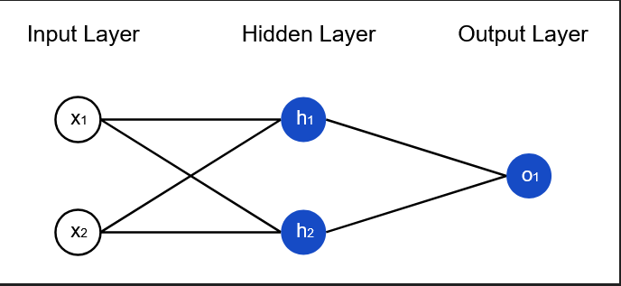

Key Components

- **Neurons**: Basic processing units.
- **Weights**: Determine the importance of inputs.
- **Bias**: Helps adjust the output.
- **Activation Function**: Decides whether a neuron should be activated.


[Go To Top](#content)

---

# Perceptron
Perceptron is an algorithm used for supervised ML and is one of the simplest types of artificial neural networks


Here
1. **Inputs**: 
    - These are the features/data points coming into the model.
    - Each input represents some information
    
2. **Weights**: 
    - Each input is connected with a weight.
    - These control how important each input is
    - Larger weight → more influence
    - Smaller weight → less influence
3. **Summation Block**: 
    - All weighted inputs are added together here.
    - This computes the linear combination
    - $z = w_1x_1 + w_2x_2 + ... + w_nx_n + b$
4. **Bias**: 
    - The bias is added to the sum
    - It shifts the decision boundary (like adjusting a threshold)
5. **Activation Function**: 
    - Takes the summed value and decides output
    - Example:\
    step function:
        - If the result ≥ 0 → output = 1
        - If the result < 0 → output = 0

in the training phase of the perceptron we feed the training data and try to find out the compatible `Weight` and `Bias` such that predicted output and actual output matches

Once we found out those `Weight` and `Bias` from training phase we use those same `Weight` and `Bias` for future prediction

### Perceptron is Inspired by Neuron
- perceptron was designed by copying the basic idea of how a human `neuron` works.
- A human `neuron` takes signals from `dendrites`, processes them, and sends an output, so a perceptron does the same with numbers.
- In a `neuron`, `synapses` decide signal strength, and in a perceptron, `weights` decide input importance.

    

- The perceptron does not copy the full complexity of the brain, it only copies the simple “input → process → output” behavior.
- So, a perceptron is a simplified mathematical version of a human `neuron`, not an exact copy.

### Geometrical Intuition Behind perceptron

Lets take a summation function of a perceptron

$$z = w_1x_1 + w_2x_2 + ... + w_nx_n + b$$

keep $n = 2$

$$z = w_1x_1 + w_2x_2 + b$$

if you look closely this function is similar to equation of string line:

$$Ax + By + C = 0$$


so when we train our perceptron on a dataset we get a line as follow


now whenever we want to predict new value we pass the input data ($x_1, x_2$), which inside summation block convert into an equation $Ax_1 + Bx_2 + C$
- A = weight of feature $x_1$
- B = weight of feature $x_2$
- C = Bias
- $Ax_1 + Bx_2 + C$ = represent a point ($x_1, x_2$) inside a plane

Inside a activation function passes the result through a step function:

- If $Ax_1 + Bx_2 + C$ ≥ 0 → output = Class A
- If $Ax_1 + Bx_2 + C$ < 0 → output = Class B


>Because of this we can classify our data into two classes, therefor we called perceptron a binary classifier

**with 2D data we get a line that separate two classes, where as in 3D we get a plane and for 4D and above we get hyperplane**

### Why compare with 0
to understand this we first need to understand how to check on which side of a line a point will lie?

To determine which side of a line a point lies on, you can use a very clean geometric idea based on the line equation sign test.

If a line is written as:

$$ax + by + c = 0$$

Then for any point ($x_1, y_1$), compute:

$$S = ax_1 + by_1 + c$$

- If S > 0 → positive region → point lies on one side of the line
- If S < 0 → negative region → point lies on the other side
- If S = 0 → point lies exactly on the line

### Woks only with liner data
in perceptron we find the best fit line that separate two classes, but we can only find this best fit line if we have liner data and will not work with non liner data


[Go To Top](#content)

---
# Perceptron Trick
Perceptron Trick is a way to find the best fit line that best separate two classes

> this is iterative approach i.e, we can perform then trick in loop until we find the best fit line

we start with any random line


now we randomly pick any point and check whether or not it is properly classified or not

here:
- 2,5 supposed to belong in positive region (properly classified)
- -2, -4 supposed to belongs in negative region (incorrectly classified)

if the point is properly classified then we do nothing and switch to next point

if the point is not classified correctly then that point will move the line, such that the new line will properly classify that point

in our case point (-2, -4) will move the line so that this point will come under the negative region of the line


To make this transformation we only need to change the weight and bias such that the new line will  properly classified respective point

### How changing the weight and bias transform the line

Equation:

$$Ax_1 + Bx_2 + C$$

- A = weight of feature $x_1$
- B = weight of feature $x_2$
- C = Bias

Changing the C moves line up or down without changing the slop

changing the A will rotate the line along the point $x_1$

changing the B will rotate the line along the point $x_2$

### How to apply changes to weight and bias

lets take equation of line:

$$2x + 3y + 5 = 0 _{--------}(i)$$


And we have coordinates of improper classified point as follow:

$$x = 4, y = 5$$

```
(4 * 2) + (5 * 3) + 5 = 8 + 15 + 5 = 28 

28 > 0 -> +ve region
```

we add one arbitrary point:

$$x = 4, y = 5, c = 1_{--------}(ii)$$

from $(i)$ we get
- A = 2
- B = 3
- C = 5

just subtract this value form $(ii)$ x, y, c to get new equation
```
A - x = 2 - 4 = -2
B - y = 3 - 5 = -2
C - c = 5 - 1 = 4
```

Therefor new equation of line:

$$-2x-2y + 4 = 0$$

```
(-2 * 4) + (-2 * 5) + 4 = -8 + (-10) + 4 = -14

-14 < 0 -> -ve region
```
### How to pick the arbitrary point
higher the value of arbitrary point higher the transformation of line, where as lower the value of arbitrary point lower the transformation

hence we can say that this arbitrary point defines the learning rate of our model 

generally is most of the cases learning rate is equal to `0.01`

Therefor instead of subtracting the x, y ,c value directly we use formula:

$$new\ coefficient\ of\ line = old\ coefficient\ of\ line - (learning\ rate \times coordinates)$$

Example:

$A_{new} = A_{old} - 0.01 \times x = 2 - 0.04 = 1.96$

$B_{new} = B_{old} - 0.01 \times y = 3 - 0.05 = 2.95$

$C_{new} = C_{old} - 0.01 \times c = 5 - 0.01 = 4.99$

Therefor new equation of line:

$$1.96x+2.95y + 4.99 = 0$$

### Problem With Perceptron trick

- In the perceptron trick, we randomly pick one misclassified point and adjust the decision boundary so it moves toward correctly classifying that point.
- Since the misclassified point is chosen randomly, the final decision boundary we get can also vary each time.
- If the two classes are clearly separable, there can be multiple valid decision boundaries that correctly divide them.
- Because of this randomness, the perceptron may end up finding any one of these possible separating lines.
- Also, the perceptron does not provide a way to determine which of these separating lines is better than the others.
- As a result we cannot specify whether the decision boundary we get in the end is the optimal one or any other optimal one still exist

**Because of this we avoid using this perceptron trick algorithm and instead use more reliable approach where we use [gradient decent](../MachineLearning/Readme.md#gradient-descent) along with [loss function](#loss-function-in-perceptron)**

[Go To Top](#content)

---
# Loss Function In Perceptron
> Loss function is function that return a numerical value, we use this numerical value to calculate the error done by our model, higher the output of the loss function poor the model accuracy 

For perceptron the simplest way to find the error is to check the no. of misclassified point 


In above example the output of loss function is `5` as there are `5` misclassified points

- the problem with this method is that it give same penalty to each point, irrespective to how far the point is from decision boundary
- Even though this work but in case of multiple decision boundaries we didn't know which line cause the lowest error as penalty for each data point is same

Therefor we try to find the error by finding the distance between the decision boundary and the misclassified points

To do that we can use distance formula and find the perpendicular distance of a point from the line, but using the method is little hard

hence we just put the value of misclassified in the equation of decision boundary


- for `(5.5, 5.5)`

    $x = 5.5 \ ;\  y = 5.5$ 

    $|x + y - 10| = |5.5 + 5.5 - 10| = |11 - 10| = 1$

- for `(4, 4)`

    $x = 4 \ ;\  y = 4$ 

    $|x + y - 10| = |4 + 4 - 10| = |8 - 10| = 2$

- Output of loss function = 1 + 2 = 3

Fom above example we see that the point which is closest to decision boundary (`5.5, 5.5`) get the less penalty (`1`), that than to the point which is far away (`(4, 4) penalty = 2`)


[Go To Top](#content)

---
# Flexibility with Perceptron

- Perceptron is a mathematical model used in machine learning
- It first calculates a value using a formula like a weighted sum of inputs. After that, the activation function decides what kind of output to produce, such as a class label, a probability, or a number.
- By changing the activation function and loss function, you can make the same model behave like a binary classifier, a multi class classifier, or a regression model.

### How it happen
- The model always starts by computing a single value using the inputs and weights. Think of this value as a raw score. On its own, this score doesn’t mean anything yet.

- What makes it useful is how we interpret that score, and that is controlled by the activation function.
    - If we use a step or sigmoid activation, we treat the score as a decision between two classes, so the model behaves like a binary classifier.
    - If we use softmax on multiple scores, we interpret them as probabilities of different classes, so it becomes a multi class classifier.
    - If we don’t apply any activation, we treat the score directly as a number, so it becomes a regression model.

- Now comes the role of the loss function. 
    - The loss function tells the model what kind of mistake to care about. 
    - For classification, it penalizes wrong class predictions. 
    - For regression, it penalizes how far the predicted number is from the actual value. 
    - So during training, the model adjusts its weights differently depending on the loss.

- So the process is:\
The model produces a raw score → the activation converts it into a specific type of output → the loss function checks how wrong that output is → the model updates itself based on that.
- That’s why just changing activation and loss function makes the same model behave differently, even though the underlying computation stays the same.

### Some basic combination

| Problem Type              | Activation Function | Loss Function             | Output Meaning          |
| ------------------------- | ------------------------- | ------------------------- | ----------------------- |
| Binary Classification     | Step Function             | Perceptron Loss           | Class (0 or 1 directly) |
| Binary Classification / Logistic Regression    | Sigmoid                   | Binary Cross Entropy      | Probability (0 to 1)    |
| Multiclass Classification | Softmax                   | Categorical Cross Entropy | Probabilities (sum = 1) |
| Regression                | Linear (no activation)    | Mean Squared Error (MSE)  | Continuous number       |


[Go To Top](#content)

---
# Multi Layer Perceptron (MLP)
A single perceptron is basically a straight-line decision maker. It works only when the problem can be separated with a line (or a flat plane in higher dimensions). That’s a big limitation


To solve this issue we train multiple perceptron, and those multiple perceptron when combine can classify non liner data

### Example:


Now we just superimpose (combine) those multiple perceptron to get the final decision boundary


now after soothing those boundary we'll get


**This is how by using multiple perceptron we can classify between two non liner classes**

### Mathematically

- Each perceptron first calculates a weighted sum of inputs and passes it through a sigmoid function to produce a value between 0 and 1 representing how strongly a feature is present.
- These outputs (activations) are then passed to the next layer, where they are combined using new weights and again passed through a sigmoid function.
- As this process continues across layers, the network learns to combine simple features into more complex patterns, and the final layer produces the overall prediction.


in above example:
- $\sigma (z)$ = sigmoid function
- weight for both both input [ $p(y)_1$ and $p(y)_2$ ] = 1
- bias = 0

> Weights determine how important each input or feature is by controlling how much it influences the neuron’s output.

### Final structure of MLP 


### Type of Layers In MLP
There are three type of layers in MLP:
- **Input layer:** 

    The input layer receives the raw data (features) and passes it to the network without any processing.

    Example:\
    `X1` and `X2`    
- **Hidden layer:** 

    Hidden layers take inputs, apply weights and activation functions, and learn patterns or relationships in the data.

    Example:\
    `H1` and `H2`
- **Output layer**: 

    The output layer takes the final processed information and produces the prediction or result.

    Example:\
    `Y`

> you can have multiple node at each layer and can have more than one layer of same type

you can make the decision boundary more flexible just by changing the no. of nodes and no. and layers
#### Example 1: Adding nodes in hidden layers


#### Example 2: Adding multiple hidden layer


[Go To Top](#content)

---
# Notation And Dot Product

## Notation

In MLP we use different notation to represent/denote each layer, weight and bias


#### 1. Feature values
consider you have a dataset like:

feature 1 | feature 2 | feature 3 | feature 4
--- | --- | --- | ---
$X_{11}$ | $X_{12}$ | $X_{13}$ | $X_{14}$
$X_{21}$ | $X_{22}$ | $X_{23}$ | $X_{24}$
$X_{31}$ | $X_{32}$ | $X_{33}$ | $X_{34}$

Then:\
$X_{ij}$ represent the feature $j$ present in row $i$

#### 2. Layer and Node 


in above image we can see:
- L0 = input layer
- L1 = first input layer with node 1, 2, 3
- L2 = second input layer with node 1, 2
- L3 = third Output layer with node 1


#### 3. Bias and Output

Bias = $B_{ij}$\
output = $O_{ij}$

where:
- $i$ = layer number
- $j$ = Node number in that layer

#### 4. Weight
$W_{ij}^k$

where:
- $k$ = next layer number 
- $i$ = current node number
- $j$ = next node number

## Dot Product

fist consider the mathematical equation of the perceptron:

$$z = w_1x_1 + w_2x_2 + b$$

We can also write this equation in matrix format:

$$z = \begin{bmatrix} w_1 & w_2 \end{bmatrix}
\begin{bmatrix} x_1 \\ x_2 \end{bmatrix} + b$$


now if you look closely:

$\begin{bmatrix} w_1 & w_2 \end{bmatrix}
\begin{bmatrix} x_1 \\ x_2 \end{bmatrix}$ this term here is just a dot product of $x$ and $w$

Therefor you can also write the equation as:

$$z = W \cdot X + b$$

[Go To Top](#content)

---
# Forward propagation

Forward propagation in a Multi-Layer Perceptron (MLP) is the process of passing input data through the network layer by layer to produce an output (prediction).

> You start with input → apply weights + bias → apply activation → pass to next layer → repeat → get final output.

Consider following MLP:


### Computing the output of Layer 1
Formula:

$$z = W^T \cdot X + b$$


After solving we get:


**Now this output matrix will go as input for layer two**

### Computing the output of Layer 2


**Similarly ths output matrix will go as input for third layer**

### Computing the output of Layer 3


## Generalize Mathematical Representation

let the each output matrix be $a^{[i]}$ where $i$ is layer

example:
- $a^{[1]}$ = output matrix of layer 1
- $a^{[2]}$ = output matrix of layer 2
- $a^{[0]}$ = input layer matrix

> $a^{[i]}$ also known as activation f layer i

now if we compute:

$$\sigma (a^{[0]} \cdot w^{[1]} + b^{[1]})$$

we get output matrix of layer one i.e, $a^{[1]}$

> here $w^{[1]}$ is $W_{ij}^k$ with $k = 1$

Similarly for  $a^{[2]}$ and  $a^{[3]}$

$$a^{[2]} = \sigma (a^{[1]} \cdot w^{[2]} + b^{[2]})$$

$$a^{[3]} = \sigma (a^{[2]} \cdot w^{[3]} + b^{[3]})$$

Therefor we can generalize this as:

$$a^{[i]} = \sigma (a^{[i-1]} \cdot w^{[i]} + b^{[i]})$$


[Go To Top](#content)

---
# Loss Function In DL

Loss function is a method of evaluating how well your algorithm is modeling your dataset

It is a mathematical function that quantifies the difference between the predicted output of a model and the actual target value. 
 
it is a way to measure how wrong a model’s prediction is compared to the actual correct answer.

> high loss = high error = poor model\
> low loss = less error = good model

### Use of loss function
We use a loss function because it gives the model a clear way to understand how wrong it is and how to improve.

Without a loss function, a model would make predictions… but wouldn’t know if they are good or bad.

The loss function acts like a feedback signal.


### Example of loss Function
| Loss Function             | Formula                                      | Used For                   | Example                             | Key Idea                             | 
| ------------------------- | -------------------------------------------- | -------------------------- | ----------------------------------- | ------------------------------------ |  
| Mean Squared Error (MSE)  | $\frac{1}{n} \sum (y_{true} - y_{pred})^2$ | Regression                 | Actual=10, Pred=8 → Loss=4          | Penalizes large errors more          |                                                      
| Mean Absolute Error (MAE) | $\frac{1}{n} \sum  y_{true} - y_{pred}$                                     | Regression                           | Actual=10, Pred=8 → Loss=2 | Treats all errors equally |
| Binary Cross-Entropy      | $-[y\log(p) + (1-y)\log(1-p)]$            | Binary Classification      | Actual=1, Pred=0.8 → Low loss       | Punishes confident wrong predictions |                                                     
| Categorical Cross-Entropy | $-\sum y \log(p)$                         | Multi-class Classification | Correct class prob = 0.7 → Low loss | Works with probability distributions |                                                     
| Hinge Loss                | $\max(0, 1 - y \cdot f(x))$                | SVM / Classification       | Correct → 0 loss                    | Focuses on margin between classes    |                                                      

> **You can create your own loss function to customize how errors are measured based on the specific needs of your problem.**

### Loss Function vs Cost Function

| Aspect     | Loss Function                              | Cost Function                                  |
| ---------- | ------------------------------------------ | ---------------------------------------------- |
| Definition | Measures error for **a single data point** | Measures error over the **entire dataset**     |
| Scope      | Individual prediction                      | Overall model performance                      |
| Purpose    | Shows how wrong one prediction is          | Shows how well the model is performing overall |
| Example    | Error for one house price prediction       | Average error of all house predictions         |
| Relation   | Building block                             | Usually **average (or sum) of loss functions** |

> Loss function → per example error\
> Cost function → total/average error


[Go To Top](#content)

---

# Backward Propagation
Backpropagation (short for backward propagation of errors) is a core algorithm used to train neural networks in deep learning

### How it works (High-level flow)
A neural network has:

- Inputs → Hidden layers → Output
- Each connection has weights and biases

#### Step 1: choose a random weight and biases
- for your entire neural network we assume any random weight and biases

#### Step 2: Forward Pass
- Once the weight and biases are assumed the input goes through the network
- Output is produced

#### Step 3: Compute Error
- Compare predicted output vs actual output using a [loss function](#loss-function-in-dl)
- Calculate how much each weight contributed to the error
- Use derivatives (calculus) to compute gradients

#### Step 4: Update Weights
- Adjust weights to reduce error using optimization methods like Gradient Descent
- formula for weight:

$$\boxed{W_{new} = W_{old} - \alpha \frac{\partial L}{\partial W_{old}}}$$

- formula for bias:


$$\boxed{b_{new} = b_{old} - \alpha \frac{\partial L}{\partial b_{old}}}$$

- Here:\
    $\alpha$ = learning rate\
    $L$ = loss

> We repeat this steps multiple times until we hit convergence (a point where the loss is minimum)
>
>Each iteration can also be called as epoch i.e, 100 epoch = 100 iteration

### How to solve that gradient (Partial derivative)

$$\boxed{W_{new} = W_{old} - \alpha \frac{\partial L}{\partial W_{old}}}$$

lets assume our loss function will be `Mean squared error`

$$L = (y - \hat{y})^2$$

where:

- $\hat{y}$ = predicted value
- $y$ = actual value

Therefor we need to compute:

$$W_{new} = W_{old} - \alpha \frac{\partial (y - \hat{y})^2}{\partial W_{old}}$$

consider only derivative (gradient)

$$\frac{\partial (y - \hat{y})^2}{\partial W_{old}}$$

for now assume $W_{old}$ is $W_1$

$$\frac{\partial (y - \hat{y})^2}{\partial W_{1}}$$

To solve this derivative we break it and apply chain rule:

$$\frac{\partial (y - \hat{y})^2}{\partial W_1} = \frac{\partial (y - \hat{y})^2}{\partial \hat{y} } \times \frac{\partial \hat{y}}{\partial W_1}$$


According to perceptron equation:

$$\hat{y} = W_1 \cdot O_1 + W_2 \cdot O_2 + .... + W_n \cdot O_n + b$$

Therefor:

$$\boxed{\frac{\partial \hat{y}}{\partial W_1} = \frac{\partial ( W_1 \cdot O_1 + W_2 \cdot O_2 + .... + W_n \cdot O_n + b )}{\partial W_1} = O_1}$$

Also

$$\boxed{\frac{\partial (y - \hat{y})^2}{\partial \hat{y} } = -2(y - \hat{y})}$$

by combining this two

$$\frac{\partial (y - \hat{y})^2}{\partial \hat{y} } \times \frac{\partial \hat{y}}{\partial W_1} = -2(y - \hat{y}) \times  O_1$$


Therefor

$$\boxed{\frac{\partial L}{\partial W_{1}} = -2(y - \hat{y}) \times  O_1}$$

- $y$ = actual value
- $\hat{y}$ = predicted value
- $O_1$ = input value


> We use this formulas to compute all optimal weight and biases such that our loss will be minimum


[Go To Top](#content)

---
# Vanishing Gradient Problem


In Backpropagation we learn that we use following gradient decent to find the updated weight and bias

$$W_{new} = W_{old} - \alpha \frac{\partial L}{\partial W_{old}}$$

and to solve this gradient decent we do

$$L = (y - \hat{y})^2$$

$$\frac{\partial (y - \hat{y})^2}{\partial W_1} = \frac{\partial (y - \hat{y})^2}{\partial \hat{y} } \times \frac{\partial \hat{y}}{\partial W_1}$$

lets suppose 

$$\frac{\partial (y - \hat{y})^2}{\partial \hat{y} } ≈ 0.01\ \ \ ;\ \ \ \  \frac{\partial \hat{y}}{\partial W_1} ≈ 0.01 $$

Then

$$\frac{\partial (y - \hat{y})^2}{\partial \hat{y} } \times \frac{\partial \hat{y}}{\partial W_1} ≈ 0.0001$$

That means

$$\frac{\partial L}{\partial W_{old}} ≈ 0.0001 $$

Now, if compute the new weight and bias:

$$W_{new} = W_{old} - (\alpha \times 0.0001)$$

After solving this equation for $\alpha = 1$ we get


$$W_{new} = W_{old} - 0.0001$$

$$W_{new} ≈ W_{old}$$


As you can see, in training, neural networks use backpropagation to update weights. This works by passing gradients (derivatives of the loss) backward from the output layer to earlier layers.

In deep networks, those gradients get multiplied repeatedly as they move backward through layers.

If those gradients are small (less than 1), repeated multiplication makes them shrink exponentially

In worst case it may completely stop the neural network from further training

### How to check for Vanishing gradient
1. check the loss value for each epoch, if it not changing vanishing gradient has occur
2. weighted graph plot: a plot that can display the changes in weight

### How to handle Vanishing gradient
1. **Reduce the model complexity**:\
if you reduce the no. of nodes in the model the no. of multiplication being performed will also reduce, which will prevent vanishing gradient from happing

2. **Use RelU Activation function**\
As it doesn't squash gradients like sigmoid, so it can keep the output in higher range. Whereas sigmoid squash be between 0 to 1

[Go To Top](#content)

---
# Type of Gradient Decent
There are three variants of gradient decent, which differ in how much data we use to compute the gradient of the objective function. 

Depending on the amount of data, we make a trade if between the accuracy of the parameter update and the time it takes to perform an update
### 1. Stochastic Gradient Descent (SGD) 
here we take one point at a time and for that one point we calculate the loss and update the parameters  

we perform this step for each point during each epoch, i.e, for 5 parameter with 10 epoch we repeat the gradient decent 50 (5 X 10) times

- frequency of rate of update is higher
- execution slower as we have to compute gradient multiple time for single epoch
- Although the execution is slow, it get converge faster (less epoch) as we perform update frequently (multiple time in each epoch)

### 2. Batch Gradient Descent (Vanilla GD)
> This is the “pure” version.

here for single epoch we first compute the loss of the all of the data points first, and then we summarize all of those loss.

On the basis of that summarize loss we perform the gradient decent one single time for single epoch

- frequency of rate of update is low compare to SGD
- it is much faster to execution compare to SGD for same number of epoch, as we compute the gradient single time for single epoch
- Although the execution is fast, it get converge slow (more epoch) as we perform update slowly (single time for single epoch)

### 3. Mini-Batch Gradient Descent
> Middle ground between batch and SGD.

here for each epoch we we divide the dataset into the small batches, and compute the loss for each batch and perform the gradient decent 

eg., \
lets save we have 300 record, with batch size of 30. Therefor number of batch is 10 (300 / 30).\
if epoch is 5 then total number of time we perform the gradient decent is 50 (5 X 10)\
i.e, for each epoch perform gradient decent for all available batch


### Recommended batch size for optimization is multiple of 2
For most optimize performance we must provide the batch size in the multiple of 2, as for this batch size we can effectively use RAM

Therefor we must provide batch size in the multiple of 2 i.e,\
`2, 4, 8, 32, 64, 128, 256, ....`

[Go To Top](#content)

---
# Overfitting
Overfitting is when a model learns the training data too well—including the noise and random quirks—so it performs great on training data but fails badly on new, unseen data.
> your model isn’t “smart” in this case—it’s basically memorizing instead of learning patterns.

### Simple example

Imagine you’re preparing for an exam:

- Good learning → you understand concepts and can solve new questions
- Overfitting → you memorize past questions word-for-word

When the exam changes slightly, you’re stuck.

### Signs of overfitting
- Very high training accuracy
- Much lower validation/test accuracy
- Model performs inconsistently on new inputs

### Why it happens
- Model is too complex (too many parameters)
- Too little data
- Training for too long
- Data contains noise or irrelevant features

### How to prevent overfitting
there are two possible ways to reduce the overfitting of any model i.e, 
1. **Adding more data:**
    - Add more row: just increase the amount of raw data you feed into the model
    - Data augmentation: if data is limited create the new synthetic data 
2. **Reducing the complexity of the model:**
    - [Dropout](#dropout-layer): Randomly drop some nodes to reduce the complexity
    - [Regularization](#regularization): Regularization adds a penalty for complexity, encouraging simpler models that generalize better to new data.
    - Early stopping: monitor the model in training phase and stop the training if overfitting is detected

[Go To Top](#content)

---
# Dropout Layer
A dropout layer is a regularization technique used in neural networks to reduce overfitting.

During training, a dropout layer randomly turns off (sets to zero) a fraction of neurons in a layer for each epoch.

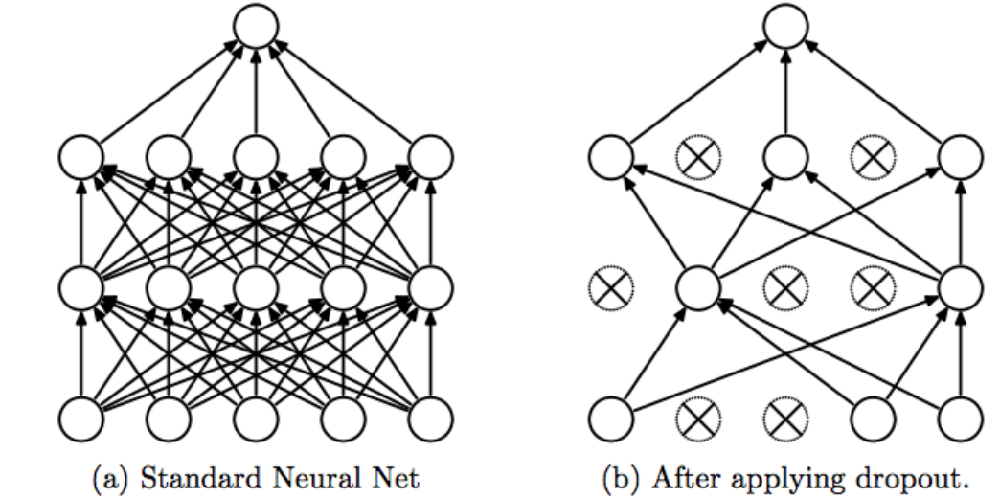

So instead of this:
```
All neurons active → model can rely heavily on specific paths
```
You get:

```
Random neurons dropped → model forced to learn more robust patterns
```

> Dropout is only active during training, not during inference (testing/prediction).\
> At inference time, all neurons are used, but their outputs are scaled appropriately.

### How it works
- You define a dropout rate, say `0.5`
- That means 50% of neurons are randomly ignored during each training step (epoch)
- During each epoch we choose different nodes for dropout
- As a result every batch sees a slightly different network

This prevents:
- Co-adaptation (neurons depending too much on each other)
- Memorization of training data

### Weights in testing phase
- If we pick any random node with  dropout rate of `0.25`then there is `25%` chance of that node not being included in any random subnetwork 
- Therefor whenever you drop any particular node the weight assign to it didn't get updated
- As this behavior only been seen in training phase, if we consider the final value of weight for testing it will not show the proper result
- This is because in training you train on subnetwork (with dropout nodes) whereas in testing / prediction you predict on whole network (without any dropout node) 
- Therefor whatever weight you get at the end of the training is approximately equal to `0.75 (as your dropout rate is 0.25)` times of actual weight
    > if dropout is 0.25 then each node is included 0.75 times\
    > Mathematically $W_{actual} = W_{train}(1 - p)$ where p is dropout rate
### Comparison with random forest (Ensemble Method)
Both dropout and Random Forest try to solve the same core problem:\
reduce overfitting by introducing randomness and diversity


#### In Random Forest
- You train many decision trees
- Each tree sees:
    - different data samples (bagging)
    - different feature subsets
- Final prediction = average / majority vote

#### In dropout (deep learning)
- When you use dropout, you are not training one fixed network.
- At every training step:
    - some neurons are randomly dropped
    - so the network structure changes
- If you have N neurons, the number of possible trained networks is enormous (exponential). Each dropout mask creates a different sub-network.
- Therefor instead of training many separate models like in Random Forest, dropout randomly creates different smaller networks during training by turning off some neurons, while all these networks share the same weights.
- So effectively:
    - You are training many smaller networks
    - But they all share parameters

#### Why this behaves like an ensemble
In a real ensemble:
- you train multiple models
- then average their predictions

With dropout:
- during training → you train many sub-networks (randomly sampled)
- during inference → you use the full network with scaled weights


This approximates averaging predictions of all those sub-networks.


[Go To Top](#content)

---
# Regularization
Regularization is a technique used in machine learning to prevent a model from overfitting—that is, memorizing the training data instead of learning general patterns.

When a model is too complex, it can fit noise in the data instead of the real signal. Regularization adds a penalty for complexity, encouraging simpler models that generalize better to new data.

In many models (like linear regression), regularization modifies the loss function:

$$Loss = Error + \lambda \times Penalty$$

- Error: how wrong the model is on training data (calculated using loss function)
- Penalty: discourages large or complex parameters
- λ (lambda): controls how strong the regularization is

### Common types
1. L1 Regularization (Lasso)
    - Adds the absolute values of weights
    - Can shrink some weights to zero → feature selection

    $$Loss = Error + \frac{\lambda}{2n}\sum||W_i||$$

2. L2 Regularization (Ridge)
    - Adds the squared values of weights
    - Keeps all features but makes weights smaller

     $$Loss = Error + \frac{\lambda}{2n}\sum||W_i||^2$$

### what does Regularization do?
In regularization we just add a penalty which cause the weight to go in the direction of zero

According tp gradient decent:

$$W_{1}^l = W_{1} - \alpha \frac{\partial L^l}{\partial W_{1}}$$

were $L^l$ is regularized loss function which in case of regularization is as follows:

$$L^l = L + \frac{\lambda}{2}\sum||W_i||^2$$

> as we are calculating loss for single instance (iteration) we are not dividing the penalty by $n$

Therefor

$$W_{1}^l = W_{1} - \alpha \frac{\partial}{\partial W_{1}}\left[L + \frac{\lambda}{2}\sum||W_i||^2\right]$$

$$W_{1}^l = W_{1} - \alpha \left[\frac{\partial L}{\partial W_{1}}+ \frac{\lambda}{2}\left(\frac{\partial}{\partial W_{1}}\sum||W_i||^2\right)\right]$$

here

$$
\begin{aligned}
\frac{\partial}{\partial W_{1}}\sum \|W_i\|^2 
&= \frac{\partial}{\partial W_{1}} (W_1^2 + W_2^2 + \dots + W_n^2) \\
&= \frac{\partial W_1^2}{\partial W_{1}} + \frac{\partial W_2^2}{\partial W_{1}} + \dots + \frac{\partial W_n^2}{\partial W_{1}} \\
&= 2W_1
\end{aligned}
$$

Hence we get

$$
\begin{aligned}
W_{1}^l 
&= W_{1} - \alpha \left[\frac{\partial L}{\partial W_{1}}+ \frac{\lambda}{2}(2W_1)\right]\\
&= W_{1} - \alpha \left[\frac{\partial L}{\partial W_{1}}+ \lambda W_1\right]\\
&= W_{1} - \alpha \frac{\partial L}{\partial W_{1}}+ \alpha \lambda W_1\\
&= (1 - \alpha \lambda)W_1  - \alpha \frac{\partial L}{\partial W_{1}}
\end{aligned}
$$

Therefor at the end we get 

$$\boxed{W_{1}^l = (1 - \alpha \lambda)W_1  - \alpha \frac{\partial L}{\partial W_{1}}}$$

Now if you compare it with that of original equation (without regularization)

$$W_{1}^l = W_{1} - \alpha \frac{\partial L^l}{\partial W_{1}}$$

the only extra pat is: $(1 - \alpha \lambda)$

in all of the cases your $\lambda$ will be positive, therefor $\alpha \lambda$ will always be a positive value, as result $(1 - \alpha \lambda)$ will be less than 1


if $(1 - \alpha \lambda)$ will be less than 1 then the values of $(1 - \alpha \lambda)W_1$ will always we less than that of $W_1$, as a result value of $W_1^l$ will be less than that of $W_1$

As this decreases in weight is because of $(1 - \alpha \lambda)$ it is also known as weight decay factor 

> subtracting the gradient from the $(1 - \alpha \lambda)W_1$ will cause the $W_1^l$ value to decreases even more

**As we perform this same operation in multiple iteration (epoch), each iteration causes the value to decreases even more, moving it towards the zero**

> it only move the value towards the zero but in case of L2 regularization value can never become zero

[Go To Top](#content)

---
# Activation Function
An activation function in Deep Learning (DL) is a mathematical function applied to the output of a neuron in a neural network.

It decides whether a neuron should be activated (fire) or not by transforming the weighted sum of inputs into another value.

### Why Do We Need Activation Functions?
Without activation functions:
- A neural network becomes just a linear model
- No matter how many layers you add, it behaves like a single linear equation

Activation functions introduce non-linearity, allowing the network to:
- Learn complex patterns
- Solve problems like image recognition, NLP, speech recognition, etc.


### Condition for ideal activation function:
1. **Non Linear**:\
if we use the liner activation function then then neural network itself become liner
2. **Differentiable**:  
to tain the neural network we need to apply backpropagation algorithm we need to use gradient decent to which we need to calculate the derivatives
3. **Computationally inexpensive**: \
whatever calculation will be performed at the time of training must be simple else the training will be slow
4. **Zero centered**:\
whatever output your activation function generate it must be normalized / zero centred (mean $\approx$ 0)
5. **Non Saturating**:\
saturating function is a function that squeeze the output (eg, sigmoid) and keep the value within a range,\
in case of saturating function chances of encountering the vanishing gradient problem is high


[Go To Top](#content)

---
# Sigmoid Activation Function
The sigmoid activation function is a mathematical function that maps any real-valued input to a value between 0 and 1

Mathematically

$$\phi (z) = \frac{1}{1+e^{-z}}$$


> for higher value of $z$ we return output nearer to 1, whereas for lower value os $z$ it return value nearer to 0

### Advantages
1. **output is between 1 and 0:**\
as sigmoid gives output between 0 to 1we can treat it as a probability for binary classification in output layered
2. **Non linear:**\
As this function is non liner we can use on non linear data
3. **Differentiable:**\
As this function is differentiable we can apply gradient decent in backpropagation

### Disadvantage
1. **Saturated Function:**\
saturating function is a function that squeeze the output and keep the value within a range (sigmoid keeps the output between 0 to 1),

    in case of saturating function chances of encountering the vanishing gradient problem is high
    
    because if this reason sigmoid is rarely used in the hidden layer of any neural network and in only useful in output layer for binary classification
2. **Non Zero Centric:**\
AS sigmoid give output between 0 to 1, the mean of all outputs can never be 0, which increases the overall training time
3. **Computationally Expensive:**\
because of the exponent in denominator solving the gradient is complex

**because of this disadvantage we generally avoid using sigmoid activation function in hidden layer, and is only used in output layer in case of binary classification**


[Go To Top](#content)

---
# Tanh Activation Function
The tanh (hyperbolic tangent) activation function is a mathematical function that maps any real-valued input to a value between −1 and 1

Mathematically

$$f(x) = \frac{e^x - e^{-x}}{e^x+e^{-x}}$$

$$f^l(x) = 1 -  tanh^2(x)$$

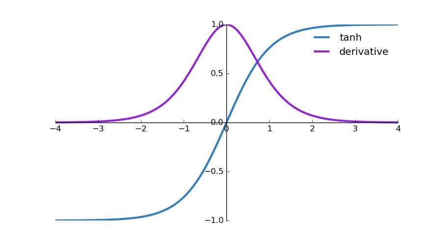

### Advantages
1. **Non linear:**\
As this function is non liner we can use on non linear data
2. **Differentiable:**\
As this function is differentiable we can apply gradient decent in backpropagation
3. **Zero centered:**\
mean of outputs will be zero, which improve the training speed


### Disadvantage
1. **Saturated Function:**\
saturating function is a function that squeeze the output and keep the value within a range (sigmoid keeps the output between 0 to 1),

    in case of saturating function chances of encountering the vanishing gradient problem is high
    
    because if this reason sigmoid is rarely used in the hidden layer of any neural network and in only useful in output layer for binary classification
2. **Computationally Expensive:**\
because of the exponent in denominator solving the gradient is complex


[Go To Top](#content)

---
# ReLU Activation function
The ReLU (Rectified Linear Unit) is an activation function that outputs the input directly if it is positive, and returns 0 if the input is negative

Mathematically:

$$f(x) = max(0, x)$$

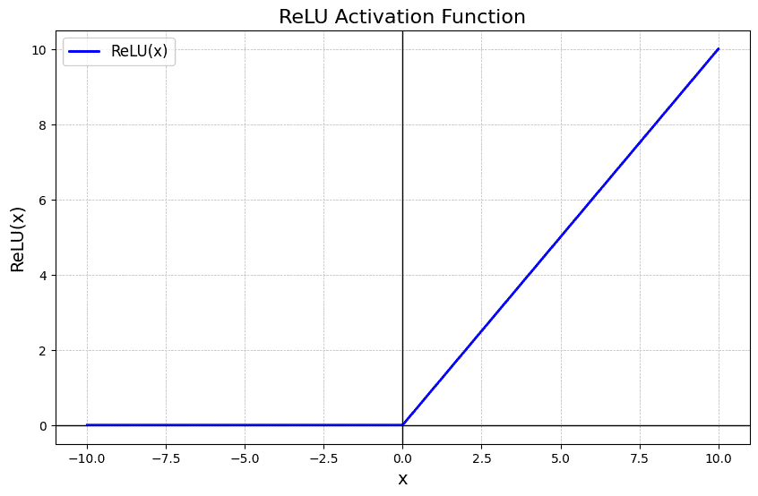

### Advantages
1. **Non linear:**\
As this function is non liner we can use on non linear data
2. **Non saturated in positive region:**\
for x > 0 ReLU behave as that of non saturated function
3. **Computationally inexpensive:**\
finding the gradient and performing the calculations is easy

### Disadvantage
1. **Non Differentiable:**\
we can not find the derivative for x = 0, therefor we need to assume:

    for x >= 0 differentiation -> 1\
    for x < 0 differentiation -> 0
2. **Non zero centered:**\
mean of outputs can not be zero, which increases the training time

> for hidden layers reLU provided high performance compare t =o other activation function

### Dying ReLU problem
The dying ReLU problem is a situation where a neuron using the ReLU activation function stops learning because it outputs 0 for all inputs.

This happens when the neuron’s weights cause its input to be always negative, so ReLU keeps giving 0. Since the gradient is also 0 in this region, the weights don’t update during training, and the neuron effectively “dies” and becomes useless.

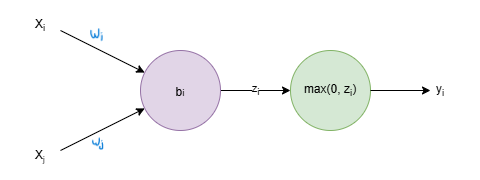

According to ReLU:

$$y_i = max(0, z_i)$$

where;

$$z_i = W_iX_i + W_jX_j + b_i$$

if somehow $z_i$ becomes less than 0 then $y_i$ becomes 0, therefor ;

$$\frac{\partial y_i}{\partial z_{i}} = 0 ------ (i)$$

According to gradient decent:


$$W_{i}^l = W_{i} - \alpha \frac{\partial L}{\partial W_{i}}$$


here;\
$L$ is $f(y)$, $y$ is $f(z)$ and $z$ is $f(W)$

Therefor

$$\frac{\partial L}{\partial W_{i}} = \frac{\partial L}{\partial y_{i}} \times \frac{\partial y_i}{\partial z_{i}} \times \frac{\partial z_i}{\partial W_{i}}$$

from $i$

$$\frac{\partial L}{\partial W_{i}} = \frac{\partial L}{\partial y_{i}} \times 0 \times \frac{\partial z_i}{\partial W_{i}} = 0$$


similarly for $W_j$

$$
\begin{aligned}
\frac{\partial L}{\partial W_{j}}
&= \frac{\partial L}{\partial y_{i}} \times \frac{\partial y_i}{\partial z_{i}} \times \frac{\partial z_i}{\partial W_{j}}\\
&= \frac{\partial L}{\partial y_{i}} \times 0 \times \frac{\partial z_i}{\partial W_{i}}\\
&= 0
\end{aligned}
$$

Therefor 

$$W_{i}^l = W_{i} - 0 \ ;\ W_{j}^l = W_{j} - 0$$

$$W_{i}^l = W_{i} \ ;\ W_{j}^l = W_{j}$$

As no weight changes for this node the output of this node does not changes i.e, $z_i$ will always be less than 0 which cause the output to be always 0 for this particular node

### Why if a node is dead then it can't recover?
Whenever the weighted sum of any node becomes negative, then after applying the reLU it will always give 0 as a output, in this case this node is consider as dead as it cant recover from it

There are 2 main reason behind why weighted sum becomes negative:
1. **High learning rate:**

    $$W_{i}^l = W_{i} - \alpha \frac{\partial L}{\partial W_{i}}$$

    here if $\alpha$ is high then $\alpha \frac{\partial L}{\partial W_{i}}$ becomes higher than that of $W_i$ causing the overall sum to be negative

    As a result new weight will be negative, and if both weight becomes negative, the weighted sum itself will be negative (as input will be normalized i.e, between 0 to 1) causing dying reLU problem

    And as learning rate $\alpha$ is constant for whole training, we cannot change it mid training. Causing the output to always be negative

    Because of this our dead node cannot be recovered once it dead
2. **High negative bias:**

    $$z_i = W_iX_i + W_jX_j + b_i$$

    if $b_i$ becomes highly negative compare to $W_i$ and $W_j$ then it effluence the overall weighted sum as out input $X_i$ and $X_j$ will be normalize (between 0 to 1)

    once the weighted sum becomes negative our reLU output becomes 0, causing its derivative to be 0 as well

    we need this reLU derivative to calculated gradient and update the bias value, as this derivative becomes 0, gradient also becomes 0 as a result no updated happen and bias remains high negative for whole trining 

    Therefor our node will always give out 0 as a output causing it to be dead forever

### Solution
1. use low learning rate
2. use a positive values (0.01) to initialize a bias 
3. Instead of typical reLU use its variants
    - linear Variants
        1. Leaky reLU
        2. Parametric reLU
    - Non Linear Variants
        1. Exponential Liner uint (ELU)
        2. Scaled exponential Linear uint (SeLU)


[Go To Top](#content)

---
# variants of ReLU


the main reason behind the dying reLU problem is the saturated nature of reLU for negative input value

> saturated function are the function that give a specific output for any input e.g, reLU gives 0 for every negative input

therefor to solve the problem we change this saturated nature of reLU and make it continuous even for the negative input value

after implementing this approach the new variants of ReLU are as follow:
- linear Variants
    1. Leaky reLU
    2. Parametric reLU
- Non Linear Variants
    1. Exponential Liner uint (ELU)
    2. Scaled exponential Linear uint (SeLU)

### 1. Leaky ReLU

for positive value it return that positive value, but for negative value instead of 0 it return a fraction of that value

- for x >= 0 -> return x
- for x < 0 -> return 0.01x

Mathematically:

$$f(x) = max(\alpha x, x)$$

where;\
$\alpha$ is a fraction (0.01)

> if $\alpha$ is set to 0 then it become normal ReLU 

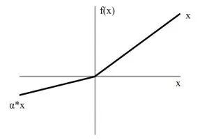

- for x < 0 the derivative is equal to $\alpha$, therefor as long as $\alpha$ is not equal to 0 small change in gradient occur even for the negative value of x 
- because of this it can help solve the dying ReLU problem

### 2. Parametric ReLU

it is same as Leaky ReLU, but instead of providing hardcoded value of $\alpha$ the $\alpha$ is treated as trainable parameter and its values if been computed at the time of training

Mathematically:

$$f(x) = max(\alpha x, x)$$

where;\
$\alpha$ is a trainable parameter 


- because of $\alpha$ being trainable parameter we get high flexibility over Leaky ReLU, as a result in some cases it perform better that that of leaky ReLU

### 3. ELU (Exponential Linear Unit)
ELU (Exponential Linear Unit) is an activation function that outputs the input for positive values and a smooth exponential curve for negative values to improve neural network learning.

Mathematically

$$
\mathrm{ELU}(x) =
\begin{cases}
x & \text{if } x > 0 \\
\alpha (e^x - 1) & \text{if } x \leq 0
\end{cases}
$$

$$
\mathrm{ELU}^l(x) =
\begin{cases}
x & \text{if } x > 0 \\
ELU(x) + \alpha & \text{if } x \leq 0
\end{cases}
$$

> $\alpha$ is a hyper parameter 

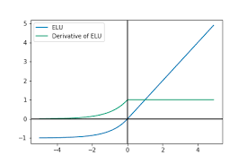

- ELU is close to zero centred as a result it get converge faster
- it provide better generalization compare to ReLU
- always continuous and always differentiable

The only downside of ELU is it is computationally expensive as we need to calculate $e^x$, bur because it is zero catered it get balanced out 

### 4. SeLU (Scaled Exponential Linear Unit)
SeLU (Scaled Exponential Linear Unit) is an activation function that scales ELU to keep neural network activations self-normalized, improving training stability.

Mathematically

$$
\mathrm{SELU}(x) =
\begin{cases}
\lambda x & \text{if } x > 0 \\
\lambda \alpha (e^x - 1) & \text{if } x \leq 0
\end{cases}
$$


$$
\mathrm{SELU^l}(x) =
\begin{cases}
\lambda & \text{if } x > 0 \\
\lambda \alpha e^x & \text{if } x \leq 0
\end{cases}
$$

Where typically:

- $λ$ ≈ 1.0507
- $α$ ≈ 1.6733

> $\alpha$ and $\lambda$ is not a trainable parameter, in post of the cases their value is fix which is experimentally proven 

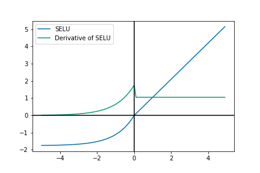

- Self normalizing Nature\
if you apply SeLU to any layer then the output of that layer will be normalized (mean = 0, SD = 1), as a result the neural network converges faster


[Go To Top](#content)

---
# Weight Initialization Problem
Weight initialization in Deep Learning (DL) is the process of setting the initial values of the neural network’s weights before training starts.

Those weights are the parameters the model learns during training. If you initialize them badly, training becomes slow, unstable, or completely fails.

### Why Weight Initialization Matters
A neural network learns using gradient descent + backpropagation.

If the starting weights are wrong:
- gradients can become too small → vanishing gradients
- gradients can become too large → exploding gradients
- neurons can all learn the same thing
- training can stall completely


Good initialization helps:

- faster convergence
- stable gradients
- better accuracy
- deeper networks train properly

### Problem 1 - Zero initialization
Suppose every weight starts as:

$$W = 0$$

Then every neuron in a layer produces the same output (assuming all bias are also same) as.

$$z = \sum W X + b$$

as $W = 0$

$$s = b$$

During backpropagation, they also receive identical gradients.

Result:

- all neurons become identical
- network loses its ability to learn different features

This is called the symmetry problem.

In the worst case, initializing all weights to zero causes the activations to become zero. Since backpropagation depends on the activations to compute gradients and update the weights, zero activations can lead to zero gradients, preventing the network from learning.

Result
- No updated will occur on the weight
- at the end of the training weight remains zero

So:

- weights should not be initialized to zero
- biases often can be zero

### Problem 2 - Non zero constant

Suppose every weight and basie starts as:

$$W = 0.5 \ \ ; \ \  b = 0.5$$

Also lets assume we have 2 hidden nodes with ReLU activation then:

**Output of first node**

$$z_1 = W_{11} X_1 + W_{12}X_2 + b_1$$

As $W = 0.5$ and $b = 0.5$ for all nodes

$$z_1 = 0.5 X_1 + 0.5X_2 + 0.5-------(i)$$

if $X_1 > 0$ and $X_2 > 0$ then $Z$ will be greater then 0 (positive)

$$a_1 = max(0, z_1) = z_1--------(ii)$$

**similarly Output of Second node**

$$z_2 = W_{21} X_1 + W_{22}X_2 + b_2$$

As $W = 0.5$ and $b = 0.5$ for all nodes

$$z_2 = 0.5 X_1 + 0.5X_2 + 0.5-------(iii)$$

if $X_1 > 0$ and $X_2 > 0$ then $Z$ will be greater then 0 (positive)

$$a_2 = max(0, z_2) = z_2------(iv)$$

From $(i)$ and $(iii)$

$$z_1 = z_2$$

from $(ii)$ put $z_1 = a_1$ and from $(iv)$ put $z_2 = a_2$

$$a_1 = a_2$$

As both activation are same there gradient (derivation) will also be same as a result whatever update will happen will happen same on all the parameter

i.e, if $W_1$ update by 0.2 then $b_1$, $W_2$ and $b_2$ will update by 0.2 as well

As a result, will always get $a_1 = a_2$ because of which the output of all hidden nodes in a same layer will be same

I.e, all the neurons in each hidden layer becomes identical to each other producing same output

### Problem 3 - Random initialization with small values
random initialization with very small values sounds safe, but it creates a serious learning problem — especially in deep networks.

During forward propagation If weights are tiny:
- outputs become tiny
- next layer receives tiny inputs
- this repeats across layers

Eventually:

- activations approach zero
- gradients also approach zero during backpropagation

This leads to a [Vanishing Gradient Problem](#vanishing-gradient-problem)

### Problem 4 - Random initialization with big values
Initializing weights with very large random values creates the opposite problem of tiny initialization.

During forward propagation:

$$z = \sum WX + b$$

- z becomes extremely large
- Activation returns extreme values
- As a result next layer will always get those extreme values

### Solution 
We need to find a way to initialize the non-zero random weight with a good range, which is not too small and not too big

[Go To Top](#content)

---
# Xavier / Glorat and He Weight Initialization
AS  we need to find a way to initialize the non-zero random weight with a good range, which is not too small and not too big

### Understand how to initialize random weight with small and big value

To do that we first need to initialize the weight with a random value

$$W = random \ value$$

now;
- for small weight initialization multiply this random value with a small number

$$W = random \ value * 0.01$$

- for big weight initialization multiply this random value with a big number

$$W = random \ value * 1$$

Therefore we use a constant value to manage how big or small ou weight will be

Therefore we just have to pick a proper value of this constant so that we get weight in a proper range i.e, not too high not too low  

### How to pick a right constants
we pick a constant value such that there variance will be equal to $1 / n$

were:
- n = no. of input


And if you want the variance of initialized constant to be:

$$Var(W) = \frac{1}{n}$$

then the actual magnitude (standard deviation) of the constant must be:

$$\sigma = \sqrt{\frac{1}{n}}$$

since:

$$Var(W) = \sigma^2$$

Therefore our weight can be:

$$W = random \ value * \sqrt{\frac{1}{n}}$$

### Intuition
As per equation:

$$z = \sum WX + b$$

Our overall output depends on:

$$\sum WX$$

as $X$ is constant (input value) we can only change the $W$ to change the overall output

Therefore for large number of input (n) we don't what that sum to be high so we try to keep weight small

Similarly for small number of input (n) we don't want the sum to be too less, so we try to keep weight big 

Therefore we get relation like:

$$W \ \alpha \ \frac{1}{n}$$

### Xavier Normal Initiation

> work well with tanh

Formula:

$$\sqrt{\frac{1}{\text{n}}}$$

Where
- n = number of input coming to node

Example:

$$W = random \ value * \sqrt{\frac{1}{\text{n}}}$$

### He Normal Initiation
> Work well with ReLU

Formula:

$$\sqrt{\frac{2}{\text{n}}}$$

Where
- n = number of input coming to node

Example:

$$W = random \ value * \sqrt{\frac{2}{\text{n}}}$$


### Xavier uniform

you generate weight between:

$$[-limit,\ limit]$$

Where:
- $limit =\sqrt{6/(n + o)}$  
- n = number of input coming to node
- o = number of output coming out of the node

### He uniform

you generate weight between:

$$[-limit,\ limit]$$

Where:
- $limit =\sqrt{6/n}$  
- n = number of input coming to node

[Go To Top](#content)

---
# Normalization

Normalization mean rescaling values into a standard range/distribution so they behave more predictably.

In BatchNorm specifically, normalization means:
- shifting values so the mean becomes 0
- scaling values so the variance becomes 1 (standard deviation becomes 1)

Suppose a layer outputs:
$$[2,4,6,8]$$

These numbers have:

- mean = 5
- large spread

Batch normalization converts them into something like:

$$[−1.34,−0.45,0.45,1.34]$$

Now:

- mean ≈ 0
- variance ≈ 1

That transformation is called normalization.

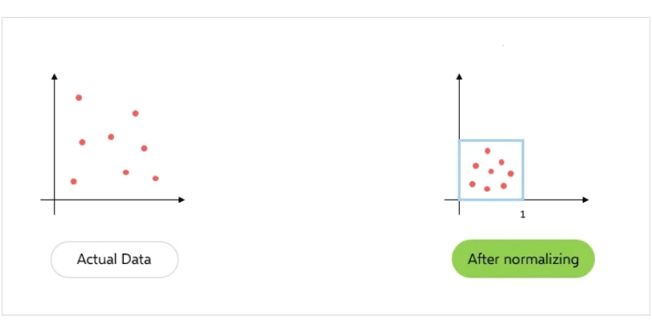

### How normalization help?

Check out the following image that explaining why input normalization helps gradient descent train faster and more stably in Deep Learning.

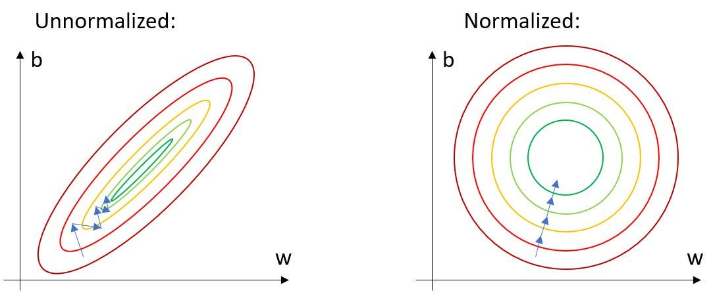

These contours represent the loss function.
- Outer red = high loss (bad)
- Inner green = low loss (good)
- Center = minimum loss (best weights)

Axes:

- w = one weight
- b = another parameter (bias / second weight)


The blue arrows show how gradient descent moves during training.

#### 3D Representation
in 3D space:
- x-axis = w
- y-axis = b
- z-axis = loss (high to low)

 You get a bowl-shaped surface.

 Contours are just: slices of equal height

>Its a same graph as that of gradient decent but in 3D space
>
>- for one trainable parameter (x) vs loss (Y) we get a 2D curve
>- for two trainable parameter (X, Y) vs loss (Z) we get a 3D bowl like shape


 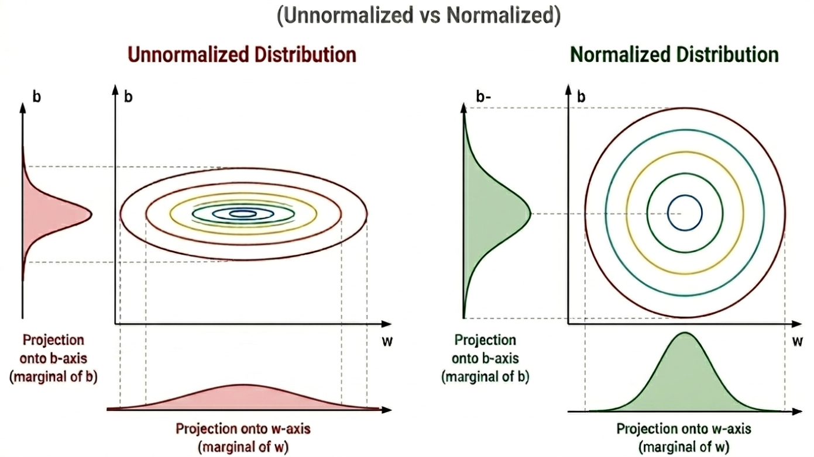

#### Left Side: Unnormalized Data

The contours are stretched like a long ellipse.

That shape happens because:

- One feature has much larger scale than another.
- Example:
    | Feature | Range       |
    | ------- | ----------- |
    | Age     | 0–100       |
    | Salary  | 0–1,000,000 |

    Salary dominates because its values are huge.

Because the loss surface is steep in one direction and shallow in another, Gradient descent becomes unstable. Instead of moving directly toward the minimum, it zig-zags.

So:

- Large updates happen along one axis
- Tiny updates happen along another

Result:

- Oscillation
- Slow convergence
- Harder optimization

> To solve this problem we can put the small learning rate as small learning rate resolve the oscitation, but it will make training slower

#### Right Side: Normalized Data

After normalization:

- features have similar scale
- usually mean ≈ 0
- variance ≈ 1

Now both features contribute more evenly.

The contours become circular.

Circular contours mean:

- curvature is similar in all directions
- gradients are balanced

Now gradient descent can move almost directly to the minimum.

So training becomes:

- faster
- smoother
- more stable

### Covariate Shift
Covariate shift happens when:

- the input data distribution changes
- but the relationship between input and output remains the same.

### Example:

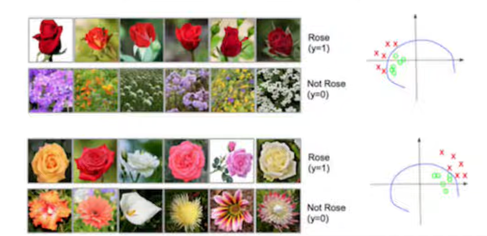

In above image we have train an CNN to differentiate between rose and other flowers

#### Top Section (Training Data) 
The model is trained on:

- Red roses → labeled as Rose (y=1)
- Purple/other flowers → labeled as Not Rose (y=0)

So the network learns a shortcut:

- “Red color strongly indicates rose.”

On the right-side graph:

- Red X = roses
- Green O = non-roses
- The curve = decision boundary learned by model

Since training data is biased:

- roses mostly appear red
- non-roses mostly are not red

the model separates classes mainly using color.

#### bottom section (Testing data)

Now during testing/inference:

- roses are no longer always red
- roses can be yellow, pink, white
- non-roses may also contain red/pink colors

So the input distribution changed.

Although The learned boundary still separates classes correctly there are chances of model getting confused.

The model becomes confused because:

- the features it relied on during training are no longer distributed the same way.

This is covariate shift.

### Internal Covariate Shift
Just like in covariate shift where the model get confused because its distribution changes, in internal covariate shift our neural network gets confused daring training because the distribution of a input of a nodes keeps on changing

This happens because:\
During neural network training, the distribution of activations inside hidden layers keeps changing because earlier layers continuously update their weights.

Suppose you have a deep network:

```
Layer1 ​→ Layer2 ​→ Layer3​
```
Now:

- Layer_2 learns using outputs from Layer_1
- Layer_3 learns using outputs from Layer_2

But during training:

- weights of Layer_1 keep changing every iteration

So outputs produced by Layer_1 also keep changing.

That means:

- the input distribution seen by Layer_2 is constantly shifting.

This shifting distribution is called internal Covariate Shift

### Solution = Normalization
with the help of normalization we can normalize the activation of each hidden layer so that there distribution will remains same throughout the training

Suppose you have a deep network:

```
Layer1 ​→ Layer2 ​→ Layer3​
```
Now:

- Layer_2 learns using normalized outputs from Layer_1
- Layer_3 learns using normalized outputs from Layer_2

during training:

- weights of Layer_1 keep changing every iteration

So outputs produced by Layer_1 also keep changing but since we are using normalization its distribution remains same.

That means:

- the input distribution seen by Layer_2 is same as previous one.

As a result the learning becomes stable and our neural network does not confused during training


[Go To Top](#content)

---
# Batch Normalization
Batch normalization (often called BatchNorm) is a technique used in deep learning to make neural networks train faster and more reliably.

The core idea is:\
Normalize the activations of each layer so they have a stable distribution during training.

must remember:
- we apply batch normalization with [mini batch gradient decent](#3-mini-batch-gradient-descent)
- we apply it layer by layer (it is not compulsory to apply batch norm to every layer)


in normal neural network
```
input ​→ ​z ​→  a ​→ next layer
```
- z = output of a node i.e $Z = \sum WX + b$
- a = activation function output

with batch Normalization

```
input ​→ ​z ​→ z_n ​→ a ​→ next layer
```
- z_n = normalized z

you can also implement 

```
input ​→ ​z ​→ a ​→ a_n ​→ next layer
```
- a_n = normalized a

### Now to normalize:

formula

$$Z_n = \frac{Z - \mu}{\sigma}$$

here:
- $\mu$ = mean
- $\sigma$ = standard deviation

since we are using [mini batch gradient decent](#3-mini-batch-gradient-descent) will be dividing our dataset into multiple mini batches, we pass one batch at a time and compute the activation for each datapoint and then use all those activation to compute mean

### Example:

- consider a neural network


- let say we have 100 datapoints
    ```
    [(1, 1), (2, 2), (3, 3), ....., (100, 100)]
    ```
- batch size is 3, then our mini batches become
    ```
    [(1, 1), (2, 2), (3, 3)],
    [(4, 4), (5, 5), (6, 6)],
    :
    :
    [(98, 98), (99, 99), (100, 100)]
    ```
- now we pass the first batch into the neural network and find the activations of node `h1` and `h2` for this batch 

    ```
    h1 = [1.1, 4.2, 3.3],
    h2 = [4.4, 7.5, 6.6],
    ```

    >Note:\
    >instead of passing each datapoint one by one and directly getting the final output we first calculate the activation of a layer for each node in a batch 
- now we use this activation to compute the mean
    ```
    mean_h1 = 1.1 + 4.2 + 3.3 / 3 = 2.8
    mean_h2 = 4.4 + 7.5 + 6.6 / 3 = 6.1
    ```
- similarly calculate standard deviation:

    formula:

    $$\sigma = \sqrt{\frac{\sum Z - \mu}{n}}$$

    Here
    - $Z$ = activation
    - $\mu$ = mean
    - $n$ = no. of datapoints

    ```
    std_h1 = 0.44
    std_h2 = 0.44
    ```
- since we now have mean and standard deviation we can easily calculate normalized activation

    formula

    $$H_n = \frac{H - \mu}{\sigma}$$

    here:
    - $\mu$ = mean
    - $\sigma$ = standard deviation

    ```
    # for first datapoint H1 = 1.1
    H1_n = 1.1 - 2.8 / 0.44 = -3.86
    
    # for second datapoint H1 = 4.2
    H1_n = 4.2 - 2.8 / 0.44 = 3.18
    
    # for third datapoint H1 = 3.3
    H1_n = 3.3 - 2.8 / 0.44 = 1.13
    ```

### Error handling
there is a chances of standard deviation becoming zero, and if that happen then according to formula:

$$Z_n = \frac{Z - \mu}{\sigma}$$

denominator becomes zero and will throw and error.

Therefore to prevent this from happing we update the formula as:

$$Z_n = \frac{Z - \mu}{\sigma + E}$$

- $E$ = error term to prevent zero in denominator

### Scale and Shift
in most od the cases some of the nodes does't what the normalized input in that case we want the flexibility so that our model can decide whether to apply normalization or not

to do that we simply update our output as follow:

$$Z_{nb} = \lambda Z_n + \beta$$

where:
- $Z_{nb}$ = actual normalized output of any node
- $Z_n$ = normalized value of activation
- $\lambda , \beta$ = tradable parameter

if our model doesn't want normalized parameter it will set the value of $\lambda = \sigma + E$ and $\beta = \mu$ which will cancel out the normalization

Example:

$$Z_{nb} = \lambda Z_n + \beta$$

$$Z_{nb} = (\sigma + E) \left( \frac{Z - \mu}{\sigma + E} \right)+ \mu$$

$$Z_{nb} =  \left( Z - \mu \right)+ \mu$$
$$Z_{nb} =   Z $$

### How to predict / test
To perform normalization on activation we need mean and standard deviation which we calculate with the help of mini batch gradient decent, as we pass the whole batch instead of single instance of data

But at the time of prediction or testing we are not passing a batch anymore we are only providing a single instance of data, therefore we are no more able to calculate the mean and standard deviation like we used to do at the time of training

To solve this problem we used exponential moving average, you can think of it as using the last value of mean and standard deviation at the time of prediction or testing 

#### Mathematical representation of exponential moving average

$$v_t = \beta v_{t-1} + (1-\beta)x_t$$

Where:
- $v_t$ = new moving average
- $v_{t-1}$ = previous average
- $x_t$ = current value
- $\beta$ = smoothing factor

#### Intuition

Suppose:
- $β=0.9$

Then:

- 90% weight comes from history
- 10% from current batch

Large β:

- smoother
- slower updates

Small β:

- reacts faster
- noisier

[Go To Top](#content)

---
# Exponentially Weighted Moving Average (EWMA)
An Exponentially Weighted Moving Average (EWMA) is a technique used to smooth a sequence of values (such as stock prices, loss values during training, network traffic, etc.) by giving more importance to recent observations and less importance to older observations.

### Formula
For a sequence $x_1, x_2, x_3, ....$: 

$$v_t = \beta v_{t-1} + (1-\beta)x_t$$

Where:
- $v_t$ = new moving average
- $v_{t-1}$ = previous average
- $x_t$ = current value
- $\beta$ = smoothing factor


### Why "Exponentially Weighted"?
Expand the recurrence:

$$V_t​=(1−β)xt​+β(1−β)xt−1​+β2(1−β)xt−2​+β3(1−β)xt−3​+⋯$$

Notice the weights:

$$(1−β), β(1−β), β2(1−β), β3(1−β),…$$

These decrease exponentially as we move further into the past.

For example, if β=0.9:

| Observation | Weight |
| ----------- | ------ |
| Current     | 0.1    |
| 1 step old  | 0.09   |
| 2 steps old | 0.081  |
| 3 steps old | 0.0729 |

Older values never completely disappear, but their influence becomes very small.

### Effect of β

β is the memory factor (or smoothing factor) in an Exponentially Weighted Moving Average.

It controls how much of the past you keep versus how much you listen to the new observation.

In the formula:

$$v_t = \beta v_{t-1} + (1-\beta)x_t$$

- β = weight given to the past average
- 1−β = weight given to the new observation

β = 0.99
- Extremely smooth
- Reacts very slowly
- This means:
    - Keep 99% of the previous average.
    - Use only 1% of the new data.

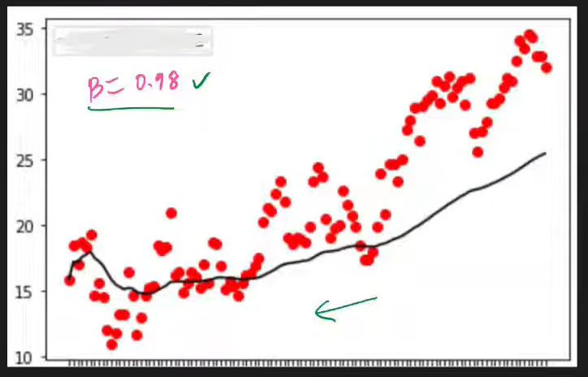


β = 0.9
- Very smooth
- Remembers a long history
- Slow to react to sudden changes
- This means:
    - Keep 90% of the previous average.
    - Use only 10% of the new data.


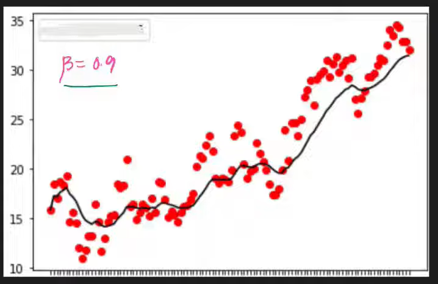

β = 0.5
- Less smooth
- Reacts faster to changes
- This means:
    - Keep 50% of the previous average.
    - Use only 50% of the new data.

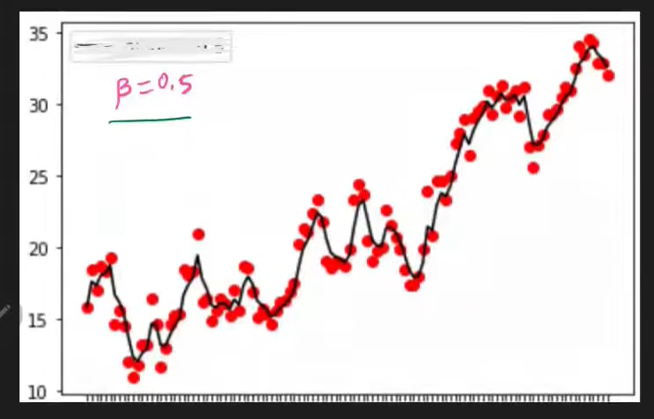

β = 0.1
- Very responsive — reacts almost immediately to new observations.
- Short memory — older values lose influence very quickly.
- Not smooth — more sensitive to noise and sudden fluctuations.
- This means:
    - Keep only 10% of the previous average.
    - Use 90% of the new data.

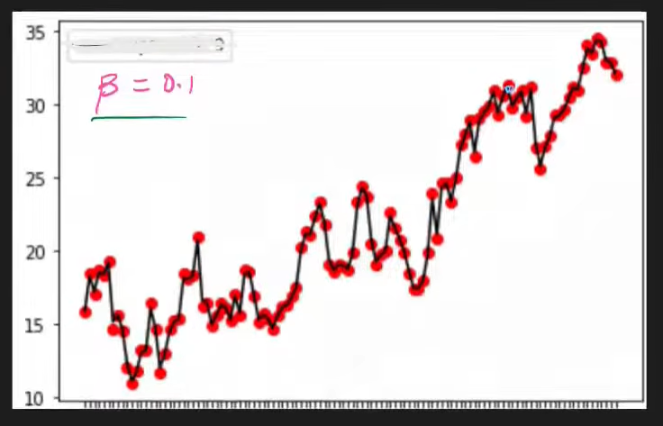


A useful rule of thumb:

$$\text{Effective window size} ≈ \frac{1}{1-\beta}$$

So:
- β = 0.9⇒ about 10 observations
- β = 0.99⇒ about 100 observations
- β = 0.999⇒ about 1000 observations


### Example
Suppose the temperatures for 5 days are:

| Day | Temperature (°C) |
| --- | ---------------- |
| 1   | 30               |
| 2   | 32               |
| 3   | 31               |
| 4   | 40               |
| 5   | 42               |

Let's use β = 0.8 and initialize the first average as the first temperature:

$$V_1 = 30$$

Now calculate the EWMA:

- Day 2

$$V_2​=0.8(30)+0.2(32)$$

$$V_2​=24+6.4=30.4$$

- Day 3

$$V_3​=0.8(30.4)+0.2(31)$$

$$V_3​=24.32+6.2=30.52$$

- Day 4

$$V_4​=0.8(30.52)+0.2(40)$$

$$V_4​=24.416+8=32.416$$

- Day 5

$$V_5​=0.8(32.416)+0.2(42)$$

$$V_5​=25.9328+8.4=34.3328$$


Result:
| Day | Actual Temp | EWMA  |
| --- | ----------- | ----- |
| 1   | 30          | 30    |
| 2   | 32          | 30.4  |
| 3   | 31          | 30.52 |
| 4   | 40          | 32.42 |
| 5   | 42          | 34.33 |

Notice what happened:
- The actual temperature jumped from 31 → 40 → 42.
- The EWMA moved more slowly: 30.52 → 32.42 → 34.33.

This removes short-term noise and reveals the underlying trend.


[Go To Top](#content)

---

# Optimizers
In Deep Learning (DL), an optimizer is an algorithm used to update the weights (parameters) of a neural network during training so that the model’s predictions become more accurate.

> When a neural network makes a prediction, it usually has some error (loss). The optimizer helps the model reduce this error step by step by adjusting weights in the right direction.

### Example you already know:

Gradient Descent
- Basic optimizer
- Updates weights in the direction of decreasing loss
- Types:
    - Batch Gradient Descent
    - Stochastic Gradient Descent (SGD)
    - Mini-batch Gradient Descent


### Convex vs non-convex Optimization

**Convex:**

- Has one global minimum.
- Any local minimum is also the global minimum.
- Gradient Descent is guaranteed to reach the optimal solution (assuming a suitable learning rate).

> No matter where you start, following the gradient downhill eventually leads to the same best solution.

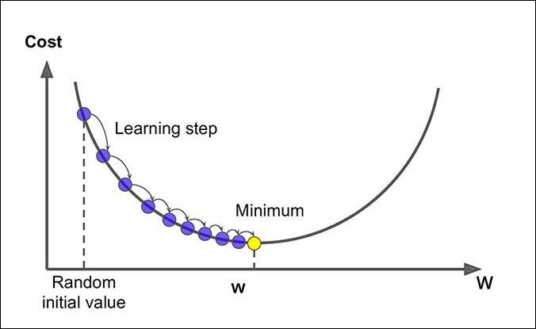

**Non-convex:**
- Can have many local minima.
- Can have saddle points.
- Gradient Descent is not guaranteed to find the global minimum.

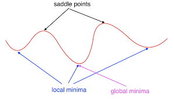


### Other Problem with Gradient Decent

1. **Choosing the learning rate is difficult**

    - Too small: Training becomes very slow.
    - Too large: The algorithm may overshoot the minimum and fail to converge.
2. **Same learning rate for all parameters**

    Basic Gradient Descent applies a single learning rate to every weight, even though different parameters may need different update sizes.

3. **Gets stuck in local minima**

    For non-convex loss functions (common in deep learning), the algorithm can converge to a local minimum instead of the global minimum.

4. **Saddle points**

    A saddle point is a region where gradients are close to zero, but the point is not an optimum. Training can slow down significantly around these areas.

### Solution

Because of all this problem we face problems like:
- Slow learning
- less accuracy / less optimal network

therefore we need more / new optimizer to solve this kind of problems

[Go To Top](#content)

---
# Momentum Optimizer
Momentum is an improvement over basic Gradient Descent that helps the optimizer move faster in the correct direction and reduce useless zig-zagging.

### Idea of Momentum

Instead of using only the current gradient, Momentum also remembers previous updates.

Think of pushing a shopping cart:
- First push → slow movement.
- Keep pushing in the same direction → speed increases.
- The cart gains momentum.

Similarly, if gradients keep pointing in roughly the same direction, Momentum accumulates speed and moves faster.

- Without momentum:

    ```
    step step step step
    ```
- With momentum:
    ```
    step → bigger step → bigger step
    ```

### Mathematically

$$W_{t} = W_{t-1} + V_t$$

where
- $W_t$ = new weight
- $W_{t-1}$ = old weight
- v = velocity (accumulated momentum)

$$V_t = \beta V_{t-1} - η \frac{\partial L}{\partial W_{t-1}}$$

here
- η = learning rate
- L = loss
- β = momentum coefficient (usually 0.9)
- $\frac{\partial L}{\partial W_{t-1}}$ = gradient

As you can see in $V_t$ we have $\beta V_{t-1}$, i.e, we are using previous velocity to calculate new velocity 

this method uses [Exponentially weighted moving average](#exponentially-weighted-moving-average-ewma) technique to use the previous velocity for computing the updated velocity


### Effect of $\beta$

> you can refer [Exponentially weighted moving average](#exponentially-weighted-moving-average-ewma) to understand how $\beta$ will affect the new velocity

$\beta$ is a decaying factor that decide how pervious velocity affect the new velocity

#### Example:

suppose you have 
```
v1, v2, v3, v4, ....,v8, v9
```
now to compute `v10` the affect of `v9` and `v8` will be high compare to `v1` and `v2`

and how much will they affect will be decide by $\beta$

Generally new velocity is average of pervious $1/(1-\beta)$ velocities

So:
- β = 0.9 ⇒ average of 10 pervious velocities
- β = 0.99 ⇒ average of 100 pervious velocities
- β = 0.999 ⇒ average of 1000 pervious velocities


if $\beta$ became 0 then $\beta V_{t-1}$ became 0 as a result:

$$V_t = \left[ 0 \times V_{t-1} \right] - η \frac{\partial L}{\partial W_{t-1}}$$

$$V_t = 0 - η \frac{\partial L}{\partial W_{t-1}}$$

$$V_t = - η \frac{\partial L}{\partial W_{t-1}}$$

As 

$$W_{t} = W_{t-1} + V_t$$

$$W_{t} = W_{t-1} - η \frac{\partial L}{\partial W_{t-1}}$$

this is our simple gradient decent

### Affect of momentum on learning

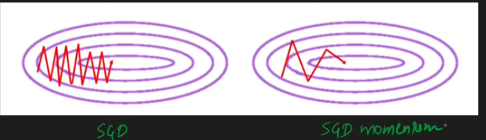

as you can see in above image in case of momentum we are moving with high velocity towards minima in horizontal direction, as SGD (siple gradient decent) constantly suggest to move in that direction

#### momentum help in escaping:
- Shallow minima
- Small bumps in the loss landscape
- Noisy local traps
- Saddle points
- Narrow valleys where plain gradient descent moves very slowly

Momentum accumulates velocity from earlier updates, allowing it to pass through these regions more quickly.

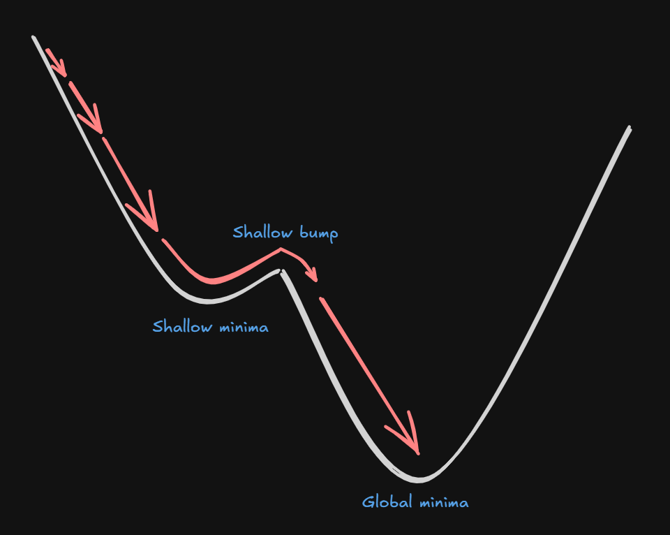

If you're in a deep, wide local minimum and the gradients around it point inward

Momentum eventually decreases because gradients become near zero and the optimizer settles there.

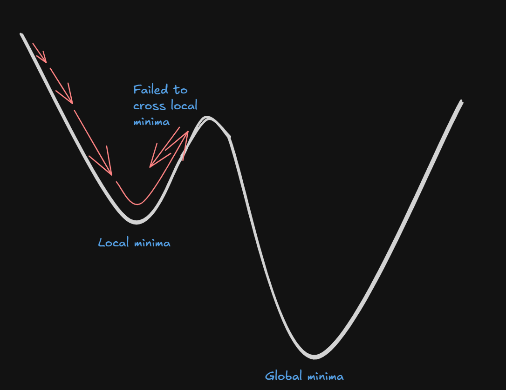

#### Extra computation / Oscillation PRoblem
Although momentum helps us to reach the minima faster but in most of the cases because of accumulated velocity we miss the minima and oscillate before settling in

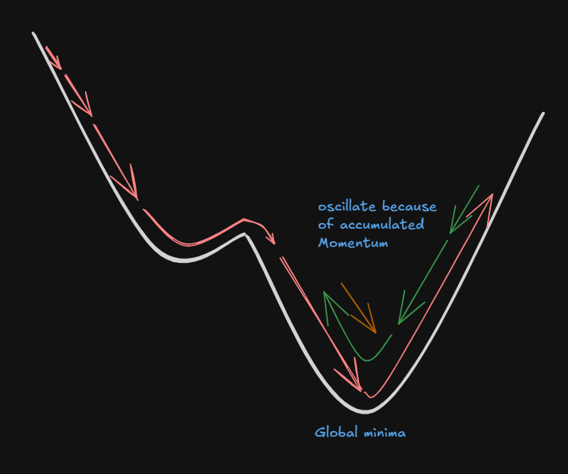

Note: once overshoot we go up the curve until gradient overcome the momentum, also momentum start to decreases because of opposite gradient


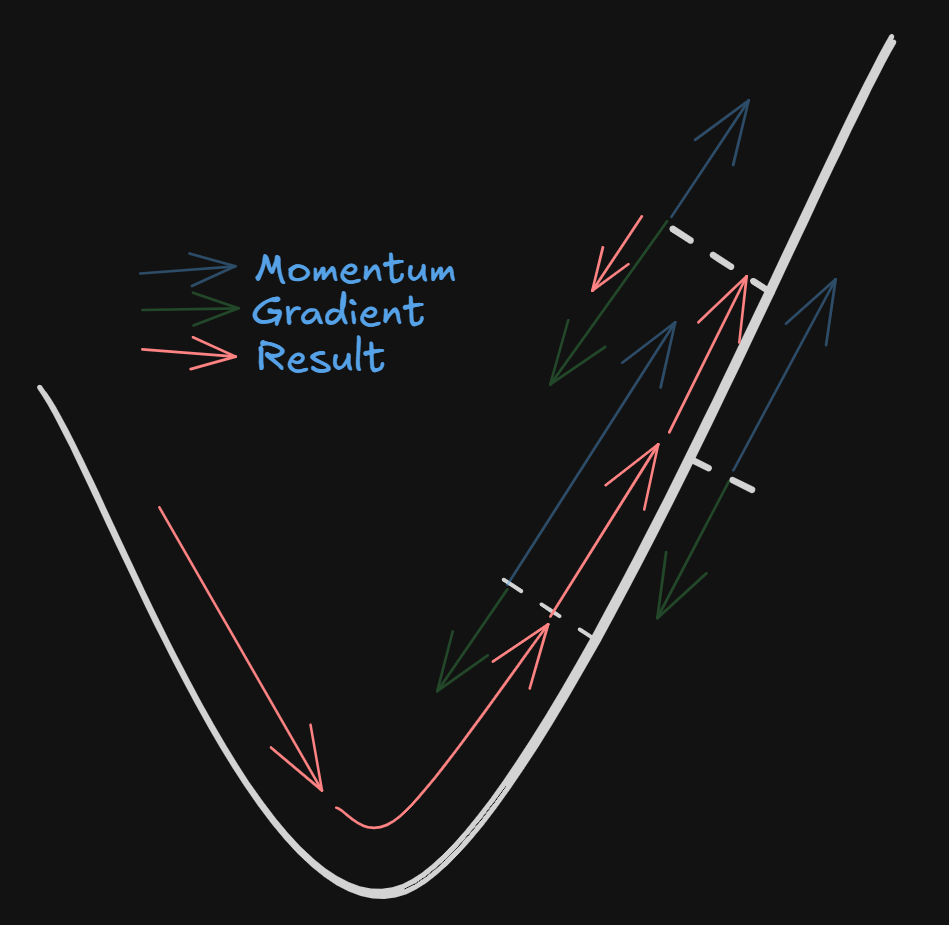

> value of $\beta$ is responsibly for amount of oscitation occurring during training, as $\beta$ decide how much previous velocity to accumulate
> - high $\beta$ = high oscitation
> - low $\beta$ = low oscitation

[Go To Top](#content)

---
# NAG - Nesterov Accelerated Gradient
Nesterov Accelerated Gradient (NAG) is an optimization algorithm used to train machine learning and deep learning models.

It is an improvement over Momentum Gradient Descent, designed to reduce oscillations and speed up convergence.

### The Problem with Momentum
momentum helps us to reach the minima faster but in most of the cases because of accumulated velocity we miss the minima and oscillate before settling in

Imagine you're rolling a ball downhill. Because of momentum, the ball may already be moving fast toward a region where the gradient changes direction. Momentum doesn't "see" this upcoming change and may overshoot.

### How NAG solve this?
in momentum:
- next jump = previous velocity + gradient at that point
- because of this we take one single jump

In NAG:
- we first find out what is the next jump with current velocity
- then from that point we calculate the gradient at that next point
- now with previous velocity and the gradient at that next point we make our jump

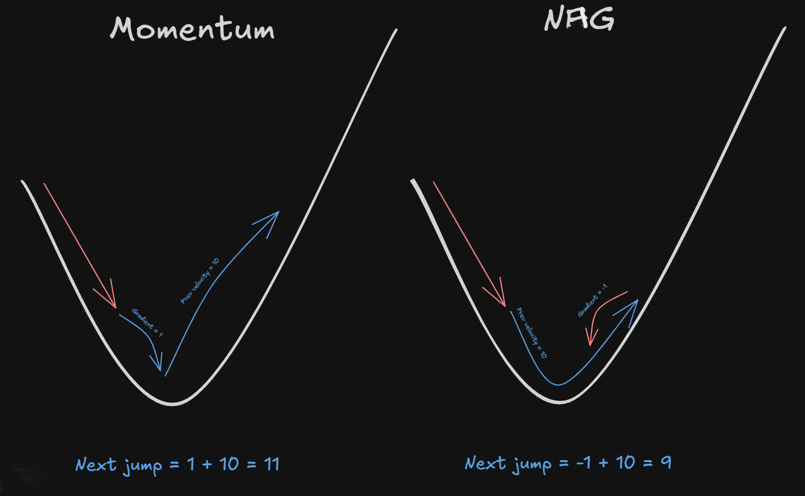

### Momentum mathematically
$$W_{t} = W_{t-1} + V_t$$

where
- $W_t$ = updated weight
- $W_{t-1}$ = current weight
- v = velocity (accumulated momentum)

$$V_t = \beta V_{t-1} - η \frac{\partial L}{\partial W_{t-1}}$$

here
- η = learning rate
- L = loss
- β = momentum coefficient (usually 0.9)
- $\frac{\partial L}{\partial W_{t-1}}$ = gradient at current weight

### NAG Mathematically

find Look-Ahead Position

$$w_{la} = w_t -\beta v_{t-1} ------ (i)$$

where:
- $w_t$ = current weights
- $v_{t-1}$ = previous velocity (momentum)
- $\beta$ = momentum coefficient (e.g. 0.9)
- $w_{la}$ = look-ahead weight / point.

Computing Gradient at the Look-Ahead Point

$$η\frac{\partial L}{\partial w_{la}}$$

>Note: The gradient is not evaluated at $w_t$, instead at $w_{la}$ 

Final velocity

$$v_t = \beta v_{t - 1} + η \frac{\partial L}{\partial w_{la}}$$

$$\text{from i we have}$$

$$\beta v_{t-1}  = w_t - w_{la}$$

$$\text{Therefore}$$

$$v_t = (w_t - w_{la}) + η \frac{\partial L}{\partial w_{la}}$$


Update the Weights


$$w_{t+1} = w_{t} + v_t$$

<!-- $$v_t = (w_{t} - w_{la}) + η \frac{\partial w_{la}}{\partial L}$$ -->


[Go To Top](#content)

---


