<h3 style="text-align: center;">RNN - Recurrent Neural Network </h3>

---

# Content
1. [Introduction](#introduction)
2. [Why to use RNN over ANN](#why-to-use-rnn-over-ann)
3. [Zero Padding Problem](#zero-padding)
4. [[ timestep, input_feature ] Representation](#timestep-input_feature)
5. [Architecture of RNN](#architecture-of-rnn)
6. [Types of RNN ](#types-of-rnn)
7. [Backpropagation In RNN](#backpropagation-in-rnn)
8. [Problems With RNN](#problems-with-rnn)
9. [LSTM - Long Short Term Memory ](#lstm---long-short-term-memory)
    - [Forget Gate](#forget-gate)
    - [Input Gate](#input-gate)
    - [Output Gate](#output-gate)

---
# Introduction
RNN (Recurrent Neural Network) is a type of neural network designed to process sequential data, where the order of inputs matters.

Sequential data is data where order matters. The meaning of the data changes if you shuffle it. Each element depends on its position in a sequence and/or previous elements.

### Example of Sequential data

1. **Text (language)**
    
    - Sentence: `“I love AI”`
    - If you shuffle it: `“AI love I”` → meaning breaks completely

2. **Time series data**

    - Example: stock price over days

        | Day | Price |
        | --- | ----- |
        | 1   | 100   |
        | 2   | 105   |
        | 3   | 102   |
    - Order matters because tomorrow depends on today.

3. **Audio / Speech**

    - Sound is a wave over time.
    - If you reorder audio samples, you don’t get speech anymore—you get noise.

4. **Video**

    - Video = sequence of frames.
    - Frame 1 → Frame 2 → Frame 3
    - Changing order breaks motion logic.


### Memory in RNN via Hidden State

RNNs have a concept of “memory” through a hidden state. This hidden state is a vector that carries information from previous time steps to the current step.

At each step, the model updates this hidden state using the current input and the previous hidden state. Because of this, earlier information in the sequence influences later outputs.

Example sentence: `“I love AI”`
1. Input: `“I”`\
    → model processes it\
    → creates hidden state (context so far)
2. Input: `“love”`\
→ uses “love” + previous hidden state (“I” context)

3. Input: `“AI”`\
→ uses “AI” + updated hidden state (“I love” context)

Note: this is not true memory like storing facts. It is a compressed representation of past information, and older details can get weaker as the sequence becomes longer.


[Go To Top](#content)

---

# Why to use RNN over ANN

the problem of ANN is that it only accept the fixed size input

lets supposes you have three sentence:

- "Hey my name is abc"
- "I love AI"
- "India won the match"

now we vectorize this sentence using one hot encoding

- there are total 12 different word in  those three sentence
- we separate out each word to perform one hot encoding to compute the input vector for that respective word
    - "hey" = $[1, 0, 0, ..., 0]_{1\times12}$
    - "my" = $[0, 1, 0, ..., 0]_{1\times12}$
    - "name" = $[0, 0, 1, ..., 0]_{1\times12}$
    - "match" = $[0, 0, 0, ..., 1]_{1\times12}$
- now sentence "Hey my name is abc" can be represented as:

|Word| Hey | my | name | is | abc |
|---|--- | --- | --- | --- | --- |
|**input vectors**| $[1, 0, 0, ..., 0]_{1\times12}$| $[0, 1, 0, ..., 0]_{1\times12}$| $[0, 0, 1, ..., 0]_{1\times12}$|$[0, 0, 0, 1 ..., 0]_{1\times12}$ | $[0, 0, 0, 0, 1..., 0]_{1\times12}$|
- similarly we can do for other two sentence as well
- Also understand that:\
number of words per sentence = number of input vectors for that sentence
- each input vector provide n input variable where n is size of the input vector

once the vectorization is done we feed the table to an ANN to predict an output

but the problem is:
- sentence 1 = "Hey my name is abc" = 5 words = 5 input vectors = 60 (5 x 12) input variable
- sentence 2 = "I love AI" = 3 words = 3 input vectors = 36 (3 x 12) input variables
- sentence 3 = "India won the match" = 4 words = 4 input vectors = 48 (4 x 12) input variable

This creates the problem as ANN only accept the fixed number input variables but with sequential data we didn't have  fixed number of input


[Go To Top](#content)

---

# Zero Padding
to solve this dynamic input size problem with sequential data we can use the zero padding method

lets suppose input vectors of:
- sentence a (3 words) = [1, 0, 0, 0, 0] [0, 1, 0, 0, 0] [0, 0, 1, 0, 0]
- sentence b (1 words) = [0, 0, 0, 1, 0]
- sentence c (2 words) =  [0, 0, 0, 1, 0] [0, 1, 0, 0, 0] 

as sentence a is biggest here with 3 input vectors, our ANN will need at least 3 input node to process them

whereas sentence b has only one input vector, but we have 3 input node in our ANN

therefore we provide this single input vector as a input to any of the input node while other two accepts 0 vector as a input

zero vector = vector having all zero init and having same size as that of other input vector

as zero vector will have all zero present inside it will not contribute in prediction at all, and is only present to solve that dynamic input size problem 


Example:

- sentence a
    ```
    input vector = v1, v2, v3

    input to ANN = v1, v2, v3
    ```

- sentence b
    ```
    input vector = v1

    input to ANN = v1, 0v, 0v
    ```

- sentence a
    ```
    input vector = v1, v2

    input to ANN = v1, v2, 0v
    ```

### Problem?

lets suppose we have large dataset of text having approximately 10,000 unique word throughout the dataset

then our single input vector (using one hot encoding) will be like:

$$[1, 0, 0, ...., 0]_{1\times10,000}$$

as you can see the size of input vector is 10,000

lets suppose the largest sentence inside the dataset is of 10 words, suggesting that there will be 10 input nodes

therefore number of input variable will be: 10,000 x 10 = 1,00,000

lets suppose you have smallest sentence is of 4 words and on an average there are only 6-7 words per sentence

now:
- for smallest word we have 6 zero vector of size 1x10,000\
number of input variable not contributing due to zero vector = 6 x 10,000 = 60,000
- for average size sentence we have 4-3 zero vector of size 1x10,000\
number of input variable not contributing due to zero vector = (3 to 4) x 10,000 = 30,000 - 40,000

this numbers are too high for any dataset, around 30% - 40% input variable are 0 in average case whereas in worst case 60% input variable are 0

also having zero as a input variable stops the model form learning. as gradient depends on this input variable and having zero as a input makes the gradient zero as well

- Gradient w.r.t weights:

$$\frac{\partial L}{\partial w} = x \times \frac{\partial L}{\partial z}$$

- But since x = 0:

$$\frac{\partial L}{\partial w} = 0$$

- now according to gradient decent:

$$w_{new} = w_{old}- \alpha  \frac{\partial L}{\partial w}$$

$$w_{new} = w_{old}$$


Meaning:
- No weight update comes from padded positions
- Model literally learns nothing from them
- So padding = dead zones for learning


Mathematically those zeros don’t contribute at all but:
- they still go through matrix multiplications
- still consume compute and memory bandwidth
- as a result we waste computation

so in our case we have around 30% - 60% of zero input variable which indicate high dead zones for learning and hugh unnessery computational cost

### Problem 2

all the above analysis works in a ideal case where we are assuming all the input text are equal to or less than that of largest sentence present inside the dataset used for training

but at the time of testing we might encounter a bigger sentence that that of training time

| dataset | larges sentence |
| --- | --- |
|training | 10 words |
| testing | 15 words |

As during training we have largest sentence with 10 words there must be 10 input vector in our model, even with the zero padding we can only accept at max 10 input vector

but in the testing we have a word with 15 words i.e, 15 input vectors and our model can only take 10 input vector 

> in production a user might pass even larger word on which we have no control 


[Go To Top](#content)

---
# [timestep, input_feature]

It describes the shape (structure) of input data for an RNN.

### 1. Timestep = “how many steps in the sequence”

This is the length of the sequence.

Example:

- Sentence: “I love AI”
- Timesteps = 3 (I → love → AI)

### 2. Input_feature = “what each step contains”
This is the size of each input at one timestep.

> It is NOT “number of words”.

It is the vector representation of each word.

Example:\
Each word is converted into numbers (embedding):

- “I” → [0.2, 0.8, 0.1]
- “love” → [0.5, 0.9, 0.3]
- “AI” → [0.7, 0.4, 0.6]

Here:
- input_feature = 3 (because each word is a 3D vector)

### Example 

consider a dataset:

| no. | text|
|--- | ---|
|1. | `movie` `was` `good`|
|2. | movie was `not` good | 

as we have 4 unique in our dataset (movie, was, good, not) our vocabulary size of 4

we can use one hot encoding to convert each word into their respective vector representation

word | vector representation
--- |---
movie | [1, 0, 0, 0]
was | [0, 1, 0, 0]
good | [0, 0, 1, 0]
not | [0, 0, 0, 1]

now as each vector is of 4 size `input_feature = 4`

Therefore

| no. | text| vector form | length / timestep  | [timestep, input_feature] |
|--- | ---| --- | --- | --- |
|1. | `movie` `was` `good`| [[1, 0, 0, 0]  [0, 1, 0, 0] [0, 0, 1, 0]] | 3 | [3, 4]
|2. | movie was `not` good | [[1, 0, 0, 0] [0, 1, 0, 0] [0, 0, 0, 1] [0, 0, 1, 0]] | 4 | [4, 4]


> you can think of [timestep, input_feature] as dimension of vector form of that respective sentence

so for sentence `movie was good` we provide a array of size 3x4 into our model to process


[Go To Top](#content)

---
# Architecture of RNN

in ANN whatever input we provide it flows only in forward direction to compute an output

```
input layer -> hidden layer -> output layer
```

but in RNN the output of each hidden layer is pass again into that hidden layer for future computation 

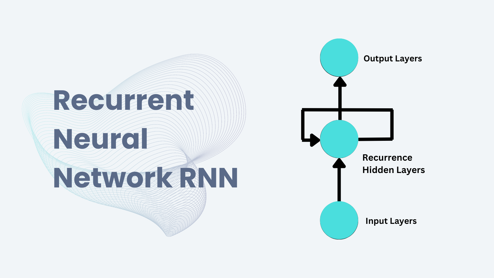


### Example

consider a simple network:

```
input layer → single hidden layer → output layer
```

sentence `"movie was good"`

so when we pass this sentence inside a model,  it process each word at a time i.e, 
- for t = 1 → `"movie"`
- for t = 2 → `"was"`
- for t = 3 → `"good"`

whenever we process any word we use output of hidden layer from previous timestamp in current timestamp

> i.e, using hidden layer output at t = 1 as a input for hidden layer when t = 2

input = `"movie"`
```
"movie" vector → input layer → hidden layer → hidden layer output for word "movie"
```
input = `"was"`
```
                    hidden layer output for word "movie"
                                 ↓
"was" vector → input layer → hidden layer → hidden layer output for word "was"                  
```
input = `"good"`
```
                        hidden layer output for word "was" 
                                 ↓
"good" vector → input layer → hidden layer → output layer → output
```

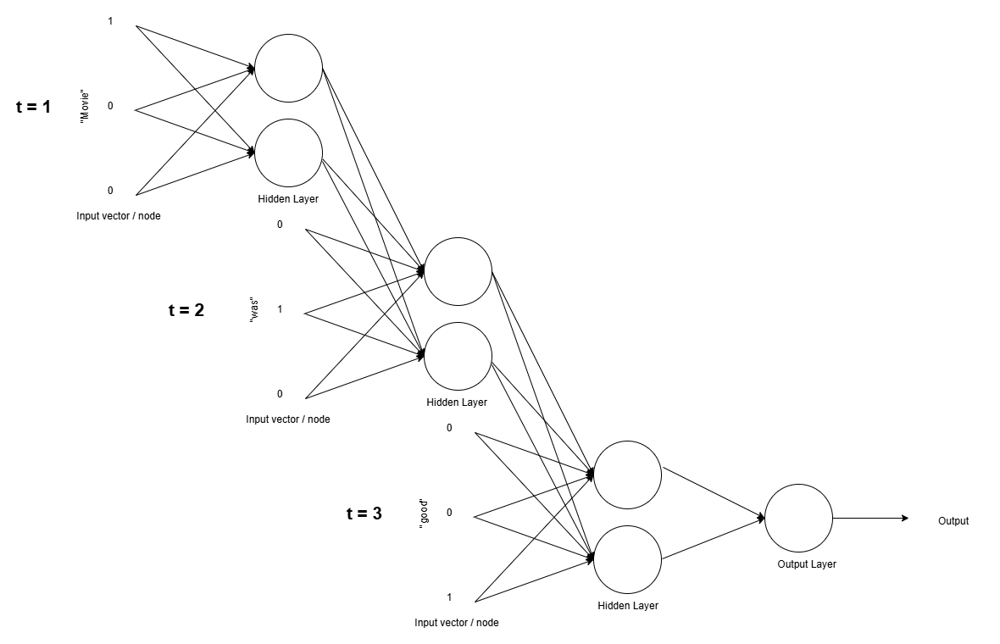

in above image you can see how exactly the output of hidden layer from previous timestamp is passed as input into the hidden layer of next timestamp

for t = 1 (first pass) we provide a default input (all 0 or random values) in place of previous hidden layer output


for t = 1 → input = `"movie"`
```
                          random values / all 0
                                   ↓
"movie" vector → input layer → hidden layer → hidden layer output for word "movie"
```
The Actual flow

```
                   default      "was" vector     "good" vector 
                      ↓                ↓            ↓
"movie" vector → hidden layer → hidden layer → hidden layer → output
```

so you can think of it as a loop that accept the initial word compute the output of hodden layer, loop back to accept the second word and again compute the output with second word and output of previous iteration, and repeat until all the words from a sentence gets completed

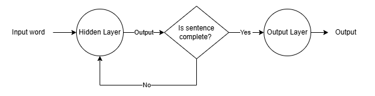

[Go To Top](#content)

---
# Types of RNN 

There are basically 4 types of different RNN based on their architecture

### 1. Many to one

- input = sequential data
- output = non sequential (scaler value like integer or number)

in this type we provide a sequential data as a input to model and in return model gives out a scaler output

Example: sentiment analysis
- for input we provide a sentence (sequence of words)
- model output:
    - 0 = sad
    - 1 = happy
    - 2 = normal\
    etc...

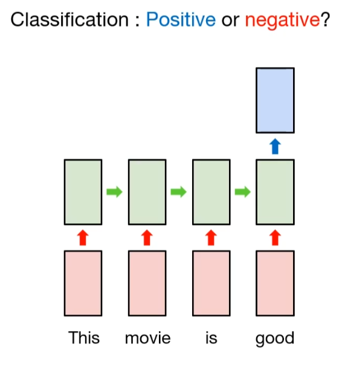

from this image we can see that we are providing the multiple input to our model, whereas the model is returning the single scaler output

### 2. One to many

- input = non sequential data
- output = sequential

in this type we provide a non sequential data as a input to model and in return model gives out a sequential output

Example: Image to text
- for input we provide a image (a metric that carry a hex code of pixel)
- for output we get textual info (sequence of words) for that image 

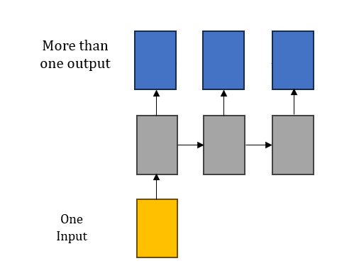

from this image we can see that we are providing the single input to our model, whereas the model is returning the multiple output which can be consider as sequence of output

### 3. Many to many

- input = sequential data
- output = also sequential

in this type we provide a sequential data as a input to model and model also return the sequential output

> also known as sequence to sequence model

#### Type:
1. **same length many to many:**
    - size of input sequence = size of output sequence  
    - Example: POS Tagging (Part-of-Speech tagging)
        - Input: `"I love pizza"`
        - output: `PRON VERB NOUN`

        Each word gets a label → output length = input length. 

    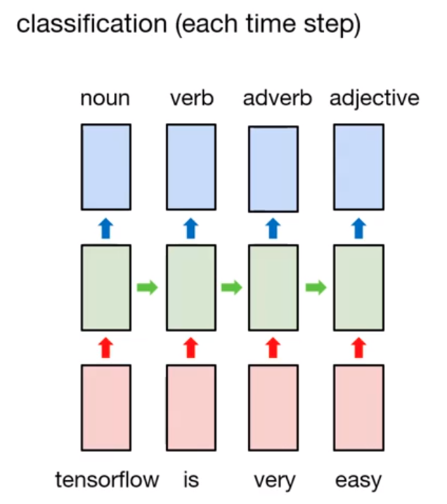

2. **variable length many to many:**
    - size of input sequence != size of output sequence  
    - Example 1: Machine Translation
        - Input (English — variable length): `“I eat rice”`
        - Output (French — variable length): `“Je mange du riz”`

    - Example 2: Text Summarization
        - Input (long paragraph): `“Artificial intelligence is transforming industries...”`
        - Output (short summary): `“AI is changing industries”`

    - Example 3: Speech-to-Text (frame → words)
        - Input (Audio is split frames): `frame1, frame2, frame3, ..., frameN`
        - Output (text): `"I need help"`
    
    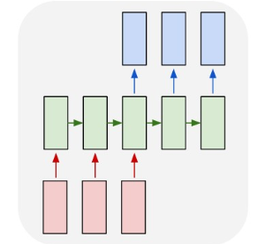

### 4. One to one

- input = non sequential data
- output = also non sequential

in this type we provide a non sequential data as a input to model and model also return the non sequential output

> Technically this is not a RNN, this is just a simple neural network like ANN or CNN

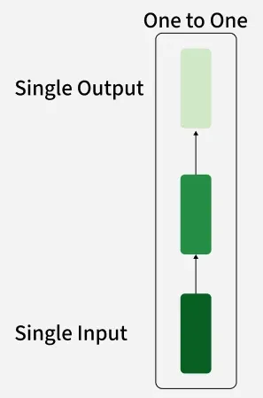

as you can for given input model provides an output

[Go To Top](#content)

---
# Backpropagation In RNN

consider a RNN

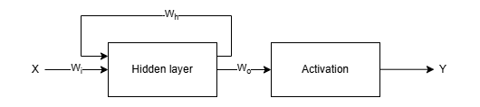

here:
- $X$ = input
- $Y$ = models output
- $W_i$ = weight between input and hidden layer 
- $W_o$ = weight between hidden and output layer 
- $W_h$ = weight between hidden layer for looping back


Now for input: `"i love AI"`

vector format: `[[1, 0, 0] [0, 1, 0] [0, 0, 1]]`

here: 
- $X_1$ = [1, 0, 0]
- $X_2$ = [0, 1, 0]
- $X_3$ = [0, 0, 1]

therefore the forward propagation is like:

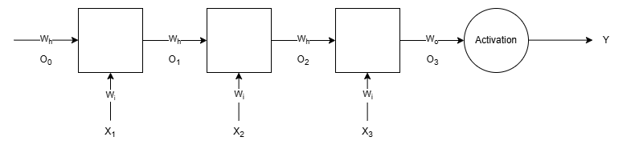

here:
- $O_0$ = default input (all zero) for hidden layer
- $O_1$ = hidden layer output for $X_1$
- $O_2$ = hidden layer output for $X_2$
- $O_3$ = hidden layer output for $X_3$

so in order to minimize the error we have to find the optimal value of $W_i$, $W_o$ and $W_h$ so that minimize the loss

### According to gradient decent:

$$W_{new} = W_{old} - η \frac{\partial L}{\partial W_{old}}$$


Loss function:

$$L = f(Y)$$


loss function is a function that takes model output as a input and compare it with the actual answer and compute the error, therefore we can say that loss function is a function of Y (models output) that returns an error 

now in order to solve that gradient decent to update the weights we just have to figure out how to compute those gradient / differentiation


To do that we first find the dependency of loss $L$ with respect to $W_i$, $W_o$ and $W_h$

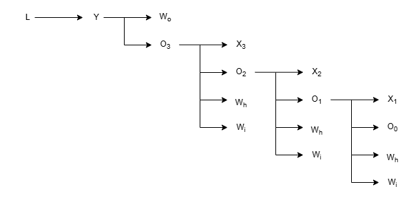

#### for $W_o$ 

$${W_{o}}^l = W_{o} - η \frac{\partial L}{\partial W_{o}}$$

now relation between $L$ and $W_o$

```
L -> Y -> W_o
```

> L is a function of Y and Y is a function of $W_o$ and $O_3$
> - $L = f(Y)$
>- $Y = f(W_o, O_3)$


therefore, from chain rule:

$$\frac{\partial L}{\partial W_{o}} = \frac{\partial L}{\partial Y} \frac{\partial Y}{\partial W_{o}}$$

#### for $W_i$

$${W_{i}}^l = W_{i} - η \frac{\partial L}{\partial W_{i}}$$

now relation between $L$ and $W_i$

```
1. L -> Y -> O_3 -> W_i
2. L -> Y -> O_3 -> O_2 -> W_i
3. L -> Y -> O_3 -> O_2 -> O_1 -> W_i
```

therefore, from chain rule:

$$\frac{\partial L}{\partial W_{i}} = \frac{\partial L}{\partial Y} \frac{\partial Y}{\partial O_{3}} \frac{\partial O_3}{\partial W_i} + \frac{\partial L}{\partial Y} \frac{\partial Y}{\partial O_{3}} \frac{\partial O_3}{\partial O_2} \frac{\partial O_2}{\partial W_i} + \frac{\partial L}{\partial Y} \frac{\partial Y}{\partial O_{3}} \frac{\partial O_3}{\partial O_2} \frac{\partial O_2}{\partial O_1}\frac{\partial O_1}{\partial W_i}$$

Simplified version:

$$\frac{\partial L}{\partial W_i} = \sum_{j=0}^n \frac{\partial L}{\partial Y} \frac{\partial Y}{\partial O_j} \frac{\partial O_j}{\partial W_i}$$

n = timestep (number of words in a sentence)


#### Similarly for $W_h$

$${W_{h}}^l = W_{i} - η \frac{\partial L}{\partial W_{h}}$$

now relation between $L$ and $W_h$

```
1. L -> Y -> O_3 -> W_h
2. L -> Y -> O_3 -> O_2 -> W_h
3. L -> Y -> O_3 -> O_2 -> O_1 -> W_h
```

therefore, from chain rule:

$$\frac{\partial L}{\partial W_{h}} = \frac{\partial L}{\partial Y} \frac{\partial Y}{\partial O_{3}} \frac{\partial O_3}{\partial W_h} + \frac{\partial L}{\partial Y} \frac{\partial Y}{\partial O_{3}} \frac{\partial O_3}{\partial O_2} \frac{\partial O_2}{\partial W_h} + \frac{\partial L}{\partial Y} \frac{\partial Y}{\partial O_{3}} \frac{\partial O_3}{\partial O_2} \frac{\partial O_2}{\partial O_1}\frac{\partial O_1}{\partial W_h}$$

Simplified version:

$$\frac{\partial L}{\partial W_h} = \sum_{j=0}^n \frac{\partial L}{\partial Y} \frac{\partial Y}{\partial O_j} \frac{\partial O_j}{\partial W_h}$$


[Go To Top](#content)

---
#  Problems With RNN
There ae three major issues with RNN i.e,
1. Long term dependency
2. stagnated Training
3. Exploded gradient

### 1. Long term dependency

- RNN processes sequential data one timestep at a time
- It maintains a hidden memory (state) that carries information forward
- As sequence length increases, earlier information becomes harder to retain
- This happen because when RNN processes long sequences:
    - each new timestep updates the memory
    - older information gets weakened or overwritten
- So the model becomes better at remembering recent inputs
- and worse at remembering early inputs

Problem?

- If a key piece of information appears early in the sequence:
- RNN may forget it by the time it reaches the end


Example
- consider a long sentence like:\
 `“I grew up in France … so I speak ___”`
 
- expected output:  `“French”`\
but the correct word (`“French”`) depends on something said very early (`“France”`) which model might forget.

This creates the problem where the model prioritizes short-term patterns instead of long-term structure

### 2. Stagnated Training
Stagnated training in RNN occurs when the model stops improving because gradients become too weak to update weights effectively, often due to vanishing gradient and poor long-term learning.

consider a RNN flow


here:
- $X_i$ = timestep $i$
- $Y$ = models output
- $W_i$ = weight between input and hidden layer 
- $W_o$ = weight between hidden and output layer 
- $W_h$ = weight between hidden layer for looping back
- $O_0$ = default input (all zero) for hidden layer
- $O_1$ = hidden layer output for $X_1$
- $O_2$ = hidden layer output for $X_2$
- $O_3$ = hidden layer output for $X_3$

According to gradient decent:

$$W_{new} = W_{old} - η \frac{\partial L}{\partial W_{old}}$$

for $W_i$

$${W_{i}}^l = W_{i} - η \frac{\partial L}{\partial W_{i}}$$

now relation between $L$ and $W_i$

```
1. L -> Y -> O_3 -> W_i
2. L -> Y -> O_3 -> O_2 -> W_i
3. L -> Y -> O_3 -> O_2 -> O_1 -> W_i
```

therefore, from chain rule:

$$\frac{\partial L}{\partial W_{i}} = \frac{\partial L}{\partial Y} \frac{\partial Y}{\partial O_{3}} \frac{\partial O_3}{\partial W_i} + \frac{\partial L}{\partial Y} \frac{\partial Y}{\partial O_{3}} \frac{\partial O_3}{\partial O_2} \frac{\partial O_2}{\partial W_i} + \frac{\partial L}{\partial Y} \frac{\partial Y}{\partial O_{3}} \frac{\partial O_3}{\partial O_2} \frac{\partial O_2}{\partial O_1}\frac{\partial O_1}{\partial W_i}$$

Here:

- $\frac{\partial L}{\partial Y} \frac{\partial Y}{\partial O_{3}} \frac{\partial O_3}{\partial W_i}$ = short term dependency (gradient because of recent timestep)

- $\frac{\partial L}{\partial Y} \frac{\partial Y}{\partial O_{3}} \frac{\partial O_3}{\partial O_2} \frac{\partial O_2}{\partial O_1}\frac{\partial O_1}{\partial W_i}$ = long term dependency (gradient because of oldest timestep)

> lets assume activation = `tanh` i.e, output = `0-1`

as number of timestep increases the long term dependency became long and their overall sum became soo less that they contribute nothing compare to short term dependency in gradient decent

> number of timestep increase -> long term dependency decreases -> contribution of long term dependency decreases -> gradient depends of short term dependency

As a result the learning signal (gradient) becomes extremely small for early steps

As Gradient = how much each earlier step should change so the final answer improves
- big gradient → model learns strongly from that step
- small gradient → model almost ignores that step

as earlier steps has small gradient model ignores them causing vanishing gradient problem

### 3. Exploded gradient

similar to stagnant training where because of saturated activation function tanh we are facing the problem of vanishing gradient

were:\
as number of timestep increases the long term dependency became long and their overall sum became soo less that they contribute nothing compare to short term dependency in gradient decent

but in exploding gradient exactly opposite happens:\
as number of timestep increases the long term dependency became long and their overall sum became soo huge that short term dependency gets ignores in gradient decent

This specially happens when you work with unsaturated activation function, where gradient of each step is above 1

Example:\
in ReLU gradient can be either 0 or any positive number, therefore for positive case we might face exploding gradient problem


### Solution
- use better activation function like Leaky ReLU
- use better weight initialization technique
- use different RNN architecture like LSTM

[Go To Top](#content)

---
# LSTM - Long Short Term Memory 
Long Short-Term Memory is a type of recurrent neural network (RNN) used in machine learning for processing sequences of data.

It was designed to solve a problem with traditional RNNs where they struggle to remember information from far back in a sequence because of the vanishing gradient problem.

### How LSTM Works
In RNN we have hidden state that carry the working memory to store the sequence data for final output, but as sequence became long the working memory start to loose the earlier data 

To solve this LSTM add one more state:
1. short term memory = similar to working memory of hidden state of RNN which store the most recent data
2. Long term memory = stores data for long period of time

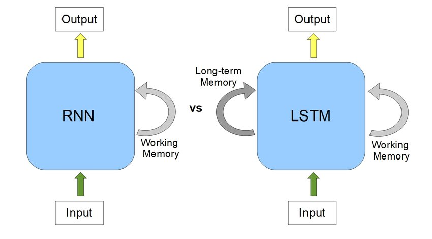

now with this architecture our model can carry most recent data up till end using short term memory, and older data using long term memory

Example
- consider a long sentence like:\
 `“I grew up in France … so I speak ___”`
- here word `“France”` get store is long term memory 
- now as we move ahead in our sequence it slowly get removed from short term memory as it appear earlier
- but since we have stored it in long term memory which stores data over a long period (up till end of the sequence) we can access word `“France”` for final output

>for final output:
>- recent data -> carried by short term memory
>- older data -> carried by long term memory

*Note: our can model decide which data to store / remove from long term memory, and to do that there exit a communication channel between short term memory and long term memory*

### Architecture
An LSTM has a special memory cell and three main gates that control information flow:

1. **Forget Gate** – Decides what information to discard from long term memory.
2. **Input Gate** – Decides what new information to store in long term memory.
3. **Output Gate** – responsibly for final output and maintaining short term memory.

These gates allow the network to keep important information for long periods and forget irrelevant details.

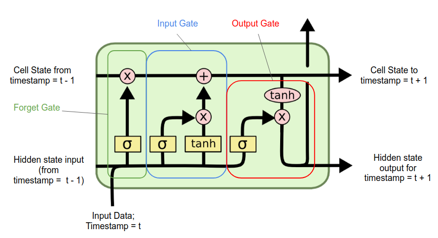

Here:
- cell state -> carry long term memory
- hidden state -> carry short term memory

> both hidden state and cell state are same in size

#### Understand each element

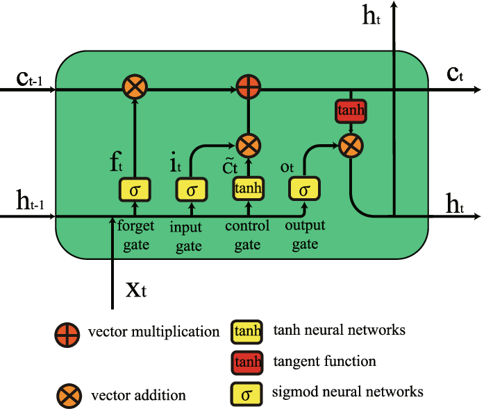

#### Point vise operation

 1. **vector Multiplication**
    - Its just a value by value multiplication between two vector of same size
    - Example:
        - vector 1 = [1, 2, 3]
        - vector 2 = [4, 5, 6]
        - Element Wise Multiplication = [1x4, 2x5, 3x6] = [4, 10, 18]

 2. **vector addition**
    - Its just a value by value addition between two vector of same size
    - Example:
        - vector 1 = [1, 2, 3]
        - vector 2 = [4, 5, 6]
        - Element Wise Multiplication = [1+4, 2+5, 3+6] = [5, 7, 9]

3. **Tangent function**
    - it accept a vector and output its tanh value for each value init
    - example:
        - input vector = [1, 2, 3]
        - tanh (1) = 0.76
        - tanh (2) = 0.96
        - tanh (3) = 0.99
        - final output = [0.76, 0.96, 0.99] 

#### Neural Network Layer

carries a neural network inside

1. tanh neural network
    - multiple nodes connected in to each other
    - each nodes has tanh as an activation function

2. sigmoid neural network
    - multiple nodes connected in to each other
    - each nodes has sigmoid as an activation function

Note: number of nodes in all of the neural network is same, as that of the dimension of the hidden state and cell state

[Go To Top](#content)

---

# Forget Gate
forget gate is responsive for removing the irrelevant information from cell state (long term memory)

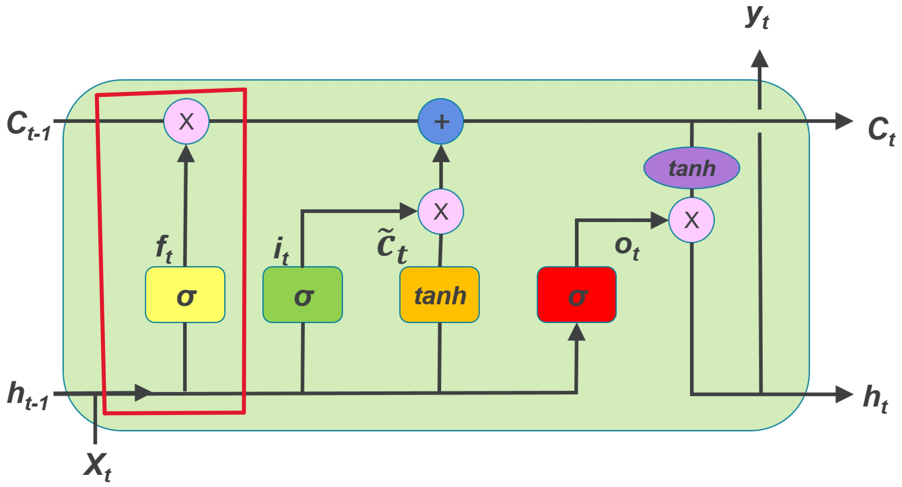

lets assume:
- $h_{t-1}$ = 3 dimensional vector 
- $C_{t-1}$ = 3 dimensional vector 
- $X_t$ = 4 dimensional vector

in forgat gate we perform two steps i.e, 
1. calculate $f_t$
2. point vise multiplication between $C_{t-1}$ and $f_t$


### calculate $f_t$
1. combine $h_{t-1}$ and $X_t$
    - $h_{t-1}$ = 3 dimensional vector = $[h_1, h_2, h_3]$
    - $X_t$ = 4 dimensional vector = $[X_1, X_2, X_3, X_4]$
    - $h_{t-1} + X_t$ = 3 + 4 = 7 dimensional vector = $[h_1, h_2, h_3, X_1, X_2, X_3, X_4]$
2. pass this combine vector to sigmoid neural network
    - since hidden state and cell state is a 3 dimensional vector number of nodes in this neural network is also 3
    - as a result in output we also get a 3 dimensional vector

    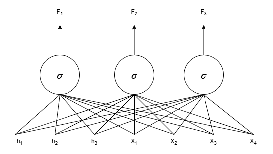

    - here output vector = $[f_1, f_2, f_3]$
3. compute the $f_t$
    - whatever value the sigmoid neural network is returning will be the value of $f_t$
    - in above example, $f_t = [f_1, f_2, f_3]$
    - mathematically

    $$f_t = \sigma \left( W_f [h_{t-1}, X_t] + b_f \right)$$
    
    - here:
        - $W_f$ = weight matrix of neural network
        - $[h_{t-1}, X_t]$ = combine $h_{t-1}$ and $X_t$
        - $b_f$ = basie matrix
        - $\sigma ()$ = sigmoid function  

### point vise multiplication between $C_{t-1}$ and $f_t$
- from above example we can see that our $f_t = [f_1, f_2, f_3]$
- lets assume $C_{t-1} = [C_1, C_2, C_3]$ 
- point vise multiplication = $[f_1 \times C_1, f_2 \times C_2, f_3 \times C_3]$
- this is our updated value of cell state (long term memory) 

### How it help to remove irrelevant information
- we are using sigmoid neural network that gives output between 0 & 1
- here:
    - 0 = everything is irrelevant, therefore remove everything
    - 1 = everything is relevant, therefore keep everything
    - 0.5 = only 50% is relevant, therefore remove other 50% 
- therefore:
    - if $f_t = [0, 0, 0]$ -> point vise multiplication = $[0, 0, 0]$
    - if $f_t = [1, 1, 1]$ -> point vise multiplication = $[C_1, C_2, C_3]$ (same as $C_{t-1}$)
    - if $f_t = [0.5, 0.5, 0.5]$ -> point vise multiplication = $\left[\frac{C_1}{2}, \frac{C_2}{2}, \frac{C_3}{2} \right]$ (removed 50% info from $C_{t-1}$)


[Go To Top](#content)

---

# Input gate
> Before this read about [Forget Gate](#forget-gate)

Input gat is responsible for adding new info into the cell state (long term memory)

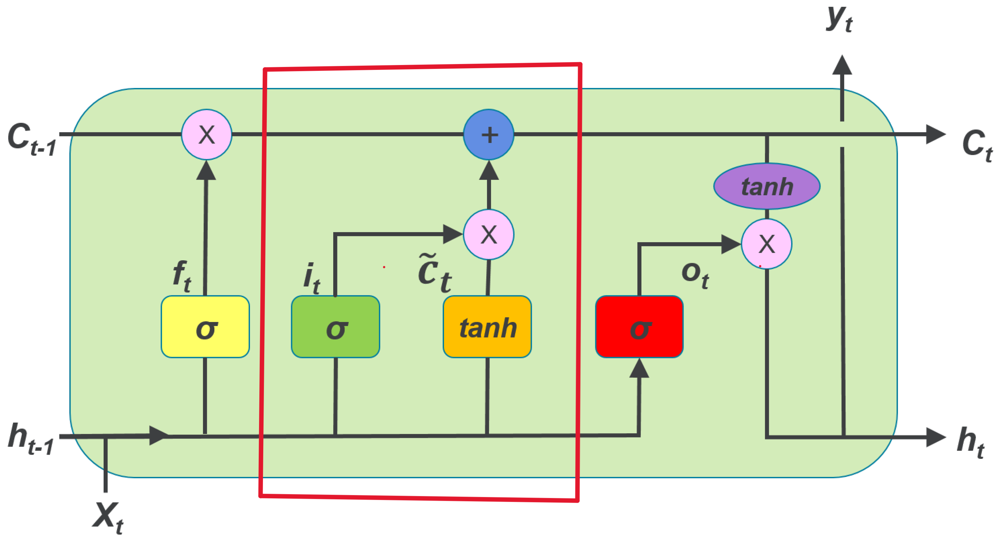

lets assume:
- $h_{t-1}$ = 3 dimensional vector 
- $C_{t-1}$ = 3 dimensional vector 
- $X_t$ = 4 dimensional vector


in input gate we perform 3 stapes:
1. calculate $\bar{C_t}$ i.e, candidate cell state -> possible data that can be added into the cell state 
2. calculate $i_t$ -> decide which $\bar{C_t}$ is gonna add into cell state
3. Calculate $C_t$ -> update cell state i.e, long term memory

### calculate $\bar{C_t}$ (Candidate cell state)
- just like the input gate we combine $h_{t-1}$ and $X_t$ and pass the resultant vector into the tanh neural network
- But unlike sigmoid neural network in forget gate where we has sigmoid function as an activation function here in input gate we have tanh network which have tanh as an activation function 

    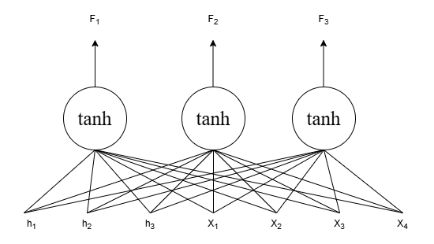

- just like forget gate here output vector = $[f_1, f_2, f_3]$
- $\bar{C_t} = [f_1, f_2, f_3]$

mathematically

$$\bar{C_t} = tanh \left( W_f [h_{t-1}, X_t] + b_f \right)$$

- here:
    - $W_f$ = weight matrix of neural network
    - $[h_{t-1}, X_t]$ = combine $h_{t-1}$ and $X_t$
    - $b_f$ = basie matrix
    - $tanh ()$ = tanh activation function  


### calculate $i_t$
this is exactly same as that of forget gate where we calculate the $f_t$ with the sigmoid neural network

unlike previous step where we use tanh neural network in this step we use sigmoid neural network (same as that of forget gate)

1. combine $h_{t-1}$ and $X_t$
2. pass the combine vector into the sigmoid neural network
3. get the output vector


- output vector = $[f_1, f_2, f_3]$
- $i_t = [f_1, f_2, f_3]$


#### mathematically

$$i_t = \sigma \left( W_f [h_{t-1}, X_t] + b_f \right)$$

- here:
    - $W_f$ = weight matrix of neural network
    - $[h_{t-1}, X_t]$ = combine $h_{t-1}$ and $X_t$
    - $b_f$ = basie matrix
    - $\sigma ()$ = sigmoid function  

### calculate $C_t$
once we find the value of $i_t$ and $\bar{C}_t$ its just the series of point vise operation to compute the update $C_t$

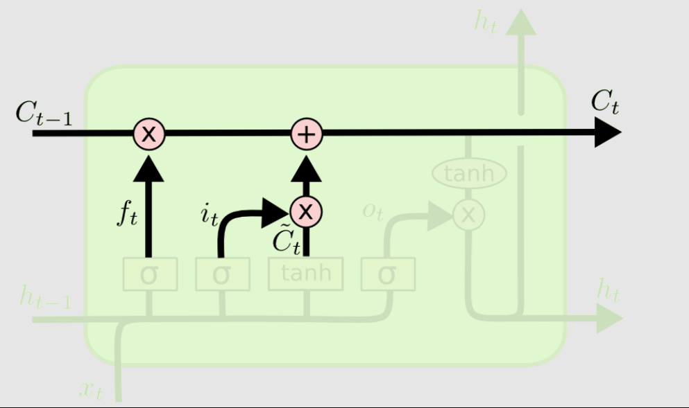

1. point vise multiplication between $\bar{C}_t$ and $i_t$
    - $i_t = [i_1, i_2, i_3]$
    - $\bar{C}_t = [\bar{C}_1, \bar{C}_2, \bar{C}_3]$ 
    - point vise multiplication = $[i_1 * \bar{C}_1, i_2 * \bar{C}_2, i_3 * \bar{C}_3]$
2. point vise addition of this vector (output of point vise multiplication) with updated value of $C_{t-1}$ (from forget gate)
    - output vector of point vise multiplication = $[i_1 * \bar{C}_1, i_2 * \bar{C}_2, i_3 * \bar{C}_3]$
    - updated $C_{t-1}$ from forget gate = $[C_1, C_2, C_3]$
    - point vise addition = $[(i_1 * \bar{C}_1)+C_1, (i_2 * \bar{C}_2)+C_2, (i_3 * \bar{C}_3) + C_3]$

Therefore, current cell state:

$$C_t = [(i_1 * \bar{C}_1)+C_1, (i_2 * \bar{C}_2)+C_2, (i_3 * \bar{C}_3) + C_3]$$

#### Mathematically

$$C_t = (i_t \otimes \bar C_t) \oplus (f_t \otimes C_{t-1})$$

Here:
- $f_t \otimes C_{t-1}$ = output of forget gate

### How it work?
- we are using sigmoid neural network that gives output between 0 & 1
- here:
    - 0 = everything is irrelevant from candidate cell state $(\bar C_{t})$, therefore add nothing
    - 1 = everything is relevant from candidate cell state $(\bar C_{t})$, therefore add everything
    - 0.5 = only 50% is relevant from candidate cell state $(\bar C_{t})$, therefore add only that 50% 
- therefore:
    - if $i_t = [0, 0, 0]$ -> point vise multiplication = $[0, 0, 0]$
    - if $i_t = [1, 1, 1]$ -> point vise multiplication = $[\bar C_1, \bar C_2,\bar C_3]$ (same as candidate cell state $\bar C_{t}$)
    - if $i_t = [0.5, 0.5, 0.5]$ -> point vise multiplication = $\left[\frac{\bar C_1}{2}, \frac{\bar C_2}{2}, \frac{\bar C_3}{2} \right]$ (removed 50% info from candidate cell state $\bar C_{t}$)
- now once we find what to add we just perform the point vise addition to add that into our cell sate ($C_t$)


[Go To Top](#content)

---

# Output gate
> before this read about [input Gate](#input-gate)

this gate is responsible for generating the output hidden state i.e, $h_t$ for current timestep

it take two thing in input i.e,:
1. current cell state $C_t$ from input gate
2. combine vector of previous hidden state and input vector

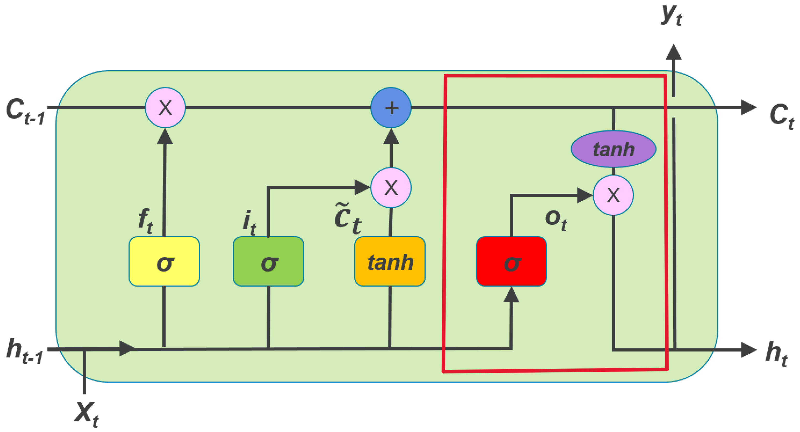

lets assume:
- $h_{t-1}$ = 3 dimensional vector 
- $C_{t-1}$ = 3 dimensional vector 
- $X_t$ = 4 dimensional vector

to calculate the $h_t$ we simply follow the three simple steps:
1. calculate the output of tanh neural network
2. calculate the output of sigmoid neural network i.e, $O_t$
3. perform the point vise multiplication

### calculate the output of tanh neural network
- input = $C_{t}$ = 3 dimensional vector from input gate
- let say input = $[C_1, C_2, C_3]$
- output = 3 dimensional vector 
- let say output = $[f_1, f_2, f_3]$

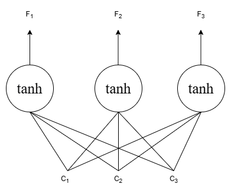

#### Mathematically:

$$output = tanh(C_t)$$

### calculate the output of sigmoid neural network i.e, $O_t$
- input = combine vector of $h_{t-1}$ and $X_t$
- let say $h_{t-1} = [h_1, h_2, h_3]$ and $X_t = [X_1, X_2, X_3]$
- combined vector = $[h_1, h_2, h_3, X_1, X_2, X_3, X_4]$
- output = 3 dimensional vector


Therefore $O_t = [f_1, f_2, f_3]$

#### Mathematically:

$$O_t = \sigma \left( W_f [h_{t-1}, X_t] + b_f \right)$$


### point vise multiplication
- once we calculate the sigmoid output $O_t$ and output of tanh network we perform the point vise multiplication between them to find the value of current hidden state $h_t$
- let say:
    - tanh output = $[f_1, f_2, f_3]$
    - sigmoid output $O_t = [O_1, O_2, O_3]$
- point vise multiplication = $[f_1 * O_1, f_2 * O_2, f_3 * O_3]$

Therefore;

$$h_t = [f_1 * O_1, f_2 * O_2, f_3 * O_3]$$

#### Mathematically

$$h_t = O_t \otimes  tanh(C_t)$$

[Go To Top](#content)

---