# Content
1. [Introduction](#introduction)
2. [Perceptron](#perceptron)
    - [Perceptron Trick](#perceptron-trick)
    - [Loss Function In Perceptron](#loss-function-in-perceptron)
    - [Flexibility with Perceptron](#flexibility-with-perceptron)
3. [Multi Layer Perceptron (MLP)](#multi-layer-perceptron-mlp)
4. [Notation And Dot Product](#notation-and-dot-product)
5. [Forward propagation](#forward-propagation)
6. [Loss Function In DL](#loss-function-in-dl)
7. [Backward Propagation](#backward-propagation)


---


# Introduction
Deep learning is a subset of AI and ML that is inspired by the structure of a human brain

It is a part of broader family of ML methods based on artificial neural network with representation learning
> **Representation learning** is a concept in machine learning where the model automatically learns useful features (representations) from raw data, instead of you manually defining them.

> in **Representation learning**, model automatically perform Feature Engineering

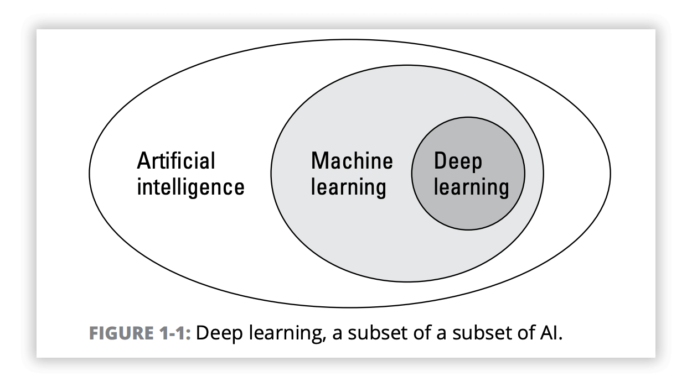

Deep learning algorithm attempts to draw similar conclusion as human would by continually analyzing data with give logical structure called neural network

**Example:**

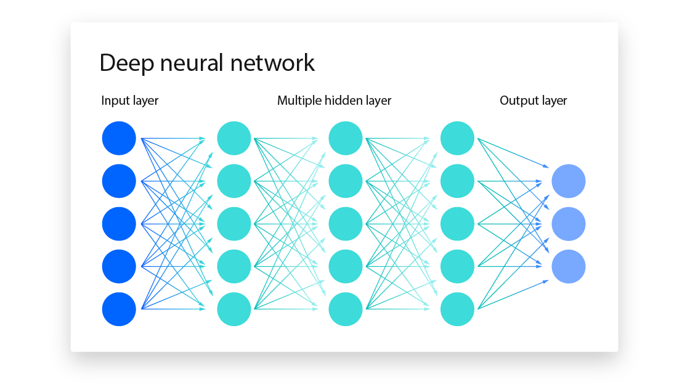

DL algorithm uses multiple layers to progressively extract higher-level features form the raw input. 

For example, in image processing lower layers may identify edges, while higher layer may identify the concept relevant to human such as digit or latter or face

### DL vs ML
| Feature                | Machine Learning (ML)                               | Deep Learning (DL)                                      |
| ---------------------- | --------------------------------------------------- | ------------------------------------------------------- |
| Definition             | Subset of AI that learns from data using algorithms | Subset of ML that uses neural networks with many layers |
| Feature Engineering    | Manual (you define features)                        | Automatic (model learns features)                       |
| Data Requirement       | Works with small to medium datasets                 | Needs large datasets                                    |
| Performance            | Good for simpler problems                           | Better for complex tasks                                |
| Computation Power      | Less (CPU often enough)                             | High (GPU/TPU required)                                 |
| Training Time          | Faster                                              | Slower                                                  |
| Interpretability       | Easier to understand                                | Harder (“black box”)                                    |
| Examples of Algorithms | Decision Trees, SVM, KNN                            | CNN, RNN, Transformer                                   |
| Best For               | Structured data (tables, CSV)                       | Unstructured data (image, audio, text)                  |


### Types of Neural Networks
| Neural Network                       | Description                                               | Best For                                 | How It Works                                                                                                      |
| ------------------------------------ | --------------------------------------------------------- | ---------------------------------------- | ----------------------------------------------------------------------------------------------------------------- |
| MLP (Multilayer Perceptron)          | Basic fully connected neural network with multiple layers | Tabular data, classification, regression | Data passes through multiple fully connected layers where each neuron applies weights and activation functions    |
| CNN (Convolutional Neural Network)   | Specialized for processing grid-like data (images)        | Image processing, computer vision        | Applies convolution filters to extract features (edges, patterns), followed by pooling and fully connected layers |
| RNN (Recurrent Neural Network)       | Designed for sequential data with memory                  | Text, speech, time-series                | Processes input step-by-step while passing previous hidden state to next step                                     |
| Autoencoder                          | Learns to compress and reconstruct data                   | Data compression, denoising              | Encoder reduces input into smaller representation, decoder reconstructs original data from it                     |
| GAN (Generative Adversarial Network) | Two networks competing with each other                    | Image generation, deepfakes              | Generator creates fake data, discriminator evaluates it; both improve through competition                         |

[Go To Top](#content)

---
# Perceptron
Perceptron is an algorithm used for supervised ML and is one of the simplest types of artificial neural networks

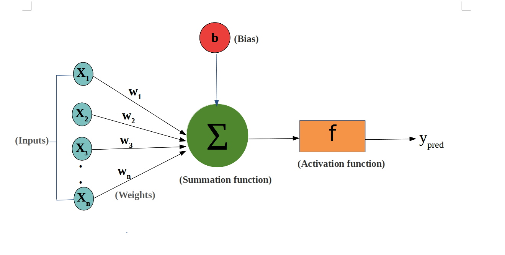

Here
1. **Inputs**: 
    - These are the features/data points coming into the model.
    - Each input represents some information
    
2. **Weights**: 
    - Each input is connected with a weight.
    - These control how important each input is
    - Larger weight → more influence
    - Smaller weight → less influence
3. **Summation Block**: 
    - All weighted inputs are added together here.
    - This computes the linear combination
    - $z = w_1x_1 + w_2x_2 + ... + w_nx_n + b$
4. **Bias**: 
    - The bias is added to the sum
    - It shifts the decision boundary (like adjusting a threshold)
5. **Activation Function**: 
    - Takes the summed value and decides output
    - Example:\
    step function:
        - If the result ≥ 0 → output = 1
        - If the result < 0 → output = 0

in the training phase of the perceptron we feed the training data and try to find out the compatible `Weight` and `Bias` such that predicted output and actual output matches

Once we found out those `Weight` and `Bias` from training phase we use those same `Weight` and `Bias` for future prediction

### Perceptron is Inspired by Neuron
- perceptron was designed by copying the basic idea of how a human `neuron` works.
- A human `neuron` takes signals from `dendrites`, processes them, and sends an output, so a perceptron does the same with numbers.
- In a `neuron`, `synapses` decide signal strength, and in a perceptron, `weights` decide input importance.

    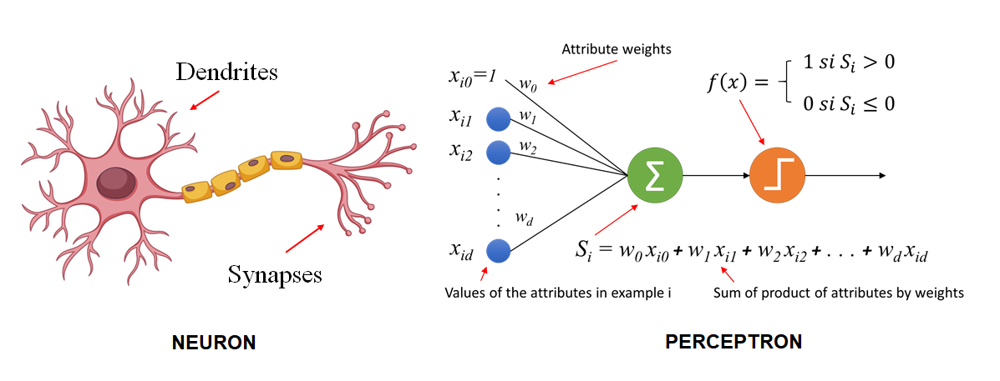

- The perceptron does not copy the full complexity of the brain, it only copies the simple “input → process → output” behavior.
- So, a perceptron is a simplified mathematical version of a human `neuron`, not an exact copy.

### Geometrical Intuition Behind perceptron

Lets take a summation function of a perceptron

$$z = w_1x_1 + w_2x_2 + ... + w_nx_n + b$$

keep $n = 2$

$$z = w_1x_1 + w_2x_2 + b$$

if you look closely this function is similar to equation of string line:

$$Ax + By + C = 0$$


so when we train our perceptron on a dataset we get a line as follow


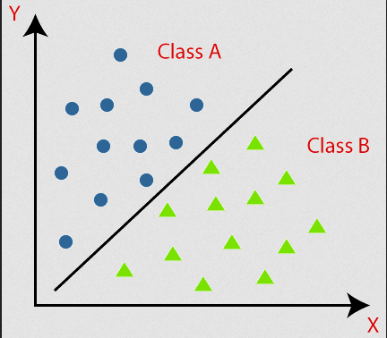

now whenever we want to predict new value we pass the input data ($x_1, x_2$), which inside summation block convert into an equation $Ax_1 + Bx_2 + C$
- A = weight of feature $x_1$
- B = weight of feature $x_2$
- C = Bias
- $Ax_1 + Bx_2 + C$ = represent a point ($x_1, x_2$) inside a plane

Inside a activation function passes the result through a step function:

- If $Ax_1 + Bx_2 + C$ ≥ 0 → output = Class A
- If $Ax_1 + Bx_2 + C$ < 0 → output = Class B


>Because of this we can classify our data into two classes, therefor we called perceptron a binary classifier

**with 2D data we get a line that separate two classes, where as in 3D we get a plane and for 4D and above we get hyperplane**

### Why compare with 0
to understand this we first need to understand how to check on which side of a line a point will lie?

To determine which side of a line a point lies on, you can use a very clean geometric idea based on the line equation sign test.

If a line is written as:

$$ax + by + c = 0$$

Then for any point ($x_1, y_1$), compute:

$$S = ax_1 + by_1 + c$$

- If S > 0 → positive region → point lies on one side of the line
- If S < 0 → negative region → point lies on the other side
- If S = 0 → point lies exactly on the line

### Woks only with liner data
in perceptron we find the best fit line that separate two classes, but we can only find this best fit line if we have liner data and will not work with non liner data

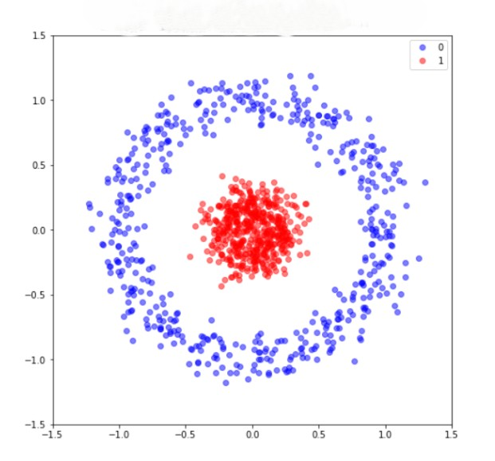

[Go To Top](#content)

---
# Perceptron Trick
Perceptron Trick is a way to find the best fit line that best separate two classes

> this is iterative approach i.e, we can perform then trick in loop until we find the best fit line

we start with any random line

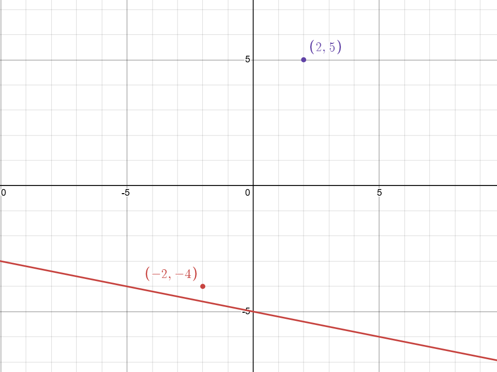

now we randomly pick any point and check whether or not it is properly classified or not

here:
- 2,5 supposed to belong in positive region (properly classified)
- -2, -4 supposed to belongs in negative region (incorrectly classified)

if the point is properly classified then we do nothing and switch to next point

if the point is not classified correctly then that point will move the line, such that the new line will properly classify that point

in our case point (-2, -4) will move the line so that this point will come under the negative region of the line

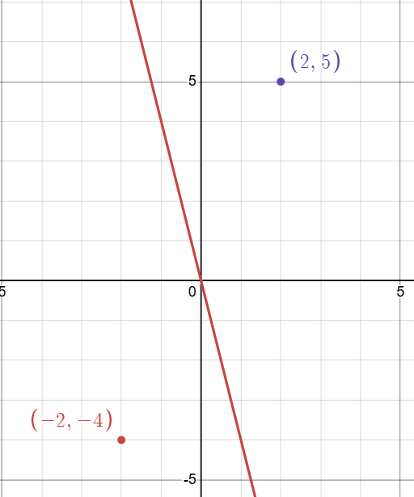

To make this transformation we only need to change the weight and bias such that the new line will  properly classified respective point

### How changing the weight and bias transform the line

Equation:

$$Ax_1 + Bx_2 + C$$

- A = weight of feature $x_1$
- B = weight of feature $x_2$
- C = Bias

Changing the C moves line up or down without changing the slop

changing the A will rotate the line along the point $x_1$

changing the B will rotate the line along the point $x_2$

### How to apply changes to weight and bias

lets take equation of line:

$$2x + 3y + 5 = 0 _{--------}(i)$$


And we have coordinates of improper classified point as follow:

$$x = 4, y = 5$$

```
(4 * 2) + (5 * 3) + 5 = 8 + 15 + 5 = 28 

28 > 0 -> +ve region
```

we add one arbitrary point:

$$x = 4, y = 5, c = 1_{--------}(ii)$$

from $(i)$ we get
- A = 2
- B = 3
- C = 5

just subtract this value form $(ii)$ x, y, c to get new equation
```
A - x = 2 - 4 = -2
B - y = 3 - 5 = -2
C - c = 5 - 1 = 4
```

Therefor new equation of line:

$$-2x-2y + 4 = 0$$

```
(-2 * 4) + (-2 * 5) + 4 = -8 + (-10) + 4 = -14

-14 < 0 -> -ve region
```
### How to pick the arbitrary point
higher the value of arbitrary point higher the transformation of line, where as lower the value of arbitrary point lower the transformation

hence we can say that this arbitrary point defines the learning rate of our model 

generally is most of the cases learning rate is equal to `0.01`

Therefor instead of subtracting the x, y ,c value directly we use formula:

$$new\ coefficient\ of\ line = old\ coefficient\ of\ line - (learning\ rate \times coordinates)$$

Example:

$A_{new} = A_{old} - 0.01 \times x = 2 - 0.04 = 1.96$

$B_{new} = B_{old} - 0.01 \times y = 3 - 0.05 = 2.95$

$C_{new} = C_{old} - 0.01 \times c = 5 - 0.01 = 4.99$

Therefor new equation of line:

$$1.96x+2.95y + 4.99 = 0$$

### Problem With Perceptron trick

- In the perceptron trick, we randomly pick one misclassified point and adjust the decision boundary so it moves toward correctly classifying that point.
- Since the misclassified point is chosen randomly, the final decision boundary we get can also vary each time.
- If the two classes are clearly separable, there can be multiple valid decision boundaries that correctly divide them.
- Because of this randomness, the perceptron may end up finding any one of these possible separating lines.
- Also, the perceptron does not provide a way to determine which of these separating lines is better than the others.
- As a result we cannot specify whether the decision boundary we get in the end is the optimal one or any other optimal one still exist

**Because of this we avoid using this perceptron trick algorithm and instead use more reliable approach where we use [gradient decent](../MachineLearning/Readme.md#gradient-descent) along with [loss function](#loss-function-in-perceptron)**

[Go To Top](#content)

---
# Loss Function In Perceptron
> Loss function is function that return a numerical value, we use this numerical value to calculate the error done by our model, higher the output of the loss function poor the model accuracy 

For perceptron the simplest way to find the error is to check the no. of misclassified point 

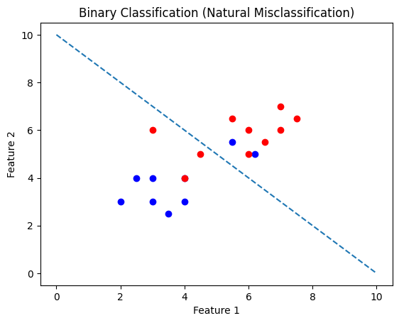

In above example the output of loss function is `5` as there are `5` misclassified points

- the problem with this method is that it give same penalty to each point, irrespective to how far the point is from decision boundary
- Even though this work but in case of multiple decision boundaries we didn't know which line cause the lowest error as penalty for each data point is same

Therefor we try to find the error by finding the distance between the decision boundary and the misclassified points

To do that we can use distance formula and find the perpendicular distance of a point from the line, but using the method is little hard

hence we just put the value of misclassified in the equation of decision boundary

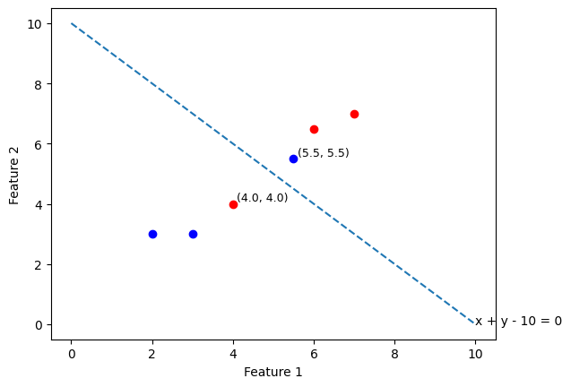

- for `(5.5, 5.5)`

    $x = 5.5 \ ;\  y = 5.5$ 

    $|x + y - 10| = |5.5 + 5.5 - 10| = |11 - 10| = 1$

- for `(4, 4)`

    $x = 4 \ ;\  y = 4$ 

    $|x + y - 10| = |4 + 4 - 10| = |8 - 10| = 2$

- Output of loss function = 1 + 2 = 3

Fom above example we see that the point which is closest to decision boundary (`5.5, 5.5`) get the less penalty (`1`), that than to the point which is far away (`(4, 4) penalty = 2`)


[Go To Top](#content)

---
# Flexibility with Perceptron

- Perceptron is a mathematical model used in machine learning
- It first calculates a value using a formula like a weighted sum of inputs. After that, the activation function decides what kind of output to produce, such as a class label, a probability, or a number.
- By changing the activation function and loss function, you can make the same model behave like a binary classifier, a multi class classifier, or a regression model.

### How it happen
- The model always starts by computing a single value using the inputs and weights. Think of this value as a raw score. On its own, this score doesn’t mean anything yet.

- What makes it useful is how we interpret that score, and that is controlled by the activation function.
    - If we use a step or sigmoid activation, we treat the score as a decision between two classes, so the model behaves like a binary classifier.
    - If we use softmax on multiple scores, we interpret them as probabilities of different classes, so it becomes a multi class classifier.
    - If we don’t apply any activation, we treat the score directly as a number, so it becomes a regression model.

- Now comes the role of the loss function. 
    - The loss function tells the model what kind of mistake to care about. 
    - For classification, it penalizes wrong class predictions. 
    - For regression, it penalizes how far the predicted number is from the actual value. 
    - So during training, the model adjusts its weights differently depending on the loss.

- So the process is:\
The model produces a raw score → the activation converts it into a specific type of output → the loss function checks how wrong that output is → the model updates itself based on that.
- That’s why just changing activation and loss function makes the same model behave differently, even though the underlying computation stays the same.

### Some basic combination

| Problem Type              | Activation Function | Loss Function             | Output Meaning          |
| ------------------------- | ------------------------- | ------------------------- | ----------------------- |
| Binary Classification     | Step Function             | Perceptron Loss           | Class (0 or 1 directly) |
| Binary Classification / Logistic Regression    | Sigmoid                   | Binary Cross Entropy      | Probability (0 to 1)    |
| Multiclass Classification | Softmax                   | Categorical Cross Entropy | Probabilities (sum = 1) |
| Regression                | Linear (no activation)    | Mean Squared Error (MSE)  | Continuous number       |


[Go To Top](#content)

---
# Multi Layer Perceptron (MLP)
A single perceptron is basically a straight-line decision maker. It works only when the problem can be separated with a line (or a flat plane in higher dimensions). That’s a big limitation

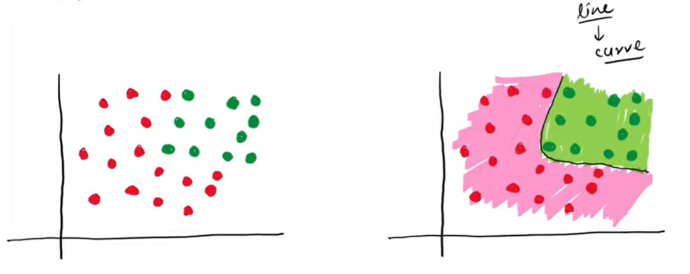

To solve this issue we train multiple perceptron, and those multiple perceptron when combine can classify non liner data

### Example:

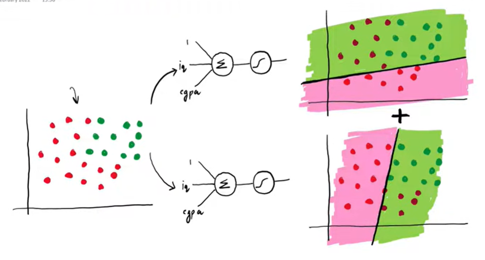

Now we just superimpose (combine) those multiple perceptron to get the final decision boundary

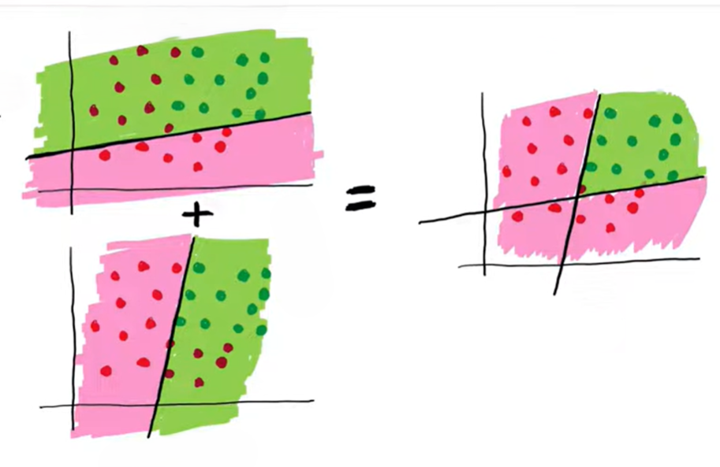

now after soothing those boundary we'll get

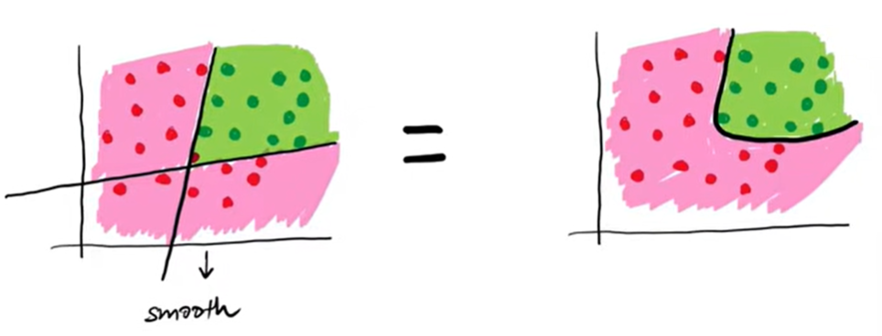

**This is how by using multiple perceptron we can classify between two non liner classes**

### Mathematically

- Each perceptron first calculates a weighted sum of inputs and passes it through a sigmoid function to produce a value between 0 and 1 representing how strongly a feature is present.
- These outputs (activations) are then passed to the next layer, where they are combined using new weights and again passed through a sigmoid function.
- As this process continues across layers, the network learns to combine simple features into more complex patterns, and the final layer produces the overall prediction.

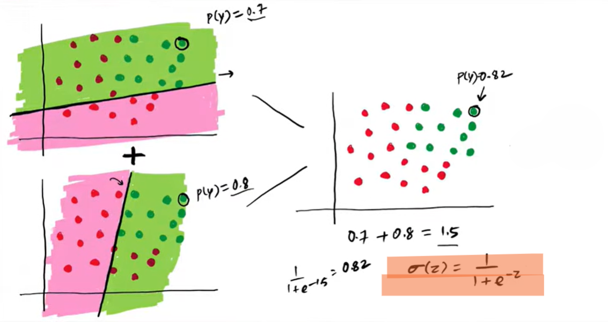

in above example:
- $\sigma (z)$ = sigmoid function
- weight for both both input [ $p(y)_1$ and $p(y)_2$ ] = 1
- bias = 0

> Weights determine how important each input or feature is by controlling how much it influences the neuron’s output.

### Final structure of MLP 

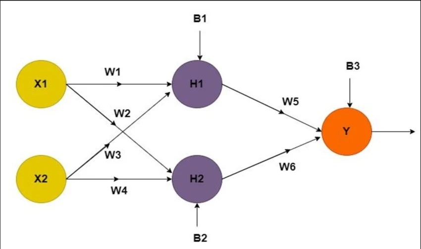

### Type of Layers In MLP
There are three type of layers in MLP:
- **Input layer:** 

    The input layer receives the raw data (features) and passes it to the network without any processing.

    Example:\
    `X1` and `X2`    
- **Hidden layer:** 

    Hidden layers take inputs, apply weights and activation functions, and learn patterns or relationships in the data.

    Example:\
    `H1` and `H2`
- **Output layer**: 

    The output layer takes the final processed information and produces the prediction or result.

    Example:\
    `Y`

> you can have multiple node at each layer and can have more than one layer of same type

you can make the decision boundary more flexible just by changing the no. of nodes and no. and layers
#### Example 1: Adding nodes in hidden layers

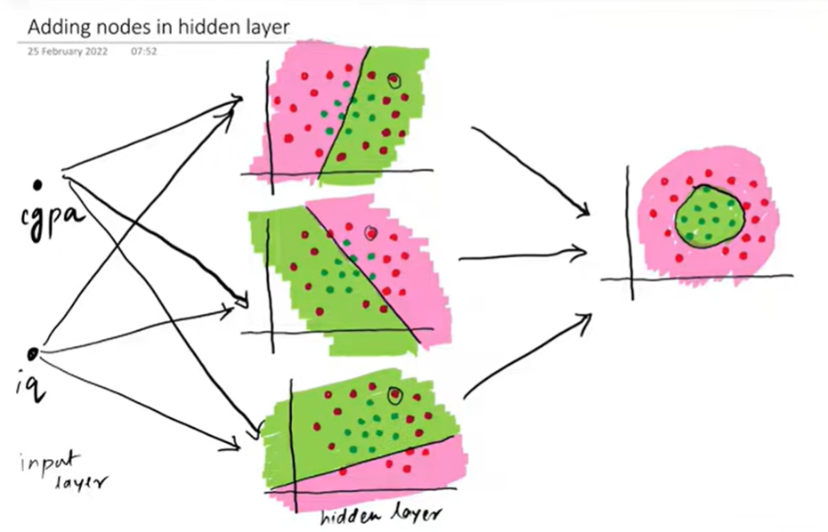

#### Example 2: Adding multiple hidden layer

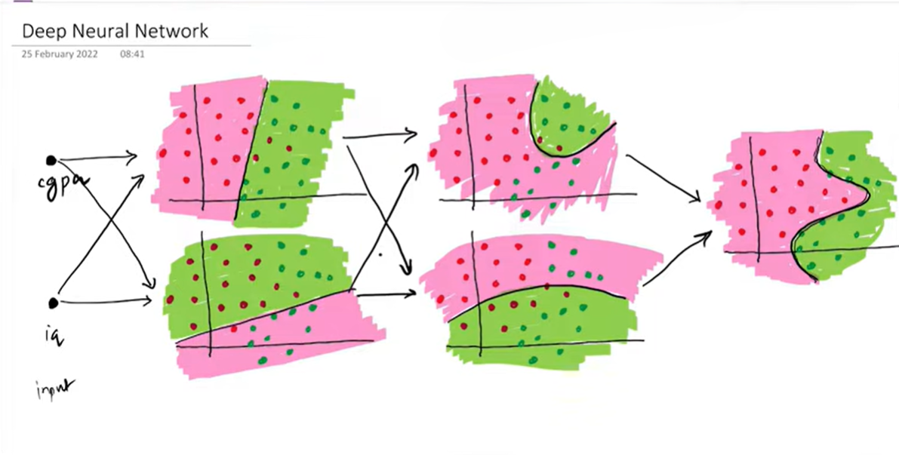


[Go To Top](#content)

---
# Notation And Dot Product

## Notation

In MLP we use different notation to represent/denote each layer, weight and bias


#### 1. Feature values
consider you have a dataset like:

feature 1 | feature 2 | feature 3 | feature 4
--- | --- | --- | ---
$X_{11}$ | $X_{12}$ | $X_{13}$ | $X_{14}$
$X_{21}$ | $X_{22}$ | $X_{23}$ | $X_{24}$
$X_{31}$ | $X_{32}$ | $X_{33}$ | $X_{34}$

Then:\
$X_{ij}$ represent the feature $j$ present in row $i$

#### 2. Layer and Node 

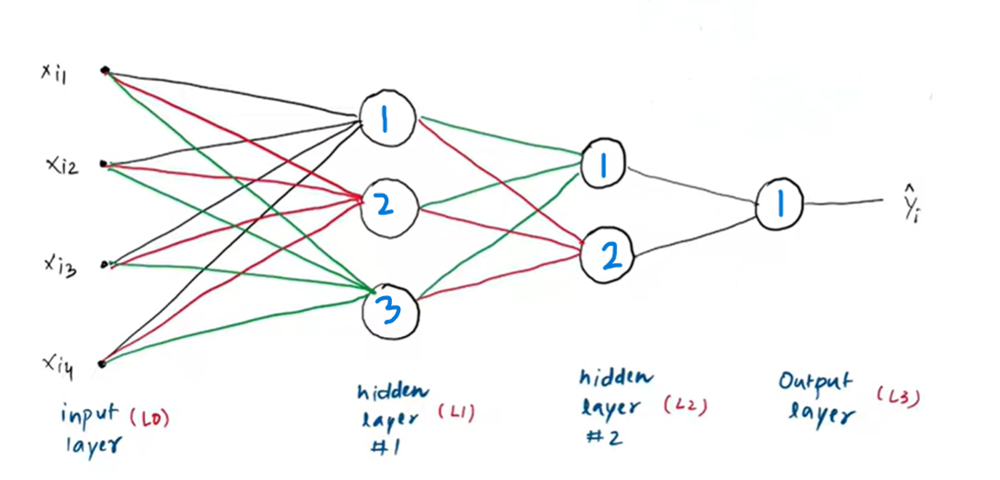

in above image we can see:
- L0 = input layer
- L1 = first input layer with node 1, 2, 3
- L2 = second input layer with node 1, 2
- L3 = third Output layer with node 1


#### 3. Bias and Output

Bias = $B_{ij}$\
output = $O_{ij}$

where:
- $i$ = layer number
- $j$ = Node number in that layer

#### 4. Weight
$W_{ij}^k$

where:
- $k$ = next layer number 
- $i$ = current node number
- $j$ = next node number

## Dot Product

fist consider the mathematical equation of the perceptron:

$$z = w_1x_1 + w_2x_2 + b$$

We can also write this equation in matrix format:

$$z = \begin{bmatrix} w_1 & w_2 \end{bmatrix}
\begin{bmatrix} x_1 \\ x_2 \end{bmatrix} + b$$


now if you look closely:

$\begin{bmatrix} w_1 & w_2 \end{bmatrix}
\begin{bmatrix} x_1 \\ x_2 \end{bmatrix}$ this term here is just a dot product of $x$ and $w$

Therefor you can also write the equation as:

$$z = W \cdot X + b$$

[Go To Top](#content)

---
# Forward propagation

Forward propagation in a Multi-Layer Perceptron (MLP) is the process of passing input data through the network layer by layer to produce an output (prediction).

> You start with input → apply weights + bias → apply activation → pass to next layer → repeat → get final output.

Consider following MLP:

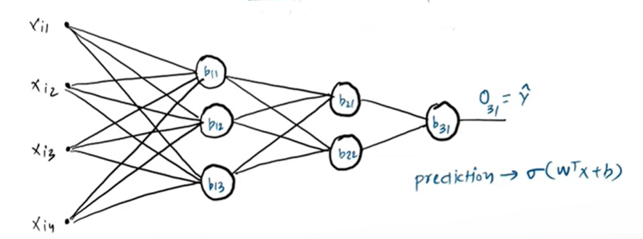

### Computing the output of Layer 1
Formula:

$$z = W^T \cdot X + b$$


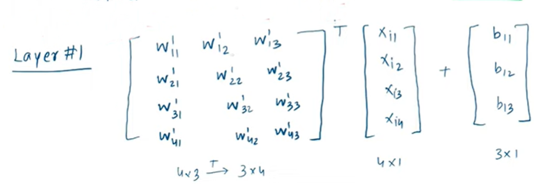

After solving we get:

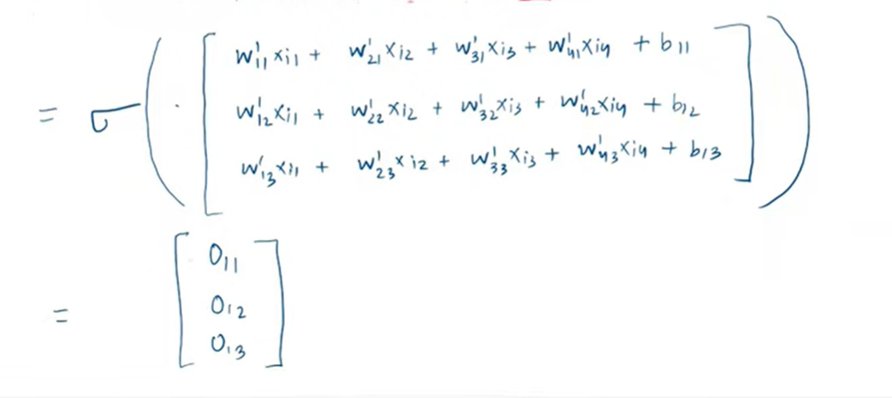

**Now this output matrix will go as input for layer two**

### Computing the output of Layer 2

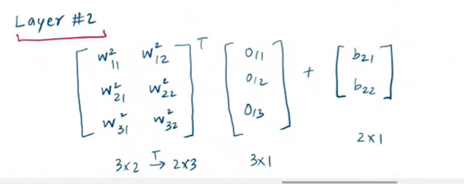

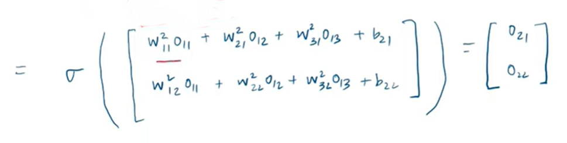

**Similarly ths output matrix will go as input for third layer**

### Computing the output of Layer 3

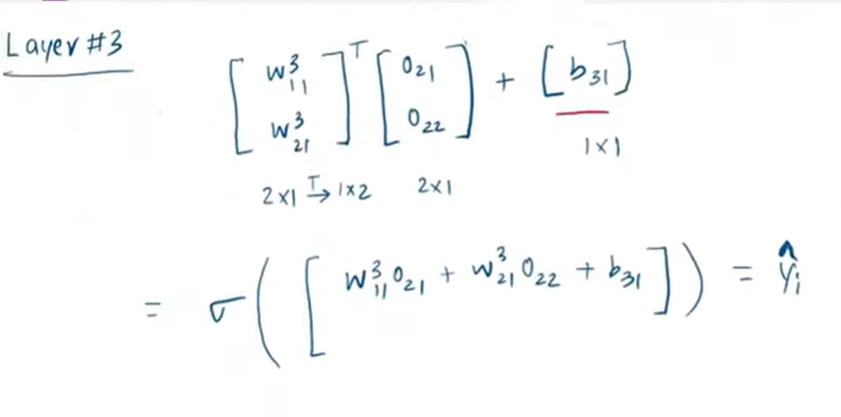


## Generalize Mathematical Representation

let the each output matrix be $a^{[i]}$ where $i$ is layer

example:
- $a^{[1]}$ = output matrix of layer 1
- $a^{[2]}$ = output matrix of layer 2
- $a^{[0]}$ = input layer matrix

> $a^{[i]}$ also known as activation f layer i

now if we compute:

$$\sigma (a^{[0]} \cdot w^{[1]} + b^{[1]})$$

we get output matrix of layer one i.e, $a^{[1]}$

> here $w^{[1]}$ is $W_{ij}^k$ with $k = 1$

Similarly for  $a^{[2]}$ and  $a^{[3]}$

$$a^{[2]} = \sigma (a^{[1]} \cdot w^{[2]} + b^{[2]})$$

$$a^{[3]} = \sigma (a^{[2]} \cdot w^{[3]} + b^{[3]})$$

Therefor we can generalize this as:

$$a^{[i]} = \sigma (a^{[i-1]} \cdot w^{[i]} + b^{[i]})$$

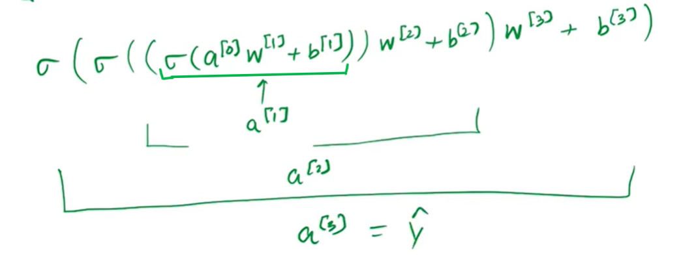


[Go To Top](#content)

---
# Loss Function In DL

Loss function is a method of evaluating how well your algorithm is modeling your dataset

It is a mathematical function that quantifies the difference between the predicted output of a model and the actual target value. 
 
it is a way to measure how wrong a model’s prediction is compared to the actual correct answer.

> high loss = high error = poor model\
> low loss = less error = good model

### Use of loss function
We use a loss function because it gives the model a clear way to understand how wrong it is and how to improve.

Without a loss function, a model would make predictions… but wouldn’t know if they are good or bad.

The loss function acts like a feedback signal.


### Example of loss Function
| Loss Function             | Formula                                      | Used For                   | Example                             | Key Idea                             | 
| ------------------------- | -------------------------------------------- | -------------------------- | ----------------------------------- | ------------------------------------ |  
| Mean Squared Error (MSE)  | $\frac{1}{n} \sum (y_{true} - y_{pred})^2$ | Regression                 | Actual=10, Pred=8 → Loss=4          | Penalizes large errors more          |                                                      
| Mean Absolute Error (MAE) | $\frac{1}{n} \sum  y_{true} - y_{pred}$                                     | Regression                           | Actual=10, Pred=8 → Loss=2 | Treats all errors equally |
| Binary Cross-Entropy      | $-[y\log(p) + (1-y)\log(1-p)]$            | Binary Classification      | Actual=1, Pred=0.8 → Low loss       | Punishes confident wrong predictions |                                                     
| Categorical Cross-Entropy | $-\sum y \log(p)$                         | Multi-class Classification | Correct class prob = 0.7 → Low loss | Works with probability distributions |                                                     
| Hinge Loss                | $\max(0, 1 - y \cdot f(x))$                | SVM / Classification       | Correct → 0 loss                    | Focuses on margin between classes    |                                                      

> **You can create your own loss function to customize how errors are measured based on the specific needs of your problem.**

### Loss Function vs Cost Function

| Aspect     | Loss Function                              | Cost Function                                  |
| ---------- | ------------------------------------------ | ---------------------------------------------- |
| Definition | Measures error for **a single data point** | Measures error over the **entire dataset**     |
| Scope      | Individual prediction                      | Overall model performance                      |
| Purpose    | Shows how wrong one prediction is          | Shows how well the model is performing overall |
| Example    | Error for one house price prediction       | Average error of all house predictions         |
| Relation   | Building block                             | Usually **average (or sum) of loss functions** |

> Loss function → per example error\
> Cost function → total/average error


[Go To Top](#content)

---

# Backward Propagation
Backpropagation (short for backward propagation of errors) is a core algorithm used to train neural networks in deep learning

### How it works (High-level flow)
A neural network has:

- Inputs → Hidden layers → Output
- Each connection has weights and biases

#### Step 1: choose a random weight and biases
- for your entire neural network we assume any random weight and biases

#### Step 2: Forward Pass
- Once the weight and biases are assumed the input goes through the network
- Output is produced

#### Step 3: Compute Error
- Compare predicted output vs actual output using a [loss function](#loss-function-in-dl)
- Calculate how much each weight contributed to the error
- Use derivatives (calculus) to compute gradients

#### Step 4: Update Weights
- Adjust weights to reduce error using optimization methods like Gradient Descent
- formula for weight:

$$\boxed{W_{new} = W_{old} - \alpha \frac{\partial L}{\partial W_{old}}}$$

- formula for bias:


$$\boxed{b_{new} = b_{old} - \alpha \frac{\partial L}{\partial b_{old}}}$$

- Here:\
    $\alpha$ = learning rate\
    $L$ = loss

> We use this formulas to compute all optimal weight and biases such that our loss will be minimum

### How to solve that gradient (Partial derivative)

$$\boxed{W_{new} = W_{old} - \alpha \frac{\partial L}{\partial W_{old}}}$$

lets assume our loss function will be `Mean squared error`

$$L = (y - \hat{y})^2$$

where:

- $\hat{y}$ = predicted value
- $y$ = actual value

Therefor we need to compute:

$$W_{new} = W_{old} - \alpha \frac{\partial (y - \hat{y})^2}{\partial W_{old}}$$

consider only derivative (gradient)

$$\frac{\partial (y - \hat{y})^2}{\partial W_{old}}$$

for now assume $W_{old}$ is $W_1$

$$\frac{\partial (y - \hat{y})^2}{\partial W_{1}}$$

To solve this derivative we break it and apply chain rule:

$$\frac{\partial (y - \hat{y})^2}{\partial W_1} = \frac{\partial (y - \hat{y})^2}{\partial \hat{y} } \times \frac{\partial \hat{y}}{\partial W_1}$$


According to perceptron equation:

$$\hat{y} = W_1 \cdot O_1 + W_2 \cdot O_2 + .... + W_n \cdot O_n + b$$

Therefor:

$$\boxed{\frac{\partial \hat{y}}{\partial W_1} = \frac{\partial ( W_1 \cdot O_1 + W_2 \cdot O_2 + .... + W_n \cdot O_n + b )}{\partial W_1} = O_1}$$

Also

$$\boxed{\frac{\partial (y - \hat{y})^2}{\partial \hat{y} } = -2(y - \hat{y})}$$

by combining this two

$$\frac{\partial (y - \hat{y})^2}{\partial \hat{y} } \times \frac{\partial \hat{y}}{\partial W_1} = -2(y - \hat{y}) \times  O_1$$


Therefor

$$\boxed{\frac{\partial L}{\partial W_{1}} = -2(y - \hat{y}) \times  O_1}$$

- $y$ = actual value
- $\hat{y}$ = predicted value
- $O_1$ = input value


[Go To Top](#content)

---
