# Content
1. [Introduction](#introduction)
2. [Encoder Decoder](#encoder-decoder)
3. [How To Train Encoder Decoder Model](#how-to-train-encoder-decoder-model)
4. [Problem with Encoder Decoder Architecture](#problem-with-encoder-decoder-architecture)
5. [Attention Mechanism](#attention-mechanism)
    - [Bahdanau Attention](#bahdanau-attention)
    - [Luong Attention](#luong-attention) 
6. [Self Attention](#self-attention)
7. [Properties of Self Attention](#properties-of-self-attention)
8. [Task Specific Embeddings in Self Attention](#task-specific-embeddings-in-self-attention)

---

# Introduction
A Sequence-to-Sequence (Seq2Seq) model is a neural network architecture that takes one sequence as input and generates another sequence as output. The input and output sequences can have different lengths.

think of it as variable length many to many RNN

### Example machine translation:

```
Input:  "I love programming"
Output: "मुझे प्रोग्रामिंग पसंद है।"
```
As you can see in input we have english text that contains 3 words, as each word is represented as a vector we have total of 3 vector in input

Whereas in output we have a hindi text that contains 4 words i.e, 4 output vector

- input = 3 vectors
- output = 4 vectors

### Other examples
1. Text summarization

    ```
    Input:  Long article
    Output: Short summary
    ```
2. Chatbots
    ```
    Input:  "How are you?"
    Output: "I'm doing well, thanks!"
    ```


[Go To Top](#content)

---
# Encoder Decoder
Encoder-Decoder Architecture is a neural network framework in which an encoder transforms the input into an internal representation, and a decoder uses that representation to produce the desired output sequence.

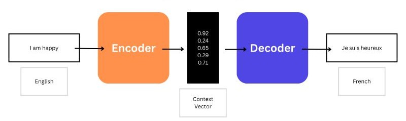

Here:
- **Encoder:** reads the input sequence and converts it into a numerical representation (called a context vector or hidden state) that captures the meaning of the input.
- **Decoder:** takes the context vector from the encoder and generates the output sequence word by word.

### Encoder
The encoder reads the input sequence and converts it into a numerical representation (called a context vector or hidden state) that captures the meaning of the input, and to do this task we use LSTM cell.

eg.,\
input sequence = `"Nice to meet you"`

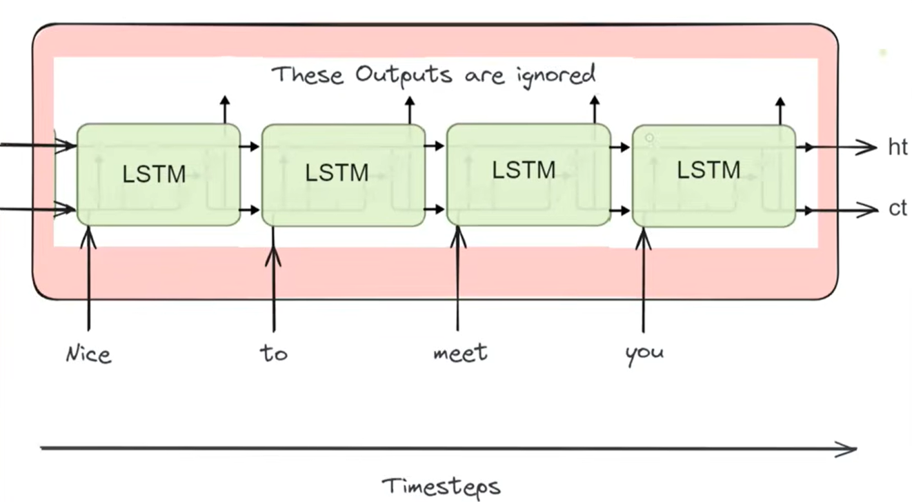

here ht and ct are the final context vector


#### Why use LSTM
In a Seq2Seq model, the encoder needs to understand the entire input sequence and preserve important information. Regular RNNs struggle with long sequences because they suffer from the vanishing gradient problem, causing them to forget earlier information.

LSTM is a type of RNN with memory cells that can retain important information for long periods, which makes it suitable for encoders that need to understand and summarize input sequences.

> Instead of LSTM you can also use GRU, as they also helps in retaining memory over a long sequence

### Decoder

The decoder takes the context vector from the encoder and generates the output sequence token by token.

e.g,\
output sequence: `"आपसे मिलकर अच्छा लगा"`    

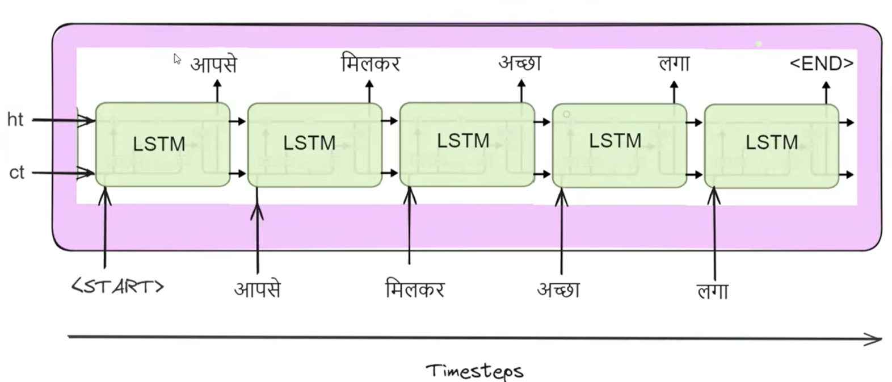

here ht and ct are the context vector provided by the encoder

- `<start>` -> a special type of symbol that tells the model to `start` producing output
- `<end>` -> a special type of symbol that tells the model to `stop` producing output


[Go To Top](#content)

---


# How To Train Encoder Decoder Model

in machine translation we generally require a supervised dataset, i.e, tabular data with one column containing sentence from input language and other with output language

### Example

english | hindi
--- | ---
"Think about it" | "इस बारे में सोचिए"


now we first convert sentence into their respective vector format using one hot encoding

- english:
    - total 3 unique words -> 3 dimensional vectors
    - think = [1, 0, 0]
    - about = [0, 1, 0]
    - it = [0, 0, 1]
- Hindi
    - total 4 unique words + 2 special symbol `<start>` and `<end>` -> 6 dimension vector
    - `<start>` = [1, 0, 0, 0, 0, 0]
    - इस = [0, 1, 0, 0, 0, 0]
    - बारे = [0, 0, 1, 0, 0, 0]
    - में = [0, 0, 0, 1, 0, 0]
    - सोचिए = [0, 0, 0, 0, 1, 0]
    - `<end>` = [0, 0, 0, 0, 0, 1]

### Dataset in vector format

input vector | output vector
--- | ---
[[1, 0, 0], [0, 1, 0], [0, 0, 1]] | [[1, 0, 0, 0, 0, 0], [0, 1, 0, 0, 0, 0], [0, 0, 1, 0, 0, 0], [0, 0, 0, 1, 0, 0], [0, 0, 0, 0, 1, 0], [0, 0, 0, 0, 0, 1]]

### forward propagation

now we pass the input vector into encoder and compute the context vector 

initially we'll be having the random weights and biases

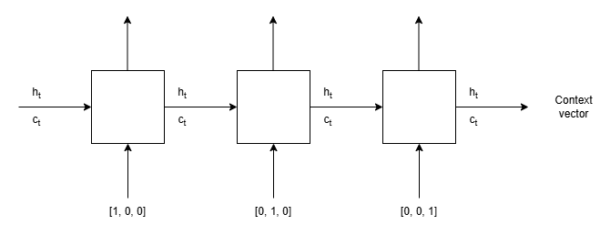


Now in case of decoder:
- we first pass this context vector as a input in decoder and compute the first output for first timestamp

    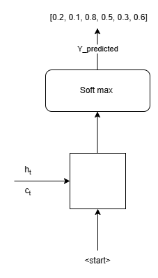

    soft max is just a neural network that convert the LSTM cell output into an required output, in our case its 6 dimension vector containing probability that represent the output word in vector format

    now:
    - y_predicted = [0.2, 0.1, 0.8, 0.5, 0.3, 0.6]  -> [0, 0, 1, 0, 0, 0] -> में
    - y_original = [0, 1, 0, 0, 0, 0] -> इस

    As you can see there is an error at y_predicted and y_original
- now for timestamp 2 instead of passing  previous output i.e, y_predicted we pass the y_original 

    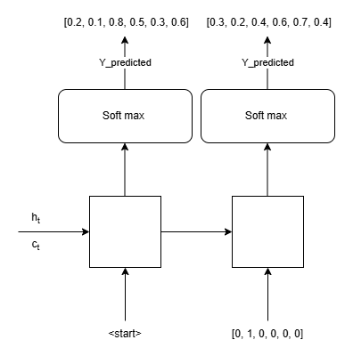

    here for timestamp 2:
    - y_predicted = [0.3, 0.2, 0.4, 0.6, 0.7, 0.4]  -> [0, 0, 0, 0, 1, 0] -> सोचिए
    - y_original = [0, 0, 1, 0, 0, 0] -> इस 
- we repeat this until the model outputs end or our sequence ends
        
    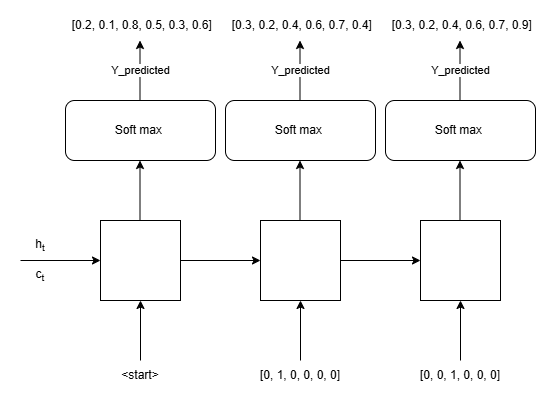

    here for timestamp 2:
    - y_predicted = [0.3, 0.2, 0.4, 0.6, 0.7, 0.9]  -> [0, 0, 0, 0, 0, 1] -> `<end>`
    - y_original = [0, 0, 0, 1, 0, 0] -> बारे

    since model output `<end>` we stop prediction

### Calculate Loss


| timestamp | 1 | 2 | 3|
--- | --- | --- | ---
**y_predicted** | [0.2, 0.1, 0.8, 0.5, 0.3, 0.6] | [0.3, 0.2, 0.4, 0.6, 0.7, 0.4] | [0.3, 0.2, 0.4, 0.6, 0.7, 0.9] |
**y_original** |[0, 1, 0, 0, 0, 0] | [0, 0, 1, 0, 0, 0] | [0, 0, 0, 1, 0, 0] | 

now calculate the loos for each timestamp
- since we have multi class classification problem will be use categorical cross entropy as a loss function
- mathematically:

    $$L = -\sum_{i=1}^n y_i^{og}\ log(y_i^{pred})$$

    here:
    - n = dimension of output vector
    - $y^{og}$ = y_original
    - $y^{pred}$ = y_predicted
- for timestamp 1:
    - $y^{og}$ = [0, 1, 0, 0, 0, 0]
    - $y^{pred}$ = [0.2, 0.1, 0.8, 0.5, 0.3, 0.6]
    - $L_1 = -[(0 \times log\ 0.2) + (1 \times log\ 0.1) + (0 \times log\ 0.8) + (0 \times log\ 0.5) + (0 \times log\ 0.3) + (0 \times log\ 0.6)]$
    - $L_1 = - (1 \times log\ 0.1) = 1$
- for timestamp 2:
    - $y^{og}$ = [0, 0, 1, 0, 0, 0]
    - $y^{pred}$ = [0.3, 0.2, 0.4, 0.6, 0.7, 0.4]
    - $L_2 = - (1 \times log\ 0.4) = 0.39$
- for timestamp 3:
    - $y^{og}$ = [0, 0, 0, 1, 0, 0]
    - $y^{pred}$ = [0.3, 0.2, 0.4, 0.6, 0.7, 0.9]
    - $L_3 = - (1 \times log\ 0.6) = 0.22$

- total loss = 1 + 0.39 + 0.22 = 1.61
- average loss = 1.61 / 3 = 0.53

### Backpropagation

1. calculate gradient for loss using formula:

    $$\frac{\partial L}{\partial W} = \sum_{i=1}^n \frac{\partial L_i}{\partial W}$$

    here:
    - $W$ = trainable Parameter
    - $L$ = loss function 
    - $i$ = number of timestamp in decoder
2. Update the parameter using gradient decent:

    $$W_{new} = W_{old} - \alpha \frac{\partial L}{\partial W_{old}}$$


[Go To Top](#content)

---
# Problem with Encoder Decoder Architecture

Suppose we have an LSTM encoder.

Input sentence:

>"The student who studied machine learning for six months built an excellent project."

The encoder reads words one by one:
```
"The"      → h1
"student"  → h2
"who"      → h3
...
"project"  → h12
```
At each step we calculate the hidden state of LSTM till we get final hidden state:
```
h12
```
This becomes the context vector.

### In encoder decoder the assumption is:
> h12 contains all important information about the entire sentence.

The decoder only receives this vector.

hidden state size is decided at the time of training and is fixed, now suppose the hidden state size is:
```
512
```
Then regardless of whether the input contains:
```
10 words
100 words
1000 words
```
the output is still:
```
512 numbers
```
That means:
```
Input
--------------------------------
10 words   → 512 values
100 words  → 512 values
1000 words → 512 values
--------------------------------
```
- The amount of information grows.
- But the storage capacity remains fixed.

### Now imagine:
```
A paragraph of 200 words
```
The encoder is being asked to compress a large amount of information into a fixed-size representation.

Think of it like this:
```
200-page book
        ↓
1-page summary
        ↓
Reconstruct the entire book
```
Information will inevitably be lost.

As a result eventually the encoder is forced to discard information.

### Earlier Words Are More Likely to Be Forgotten

Consider a 100-word sentence.
```
w1 w2 w3 ... w100
```
The encoder processes sequentially:
```
h1 → h2 → h3 → ... → h100
``` 
When computing:

```
h100
```
the information from:
```
w1
```
has been transformed 99 times.
```
w1
 ↓
h1
 ↓
h2
 ↓
...
 ↓
h100
```
Each transformation slightly alters the representation.

By the end, the signal from the earliest words may become very weak.

### Static Representation of Context 
- In the original encoder-decoder architecture, the decoder receives the same context vector at every timestamp.

- However, different output tokens require information from different parts of the input sequence.

- Since the context vector is static and represents the entire sequence, the decoder cannot selectively focus on the most relevant input words for each output step.

- This limits performance, especially for long sequences, and is one of the motivations behind the attention mechanism.


[Go To Top](#content)

---
# Attention Mechanism
The attention mechanism is a technique used in neural networks that allows a model to focus on the most relevant parts of the input when producing an output.

Suppose you're translating:
```
"The animal didn't cross the street because it was too tired."
```

To understand what "it" refers to, you need to pay more attention to "animal" than to "street". Attention gives the model this ability.

### Classical Encoder-decoder

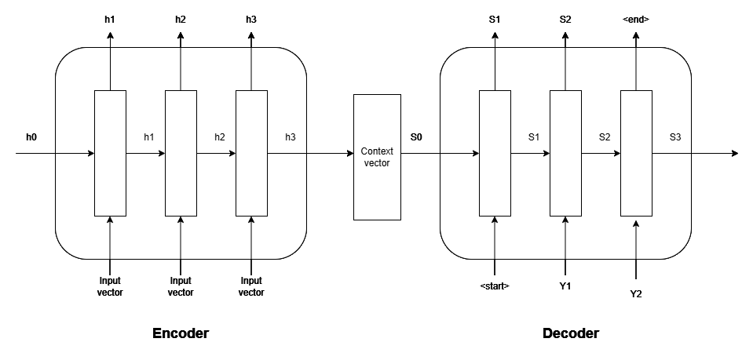

In classical encoder decoder architecture we provide two vector as an input for decoder to generate the output
- $S_{i-1}$ -> predicted output of previous timestamp
- $Y_{i-1}$ -> Original output of previous timestamp

### attention mechanism

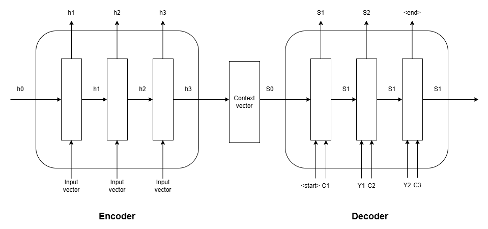

In case of attention we get three input in decoder for decoder to generate the output

- $S_{i-1}$ -> predicted output of previous timestamp
- $Y_{i-1}$ -> Original output of previous timestamp
- $C_i$ -> tells which part of the input sequence is important for generating output

### How does the LSTM handle second input vector $C_i$?

The decoder combines $Y_{i-1}$ and $C_i$ into a single input vector:

$$x_i = [Y_{i-1},  C_i]$$

LSTM actually receive this $x_i$ vector 

### What is $C_i$

$C_i$ is a weighted combination of all encoder hidden states. It summarizes the parts of the input sequence that are most relevant for generating the output at time step i.

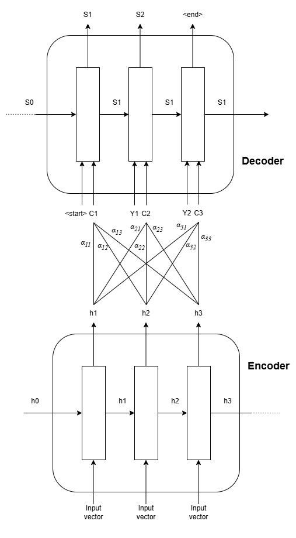

>$\alpha_{ij}$ = is like a weight between nodes $C_i$ and $h_j$, it tells how much important $h_j$ is for generating the output in timestamp $i$

#### Mathematically

If the encoder hidden states are:

$$h_1, h_2, ...h_T$$

then:

$$C_i = \sum_{j=1}^T \alpha_{ij}h_j$$

where:

- $h_j$ = encoder hidden state for timestamp j,
- $\alpha_{ij}$ = attention weight telling how much the decoder at step i should focus on encoder state $h_j$,

### Types of Attention mechanism

Now based on the how we calculate this $\alpha$ value there are two type of attention mechanism
1. [Bahdanau Attention](#bahdanau-attention): uses ANN 
2. [Luong Attention](#luong-attention): uses dot product for similarity search


[Go To Top](#content)

---

# Bahdanau Attention
In the attention mechanism, α usually represents the attention weight (or alignment score after normalization). It tells the model how much importance to assign to each encoder state when producing an output.

$\alpha$ is depend on two things;
1. encoder state $h_j$
2. decoder state from previous timestamp $S_{i-1}$

> think of it like:\
> given the outputs up till now $(S_{i-1})$ how much encoder state $h_j$ is important for next output i.e, $S_i$

### Mathematically we can say that:

$$\alpha_{ij} = f(h_j, S_{i-1})$$

here:
- $i$ = current timestamp in decoder
- $j$ = timestamp of encoders hidden state

In real case its just a ANN that takes $h_j$ and $S_{i-1}$ as an input and return $\alpha_{ij}$, and as for training its happen while we train the encoder decoder model where this ANN also get train along with the rest of the model 

**This ANN is known as alignment model**


### Example of How $\alpha_{ij}$ is computed

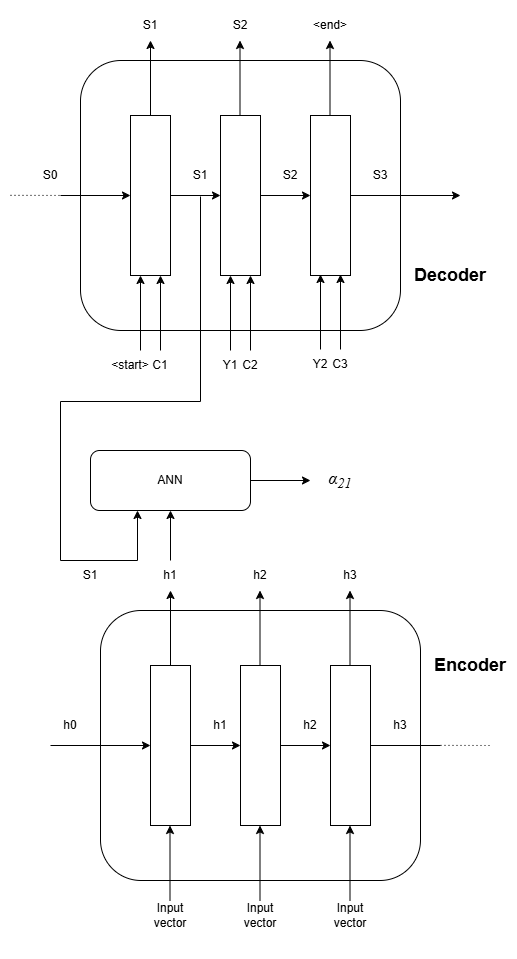

here we want to calculate the $C2$ for which we need $\alpha_{21}$, $\alpha_{22}$ and $\alpha_{23}$ and according to this image:
- ANN input:
    - $S_1$
    - $h_1$
- ANN output
    - $\alpha_{21}$

we use same ANN to compute the value of $\alpha_{22}$ and $\alpha_{23}$ as follow:

- input = $S_1$, $h_2$ -> output = $\alpha_{22}$
- input = $S_1$, $h_3$ -> output = $\alpha_{23}$

Now since we have all values of $\alpha_{ij}$ we can calculate the $C2$ using formula:

$$C_i = \sum_{j=1}^T \alpha_{ij}h_j$$

where:

- $h_j$ = encoder hidden state for timestamp j,


Therefore:

$$C_2 = \alpha_{21}h_1 + \alpha_{22}h_2 + \alpha_{23}h_3$$

Now
- LSTM input = $[Y_1, C_2]$ (combined vector)
- LSTM output = $S_2$


[Go To Top](#content)

---
# Luong Attention

In Bahdanau Attention attention to calculate the $\alpha_{ij}$ we use:

$$\alpha_{ij} = f(h_j, S_{i-1})$$

where $f(h_j, S_{i-1})$ is just a ANN that takes $h_j$ and $S_{i-1}$ as input

>- $h_j$ = hidden state of encoder for timestamp j
>- $S_{i-1}$ = hidden state of decoder for previous timestamp

But here in Luong Attention we change that to:

$$\alpha_{ij} = f(h_j, S_{i})$$

where:
- $h_j$ = hidden state of encoder for timestamp j
- $S_i$ = hidden state of decoder for current timestamp

And this time $f(h_j, S_{i})$ is just a dot product between $h_i$ and $S_i$

> in Luong Attention we are using current hidden state of decoder rather that previous hidden state, then perform the dot product and generate the final output for current timestamp

### Mathematically

$$f(h_j, S_{i}) = S_i^T \cdot h_j$$

where:
- $S_i^T$ = transpose of $S_i$

This dot products produce raw scores, not probabilities, Therefore we need to use softmax, that convert those score into the probability

Therefore:

$$\alpha_{ij} = S_i^T \cdot h_j$$

### Example
- $S_j = [a, b, c, d]$ 
- $h_j = [e, f, g, h]$ 

Now

$$S_i^T = \begin{bmatrix}
a\\
b\\
c\\
d
\end{bmatrix}$$

$$
\alpha_{ij} =  S_i^T \cdot h_j =
\begin{bmatrix}
a\\
b\\
c\\
d
\end{bmatrix}
\begin{bmatrix}
e & f & g & h
\end{bmatrix} =
ae + bf + cg + dh
$$


> Its a scalar value, as dot product return a scalar (number)

### Architectural Diagram

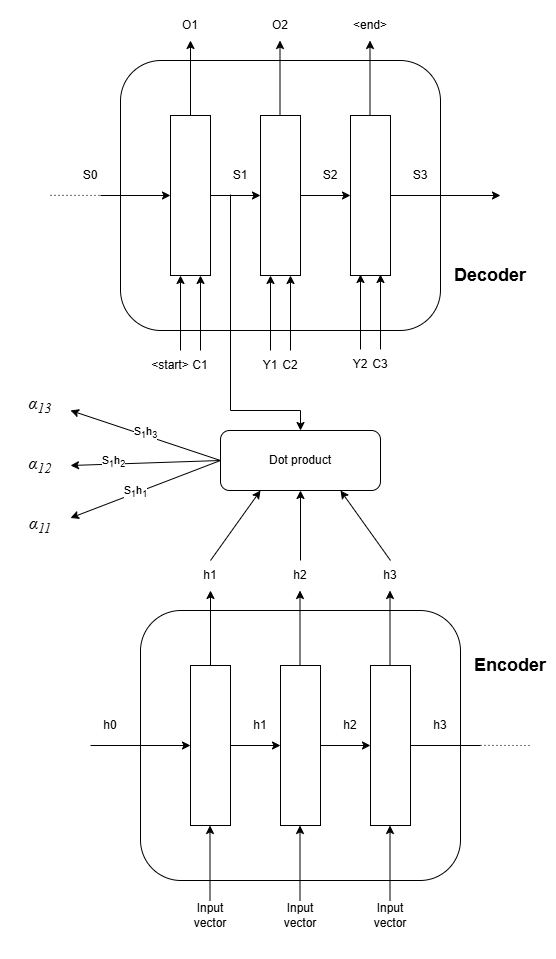

Here:
- $S_i$ = hidden state for timestamp i
- $O_i$ = Predicted output vector for timestamp i
- $Y_i$ = original output vector from previous timestamp
- $h_j$ = encoder hidden state for timestamp 
- $C_i$ = context vector that tells which $h_j$ is important for generating output
- $\alpha_{ij}$ = how much $C_i$ focus on $h_j$

### Softmax
In Luong attention, the dot products produce **raw scores**, not probabilities. Softmax converts these scores into **attention weights** ($\alpha$) that can be interpreted and used meaningfully.

Suppose the scores are:

- $\alpha_{11} = 2$
- $\alpha_{12} = 1$
- $\alpha_{13} = 3$

$$score = [2,1,3]$$

These numbers tell us that the third encoder state is more relevant, but they don't tell us **how much** each state should contribute.

#### Step 1: Apply exponential

$$e^{score} = [e^2,e^1,e^3]$$

$$\approx [7.39,\ 2.72,\ 20.09]$$

#### Step 2: Normalize

$$\alpha_{i} = \frac{e^{score_i}}{\sum e^{score_j}}$$

So,

$$
\alpha_{i} =
\left[
\frac{7.39}{30.20},
\frac{2.72}{30.20},
\frac{20.09}{30.20}
\right] =
[0.245,\ 0.090,\ 0.665]
$$

Now the weights:

* Are all between 0 and 1.
* Sum to 1.
* Can be interpreted as probabilities or relative importance.

### Why not use raw scores directly?

Suppose the scores are:

$$[100, 50, -10]$$

If you used them directly:

$$c_t = 100h_1 + 50h_2 - 10h_3$$

Problems:

* Negative weights are hard to interpret.
* The scale is arbitrary; larger scores can make the context vector explode.
* The weights don't represent relative importance.
* They don't sum to 1.

Softmax fixes all these issues. 


[Go To Top](#content)

---
# Self Attention

NLP (Natural Language Processing) is a field of computer science and AI focused on enabling computers to understand, interpret, generate, and interact with human language like human text.

But the problem is that our computer only understand the numeric value and is unable to process any textual input.

Therefore in any NLP application the first important step to convert the text into number, and this numeric representation of text is what we called vector / token


### Embeddings

- Embeddings are one of the most popular methods for converting words into vectors.

- Embeddings convert things like words or sentences into lists of numbers such that similar meanings correspond to nearby vectors.

#### Why do we need embeddings?
Suppose we have:
```
cat
dog
car
```
Using One-Hot Encoding:
```
cat → [1,0,0]
dog → [0,1,0]
car → [0,0,1]
```
The model sees all three as equally unrelated.

But with embeddings:
```
cat → [0.2, -0.7, 0.9, ...]
dog → [0.3, -0.6, 0.8, ...]
car → [-0.8, 0.4, -0.1, ...]
```
Now, cat and dog have similar vectors because they are semantically related.

#### How embedding Capture semantic similarity
embedding convert word into vector such that Similar meanings word have similar vectors.

Examples:
<!-- 
- king ↔ queen
- cat ↔ dog
- happy ↔ joyful

All of those pairs will have similar vectors -->


As you can see in above image
- `cat` and `dog` -> similar vector
- `cat` / `dog` and `snake` -> large difference between vector

This is because `cat` and `dog` is somewhat similar to each other as they both have four legs, they both can be tame, etc

whereas `snake` is soo much different from `cat` and `dog`, like `cat` and `dog` are mammals whereas `snake` is reptile

### Problem with embeddings
Embedding assign one vector per word, regardless of context.

lets suppose we have sentence like:
```
I deposited money in the bank.
I sat by the river bank.
``` 
Both occurrences of bank get the same vector, even though they mean different things, and since the vector is identical, the model mixes information and will think that they both have same meanings.

Therefore we need a mechanism where we can change the vector embedding according to sentence, like in above example both bank will have different vectors as they have different meaning

To solve this problem we use self attention, it allow us to create the different vectors for same word if they have different meaning in a sentence

### How self attention solves it?
Self-attention is a mechanism that determines how much "attention" different words or tokens in a sequence should pay to each other

Consider the sentence:\
`"The animal didn't cross the street because it was too tired."`

To understand what "it" refers to, the model needs to look at the other words in the sentence. Self-attention helps the model decide that "it" is related to "animal" more than to "street".

### Example:
consider a sentences:
1. money bank grows
2. river bank flows

here we can see word `bank` appear in both of those sentence but in each sentence the meaning of that word is different, therefore we must represent that word with different vector for different sentence

to do that we first calculate the embedding for each words 
- money = vector1
- bank = vector2
- grows = vector3 
- river = vector 4
- flows = vector6

> well only be having one vector for word bank as embedding generate same vector for same word

Now using self attention:

- sentence 1:
    - bank = 0.7 [money vector] + 0.1[bank vector] + 0.2[grows vector]
- sentence 2:
    - bank = 0.6 [river vector] + 0.2[bank vector] + 0.2[flows vector]

Now as you can see for both sentence we have different vector embedding for word `bank` indicating their meaning is different 

Also because of different vector representation the model now can distinguished between those words


You can think of it as:\
while generating the text embedding each word in a sequence giving attention to other words in its own sequence

- sentence 1 bank = 0.7[money vector] + 0.1[bank vector] + 0.2[grows vector]
    - here word bank is giving around 70% attention to vector1 i.e, money while generating embeddings
    - therefore the model will know that we are talking about money bank
- sentence 2 bank = 0.6[river vector] + 0.2[bank vector] + 0.2[flows vector]
    - here word bank is giving around 60% attention to vector4 i.e, river while generating embeddings 
    - Therefore the model will know that we are not talking about money bank, and that it's something else

### Similarly we can do for other words also
consider a sentences:
1. money bank grows
2. river bank flows

now their word embedding are:
- money = vector1
- bank = vector2
- grows = vector3 
- river = vector 4
- flows = vector6

Now with self attention:
- Sentence 1:
    - money = 0.4[vector1] + 0.1[vector2] + 0.6[vector3]
    - bank = 0.7[vector1] + 0.1[vector2] + 0.2[vector3]
    - grows = 0.5[vector1] + 0.2[vector2] + 0.3[vector3]
- Sentence 2:
    - river = 0.1[vector4] + 0.3[vector2] + 0.5[vector5]
    - bank = 0.6[vector4] + 0.2[vector2] + 0.2[vector5]
    - flows = 0.5[vector4] + 0.4[vector2] + 0.6[vector5]

### Similarity

Consider a word:
- money bank grows

their word embedding:
- money = vector1
- bank = vector2
- grows = vector3 

now using self attention:
```
bank = a [vector1] + b [vector2] + c [vector3]
```
- here a,b,c are fraction value that represent the similarity scores
    - a = similarity between bank vector and money vector
    - b = similarity between bank vector and bank vector
    - c = similarity between bank vector and grows vector
- higher the similarity more related the words are to each other

####  calculate the similarity using dot product

Whenever we have two vector we can check how much those two vector are related to each other by simply calculating the dot product between those vectors

- higher the dot product = higher the similarity
- lower the dot product = lower the similarity

from above Example:
- $vector1 \cdot vector2$ = similarity between word money and bank

Now from this we can compute:
```
bank = a [vector1] + b [vector2] + c [vector3]
```
- a = $vector2 \cdot vector1^T$
- b = $vector2 \cdot vector2^T$
- c = $vector2 \cdot vector3^T$

Therefore:

$$
bank = (vector2 \cdot vector1^T)[vector1] + (vector2 \cdot vector2^T)[vector2] + (vector2 \cdot vector3^T)[vector3]
$$

here:
- $vector1, vector2, vector3$ = n dimension vector generated using embeddings
- $vector1^T, vector2^T, vector3^T$ = Transpose vectors of $vector1, vector2, vector3$ respectively

#### Example:

sentence = Money bank grows

using embeddings we get:
- money = [0.2, 0.5, 0.3]
- bank = [0.5, 0.1, 0.4]
- grows = [0.8, 0.5, 0.1]


$$
bank = 
\left(
\begin{bmatrix}
0.5 & 0.1 & 0.4 
\end{bmatrix}
\cdot
\begin{bmatrix}
0.2\\
0.5\\
0.4
\end{bmatrix}
\right)
\begin{bmatrix}
0.2 & 0.5 & 0.4 
\end{bmatrix}
+
\left(
\begin{bmatrix}
0.5 & 0.1 & 0.4 
\end{bmatrix}
\cdot
\begin{bmatrix}
0.5\\
0.1\\
0.4
\end{bmatrix}
\right)
\begin{bmatrix}
0.5 & 0.1 & 0.4 
\end{bmatrix}
+
\left(
\begin{bmatrix}
0.5 & 0.1 & 0.4 
\end{bmatrix}
\cdot
\begin{bmatrix}
0.8\\
0.5\\
0.1
\end{bmatrix}
\right)
\begin{bmatrix}
0.8 & 0.5 & 0.1
\end{bmatrix}
$$


$$
bank = 0.27 
\begin{bmatrix}
0.2 & 0.5 & 0.4 
\end{bmatrix}
+
0.42
\begin{bmatrix}
0.5 & 0.1 & 0.4 
\end{bmatrix}
+
0.49
\begin{bmatrix}
0.8 & 0.5 & 0.1
\end{bmatrix}
$$

<!-- 
$$
bank = 
\begin{bmatrix}
0.054 & 0.135 & 0.081
\end{bmatrix}+
\begin{bmatrix}
0.210 & 0.042 & 0.168
\end{bmatrix}+
\begin{bmatrix}
0.392 & 0.245 & 0.049
\end{bmatrix}
$$

$$
bank = 
\begin{bmatrix}
0.656 & 0.422 & 0.298
\end{bmatrix}
$$ -->

### Normalization

from above example we get to know we can represent word bank in vector format using self attention mechanism

where;

$$bank = 0.27[vector1] + 0.42[vector2] + 0.49[vector3]$$

But the here problem is that in this representation we doesn't exactly know how much attention we are giving the each vector in a sequence

Therefore in this case we normalize the output of dot product, so that their sum will be equal to 1

Example:
- a = 0.27
- b = 0.42
- c = 0.49

$$a_{norm} = \frac{a}{a+b+c} = \frac{0.27}{1.18} \approx 0.23$$

$$b_{norm} = \frac{b}{a+b+c} = \frac{0.42}{1.18} \approx 0.355$$

$$c_{norm} = \frac{c}{a+b+c} = \frac{0.49}{1.18} \approx 0.415$$

Therefore

$$bank = 0.23[vector1] + 0.355[vector2] + 0.415[vector3]$$

now you can see word bank gives:
- 23% attention to vector 1
- 35.5% attention to vector 2
- 41.5% attention to vector3

Sometimes we use softmax instead of regular normalization to normalize the dot products


[Go To Top](#content)

---
# Properties of Self Attention
there are two major properties that self attention mechanism show i.e, 
1. Parallel computation
2. General contextual embeddings

### 1. Parallel computation
- once we compute the embedding for all the words in the sequence we can apply self attention to all of them parallelly
- this is because self attention is only depends on the embedding of the sequence to compute new vectors and is not depending on self attention vector of other words
- example:
    - embeddings:
        - money = [vector1]
        - bank = [vector2]
        - grows = [vector3]
    - now self attention can compute new vectors for each of those word parallelly as self attention vector of word bank is not depending on self attention vector of money or grows and same for other self attention vectors also

we can do this using liner algebra:
- money = [0.2, 0.5, 0.3]
- bank = [0.5, 0.1, 0.4]
- grows = [0.8, 0.5, 0.1]

matrix of embeddings:

$$
\begin{bmatrix}
money \ vector\\
bank\ vector\\
grows\ vector
\end{bmatrix} =
\begin{bmatrix}
0.2 & 0.5 & 0.3\\
0.5 & 0.1 & 0.4\\
0.8 & 0.5 & 0.1
\end{bmatrix}
$$

Transpose matrix

$$
\begin{bmatrix}
0.2 & 0.5 & 0.8\\
0.5 & 0.1 & 0.5\\
0.3 & 0.4 & 0.1
\end{bmatrix}
$$

dot product

$$
\begin{bmatrix}
0.2 & 0.5 & 0.3\\
0.5 & 0.1 & 0.4\\
0.8 & 0.5 & 0.1
\end{bmatrix}
\begin{bmatrix}
0.2 & 0.5 & 0.8\\
0.5 & 0.1 & 0.5\\
0.3 & 0.4 & 0.1
\end{bmatrix} =
\begin{bmatrix}
0.38 & 0.27 & 0.44\\
0.27 & 0.42 & 0.49\\
0.44 & 0.49 & 0.90
\end{bmatrix}
$$

Using normalization

$$
\begin{bmatrix}
0.35 & 0.25 & 0.40\\
0.23 & 0.36 & 0.42\\
0.24 & 0.27 & 0.49
\end{bmatrix}
$$

multiply this with embedding matrix:

$$
\begin{bmatrix}
0.35 & 0.25 & 0.40\\
0.23 & 0.36 & 0.42\\
0.24 & 0.27 & 0.49
\end{bmatrix}
\begin{bmatrix}
money \ vector\\
bank\ vector\\
grows\ vector
\end{bmatrix}
$$

Therefore:

$$
\begin{bmatrix}
0.35\ money\ vector + 0.25\ bank\ vector+ 0.40\ grows\ vector\\
0.23\ money\ vector + 0.36\ bank\ vector+ 0.42\ grows\ vector\\
0.24\ money\ vector + 0.27\ bank\ vector+ 0.49\ grows\ vector
\end{bmatrix}
$$

from this we can see:
- money = $0.35\ money\ vector + 0.25\ bank\ vector+ 0.40\ grows\ vector$
- bank = $0.23\ money\ vector + 0.36\ bank\ vector+ 0.42\ grows\ vector$
- grows = $0.24\ money\ vector + 0.27\ bank\ vector+ 0.49\ grows\ vector$

### 2. General contextual embeddings

In any Deep learning model there will always be few training parameters like weights and biases, but in self attention there is no such training parameter

Since there is no learning parameter the model is not learning from our data and is dependent on current sequence (sentence)

Therefore we can say that self attention mechanism is independent of your dataset, and can generate general contextual embeddings

These embeddings capture the meaning of tokens in context but are not optimized for any specific task.

Example:\
`"The movie was amazing."`

The embedding of "amazing" captures its contextual meaning, but it doesn't explicitly represent:

- sentiment
- spam probability
- topic category
- named entity type

It is a general representation.

#### Problem with general contextual embeddings
A general embedding tries to capture overall meaning, not what your task cares about.

Example:
```
"The movie was absolutely fantastic."
```
For sentiment analysis, the important information is that "fantastic" = positive sentiment.

A general embedding also encodes:

- grammar
- topic
- syntax
- word relationships
- sentence structure

Much of that information may be irrelevant to sentiment classification.

General embeddings are designed to work across many tasks.

As a result, they often contain features that act as noise for a specific task.


[Go To Top](#content)

---
# Task Specific Embeddings in Self Attention
> This is the actual self attention we used in todays date

As we learn that normal self attention generate the general contextual embeddings which tries to capture overall meaning of the sentence, and not what your task cares about.

To solve this problem we usually generate the task specific embeddings 

### How normal self attention work
normal self attention follows a simple flow:
1. find the vector embeddings
2. dot product between the embeddings to find similarity score
3. normalize the similarity score
3. multiply embedding with similarity score

example:
- sentence = `"money bank grows"`
- embeddings:
    - money = e1
    - bank = e2
    - grows = e3

- now with self attention:\
money = ae1 + be2 + ce3
- you can see how we compute that in following image


now if you look closely we have use 3 vector to solve this self attention problem i.e, 
- 2 vectors for dot product
- 1 vector for final attention representation

Now on the bases of how we have use those vector we can classify them into three types:

### 1. Query Vector (Q)
A Query represents:

>"What information am I looking for?"

When processing a token, its query is compared against every token's key.

For example, in:

>"money bank grows"

Suppose we're computing attention for money.

The query of money asks:

>"Which words are relevant to me?"
### 2. Key Vector (K)

A Key represents:

> "What kind of information do I contain?"

Every token publishes a key.

Examples:
```
money -> k₁
bank  -> k₂
grows -> k₃
```
### 3. Value Vector (V)
Value represents:

>"What information should I send if someone attends to me?"

Once attention scores are computed, we don't use keys anymore.

Instead we combine values.

Suppose attention weights become:
```
money -> 0.1
bank  -> 0.8
grows -> 0.1
```
Then:

money = 0.1 $V_{money}$ + 0.8 $V_{bank}$ + 0.1 $V_{grows}$

### Example
here is the example of word `money` in sentence `money bank grows`


### How to divide a embedding into 3 vectors
from the above example we can see that we need to somehow convert the one embedding vector into 3 vectors i.e, query vector, key vector and value vector 

Therefore in order to transform our one embedding vector into 3 different vector we use liner transformation

> A linear transformation takes an input vector and produces a new vector according to some rule (usually a matrix multiplication). The vector may be stretched, shrunk, rotated, reflected, or sheared.

Hence we simple matrix multiplication we can transform our original embedding vector into 3 different vectors

Example:
- $e_{bank}$ =  embedding vector for word bank
- $W_q$ = matrix for query transformation
- $W_k$ = matrix for key transformation
- $W_v$ = matrix for value transformation

Therefore
- $e_{bank} \times W_q = Q_{bank}$ -> query vector
- $e_{bank} \times W_k = K_{bank}$ -> key vector
- $e_{bank} \times W_v = V_{bank}$ -> value vector

now since we have this 3 vectors we can use that self attention flow to generate the task specific embeddings


> Note: the parallel execution property of self attention is still true for this architecture

### how to find the transformation matrix $W_q, W_k$ and $W_v$
we doesn't have to decide what the matrix will be like as its done with the help of our data

- we start with the random values for matrix
- feed the data for training
- predict the output
- calculate the loss
- update the matrix values using backpropagation
- repeat until the loss is minimum

### How this solve task specific problem
normal self attention generate the general contextual embeddings which tries to capture overall meaning of the sentence, and not what your task cares about.


This is because there is no training involve in normal self attention, so our self attention model doesn't learn anything from our data. Because of this whatever vector are being generated using self attention are general contextual embedding and are not task specific contextual embedding

Therefore we use 3 transformation vectors $W_q, W_k$ and $W_v$ that learn from the dataset and transform the embedding according to our dataset and the task needed

### Mathematical Representation

$$Attention(Q,K,V) = Softmax\left( \frac{QK^T}{d_K}\right)V$$

where:
- $Q$ = quey vector
- $K$ = key vector
- $V$ = value vector
- $d_K$ = dimension of key vector

Also
- $QK^T$ = dot product between query vector and key vector

#### why $\frac{1}{d_K}$
in dot product as number of dimension of a vector increases the variance also increases

> high valance means values are far apart from each other, i.e, some values ae too big whereas some are too small

because of high variance softmax convert big number into high probability (90%-95%) and small number into small probability (1%-5%)

> softmax is just a function that takes a list of number as input and scale them such that their sum will be equal to 1 i.e, 100%

because of this we face the vanishing gradient problem where  points with low probability barely update its value

therefore to solve this vanishing gradient problem we somehow need to reduce the high variance of dot product

And since the reason behind high variance is high number of dimension of a vector we divide the dot product with the number of dimension to scale the product down to lower the variance

> if the list has high values its variance will be high and if it has small values its variance will be small


[Go To Top](#content)

---