# Content
1. [introduction](#introduction)
2. Self Attention
    -  [Self Attention](#self-attention)
    -  [Properties of Self Attention](#properties-of-self-attention)
    -  [Task Specific Embeddings in Self Attention](#task-specific-embeddings-in-self-attention)
3. [Multi Head Attention](#multi-head-attention)
4. [Positional Encoding](#positional-encoding)
5. [Layer Normalization](#layer-normalization)
6. [Encoder](#encoder)
7. [Masked self attention](#masked-self-attention)
8. [Cross Attention](#cross-attention)


---
# Introduction
A transformer is a deep learning architecture designed to understand relationships between pieces of data (usually words or tokens) using a mechanism called self-attention. It is the foundation of modern large language models like ChatGPT.


### Why were transformers invented?

Before transformers, models like RNNs and LSTMs processed text one word at a time.

For example:

> "The cat, which was sitting on the roof, jumped."

When the model reaches "jumped", it has to remember that the subject is "cat", even though many words came in between. RNNs often struggled with long-range dependencies and were slow because they processed words sequentially.

Transformers solve this by processing all words simultaneously and letting every word "look at" every other relevant word.

### Components of Transformers

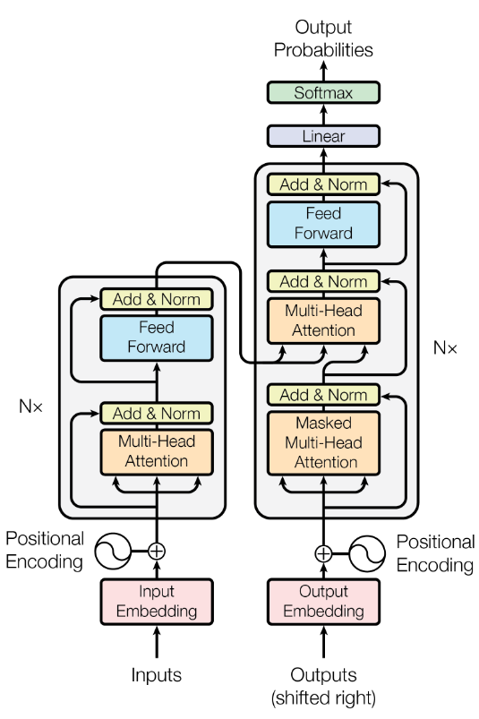

1. **Self-Attention:**\
it is a mechanism that determines how much "attention" different words or tokens in a sequence should pay to each other

2. **Multi-Head Attention:**\
Instead of one attention mechanism, the model uses several in parallel.

3. **Positional Encoding:**\
information about word with respect to its position in sequence

4. **Layer Normalization:**\
These help stabilize training and allow very deep transformer models.

### Transformers are same as encoder decoder

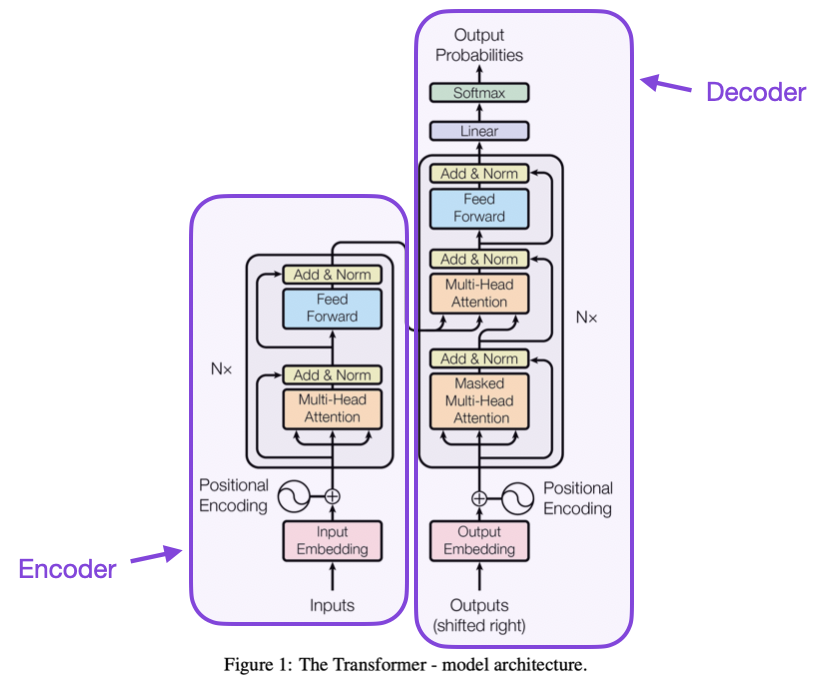

- encoder = encode the input sequence
- decoder = decodes the encoded input and generate output

> to learn more about this check ot [sequence to sequence model](./Seq2Seq.md)


[Go To Top](#content)

---

# Self Attention

NLP (Natural Language Processing) is a field of computer science and AI focused on enabling computers to understand, interpret, generate, and interact with human language like human text.

But the problem is that our computer only understand the numeric value and is unable to process any textual input.

Therefore in any NLP application the first important step to convert the text into number, and this numeric representation of text is what we called vector / token


### Embeddings

- Embeddings are one of the most popular methods for converting words into vectors.

- Embeddings convert things like words or sentences into lists of numbers such that similar meanings correspond to nearby vectors.

#### Why do we need embeddings?
Suppose we have:
```
cat
dog
car
```
Using One-Hot Encoding:
```
cat → [1,0,0]
dog → [0,1,0]
car → [0,0,1]
```
The model sees all three as equally unrelated.

But with embeddings:
```
cat → [0.2, -0.7, 0.9, ...]
dog → [0.3, -0.6, 0.8, ...]
car → [-0.8, 0.4, -0.1, ...]
```
Now, cat and dog have similar vectors because they are semantically related.

#### How embedding Capture semantic similarity
embedding convert word into vector such that Similar meanings word have similar vectors.

Examples:
<!-- 
- king ↔ queen
- cat ↔ dog
- happy ↔ joyful

All of those pairs will have similar vectors -->

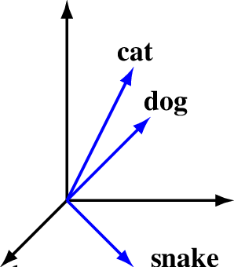

As you can see in above image
- `cat` and `dog` -> similar vector
- `cat` / `dog` and `snake` -> large difference between vector

This is because `cat` and `dog` is somewhat similar to each other as they both have four legs, they both can be tame, etc

whereas `snake` is soo much different from `cat` and `dog`, like `cat` and `dog` are mammals whereas `snake` is reptile

### Problem with embeddings
Embedding assign one vector per word, regardless of context.

lets suppose we have sentence like:
```
I deposited money in the bank.
I sat by the river bank.
``` 
Both occurrences of bank get the same vector, even though they mean different things, and since the vector is identical, the model mixes information and will think that they both have same meanings.

Therefore we need a mechanism where we can change the vector embedding according to sentence, like in above example both bank will have different vectors as they have different meaning

To solve this problem we use self attention, it allow us to create the different vectors for same word if they have different meaning in a sentence

### How self attention solves it?
Self-attention is a mechanism that determines how much "attention" different words or tokens in a sequence should pay to each other

Consider the sentence:\
`"The animal didn't cross the street because it was too tired."`

To understand what "it" refers to, the model needs to look at the other words in the sentence. Self-attention helps the model decide that "it" is related to "animal" more than to "street".

### Example:
consider a sentences:
1. money bank grows
2. river bank flows

here we can see word `bank` appear in both of those sentence but in each sentence the meaning of that word is different, therefore we must represent that word with different vector for different sentence

to do that we first calculate the embedding for each words 
- money = vector1
- bank = vector2
- grows = vector3 
- river = vector 4
- flows = vector6

> well only be having one vector for word bank as embedding generate same vector for same word

Now using self attention:

- sentence 1:
    - bank = 0.7 [money vector] + 0.1[bank vector] + 0.2[grows vector]
- sentence 2:
    - bank = 0.6 [river vector] + 0.2[bank vector] + 0.2[flows vector]

Now as you can see for both sentence we have different vector embedding for word `bank` indicating their meaning is different 

Also because of different vector representation the model now can distinguished between those words


You can think of it as:\
while generating the text embedding each word in a sequence giving attention to other words in its own sequence

- sentence 1 bank = 0.7[money vector] + 0.1[bank vector] + 0.2[grows vector]
    - here word bank is giving around 70% attention to vector1 i.e, money while generating embeddings
    - therefore the model will know that we are talking about money bank
- sentence 2 bank = 0.6[river vector] + 0.2[bank vector] + 0.2[flows vector]
    - here word bank is giving around 60% attention to vector4 i.e, river while generating embeddings 
    - Therefore the model will know that we are not talking about money bank, and that it's something else

### Similarly we can do for other words also
consider a sentences:
1. money bank grows
2. river bank flows

now their word embedding are:
- money = vector1
- bank = vector2
- grows = vector3 
- river = vector 4
- flows = vector6

Now with self attention:
- Sentence 1:
    - money = 0.4[vector1] + 0.1[vector2] + 0.6[vector3]
    - bank = 0.7[vector1] + 0.1[vector2] + 0.2[vector3]
    - grows = 0.5[vector1] + 0.2[vector2] + 0.3[vector3]
- Sentence 2:
    - river = 0.1[vector4] + 0.3[vector2] + 0.5[vector5]
    - bank = 0.6[vector4] + 0.2[vector2] + 0.2[vector5]
    - flows = 0.5[vector4] + 0.4[vector2] + 0.6[vector5]

### Similarity

Consider a word:
- money bank grows

their word embedding:
- money = vector1
- bank = vector2
- grows = vector3 

now using self attention:
```
bank = a [vector1] + b [vector2] + c [vector3]
```
- here a,b,c are fraction value that represent the similarity scores
    - a = similarity between bank vector and money vector
    - b = similarity between bank vector and bank vector
    - c = similarity between bank vector and grows vector
- higher the similarity more related the words are to each other

####  calculate the similarity using dot product

Whenever we have two vector we can check how much those two vector are related to each other by simply calculating the dot product between those vectors

- higher the dot product = higher the similarity
- lower the dot product = lower the similarity

from above Example:
- $vector1 \cdot vector2$ = similarity between word money and bank

Now from this we can compute:
```
bank = a [vector1] + b [vector2] + c [vector3]
```
- a = $vector2 \cdot vector1^T$
- b = $vector2 \cdot vector2^T$
- c = $vector2 \cdot vector3^T$

Therefore:

$$
bank = (vector2 \cdot vector1^T)[vector1] + (vector2 \cdot vector2^T)[vector2] + (vector2 \cdot vector3^T)[vector3]
$$

here:
- $vector1, vector2, vector3$ = n dimension vector generated using embeddings
- $vector1^T, vector2^T, vector3^T$ = Transpose vectors of $vector1, vector2, vector3$ respectively

#### Example:

sentence = Money bank grows

using embeddings we get:
- money = [0.2, 0.5, 0.3]
- bank = [0.5, 0.1, 0.4]
- grows = [0.8, 0.5, 0.1]


$$
bank = 
\left(
\begin{bmatrix}
0.5 & 0.1 & 0.4 
\end{bmatrix}
\cdot
\begin{bmatrix}
0.2\\
0.5\\
0.4
\end{bmatrix}
\right)
\begin{bmatrix}
0.2 & 0.5 & 0.4 
\end{bmatrix}
+
\left(
\begin{bmatrix}
0.5 & 0.1 & 0.4 
\end{bmatrix}
\cdot
\begin{bmatrix}
0.5\\
0.1\\
0.4
\end{bmatrix}
\right)
\begin{bmatrix}
0.5 & 0.1 & 0.4 
\end{bmatrix}
+
\left(
\begin{bmatrix}
0.5 & 0.1 & 0.4 
\end{bmatrix}
\cdot
\begin{bmatrix}
0.8\\
0.5\\
0.1
\end{bmatrix}
\right)
\begin{bmatrix}
0.8 & 0.5 & 0.1
\end{bmatrix}
$$


$$
bank = 0.27 
\begin{bmatrix}
0.2 & 0.5 & 0.4 
\end{bmatrix}
+
0.42
\begin{bmatrix}
0.5 & 0.1 & 0.4 
\end{bmatrix}
+
0.49
\begin{bmatrix}
0.8 & 0.5 & 0.1
\end{bmatrix}
$$

<!-- 
$$
bank = 
\begin{bmatrix}
0.054 & 0.135 & 0.081
\end{bmatrix}+
\begin{bmatrix}
0.210 & 0.042 & 0.168
\end{bmatrix}+
\begin{bmatrix}
0.392 & 0.245 & 0.049
\end{bmatrix}
$$

$$
bank = 
\begin{bmatrix}
0.656 & 0.422 & 0.298
\end{bmatrix}
$$ -->

### Normalization

from above example we get to know we can represent word bank in vector format using self attention mechanism

where;

$$bank = 0.27[vector1] + 0.42[vector2] + 0.49[vector3]$$

But the here problem is that in this representation we doesn't exactly know how much attention we are giving the each vector in a sequence

Therefore in this case we normalize the output of dot product, so that their sum will be equal to 1

Example:
- a = 0.27
- b = 0.42
- c = 0.49

$$a_{norm} = \frac{a}{a+b+c} = \frac{0.27}{1.18} \approx 0.23$$

$$b_{norm} = \frac{b}{a+b+c} = \frac{0.42}{1.18} \approx 0.355$$

$$c_{norm} = \frac{c}{a+b+c} = \frac{0.49}{1.18} \approx 0.415$$

Therefore

$$bank = 0.23[vector1] + 0.355[vector2] + 0.415[vector3]$$

now you can see word bank gives:
- 23% attention to vector 1
- 35.5% attention to vector 2
- 41.5% attention to vector3

Sometimes we use softmax instead of regular normalization to normalize the dot products


[Go To Top](#content)

---
# Properties of Self Attention
there are two major properties that self attention mechanism show i.e, 
1. Parallel computation
2. General contextual embeddings

### 1. Parallel computation
- once we compute the embedding for all the words in the sequence we can apply self attention to all of them parallelly
- this is because self attention is only depends on the embedding of the sequence to compute new vectors and is not depending on self attention vector of other words
- example:
    - embeddings:
        - money = [vector1]
        - bank = [vector2]
        - grows = [vector3]
    - now self attention can compute new vectors for each of those word parallelly as self attention vector of word bank is not depending on self attention vector of money or grows and same for other self attention vectors also

we can do this using liner algebra:
- money = [0.2, 0.5, 0.3]
- bank = [0.5, 0.1, 0.4]
- grows = [0.8, 0.5, 0.1]

matrix of embeddings:

$$
\begin{bmatrix}
money \ vector\\
bank\ vector\\
grows\ vector
\end{bmatrix} =
\begin{bmatrix}
0.2 & 0.5 & 0.3\\
0.5 & 0.1 & 0.4\\
0.8 & 0.5 & 0.1
\end{bmatrix}
$$

Transpose matrix

$$
\begin{bmatrix}
0.2 & 0.5 & 0.8\\
0.5 & 0.1 & 0.5\\
0.3 & 0.4 & 0.1
\end{bmatrix}
$$

dot product

$$
\begin{bmatrix}
0.2 & 0.5 & 0.3\\
0.5 & 0.1 & 0.4\\
0.8 & 0.5 & 0.1
\end{bmatrix}
\begin{bmatrix}
0.2 & 0.5 & 0.8\\
0.5 & 0.1 & 0.5\\
0.3 & 0.4 & 0.1
\end{bmatrix} =
\begin{bmatrix}
0.38 & 0.27 & 0.44\\
0.27 & 0.42 & 0.49\\
0.44 & 0.49 & 0.90
\end{bmatrix}
$$

Using normalization

$$
\begin{bmatrix}
0.35 & 0.25 & 0.40\\
0.23 & 0.36 & 0.42\\
0.24 & 0.27 & 0.49
\end{bmatrix}
$$

multiply this with embedding matrix:

$$
\begin{bmatrix}
0.35 & 0.25 & 0.40\\
0.23 & 0.36 & 0.42\\
0.24 & 0.27 & 0.49
\end{bmatrix}
\begin{bmatrix}
money \ vector\\
bank\ vector\\
grows\ vector
\end{bmatrix}
$$

Therefore:

$$
\begin{bmatrix}
0.35\ money\ vector + 0.25\ bank\ vector+ 0.40\ grows\ vector\\
0.23\ money\ vector + 0.36\ bank\ vector+ 0.42\ grows\ vector\\
0.24\ money\ vector + 0.27\ bank\ vector+ 0.49\ grows\ vector
\end{bmatrix}
$$

from this we can see:
- money = $0.35\ money\ vector + 0.25\ bank\ vector+ 0.40\ grows\ vector$
- bank = $0.23\ money\ vector + 0.36\ bank\ vector+ 0.42\ grows\ vector$
- grows = $0.24\ money\ vector + 0.27\ bank\ vector+ 0.49\ grows\ vector$

### 2. General contextual embeddings

In any Deep learning model there will always be few training parameters like weights and biases, but in self attention there is no such training parameter

Since there is no learning parameter the model is not learning from our data and is dependent on current sequence (sentence)

Therefore we can say that self attention mechanism is independent of your dataset, and can generate general contextual embeddings

These embeddings capture the meaning of tokens in context but are not optimized for any specific task.

Example:\
`"The movie was amazing."`

The embedding of "amazing" captures its contextual meaning, but it doesn't explicitly represent:

- sentiment
- spam probability
- topic category
- named entity type

It is a general representation.

#### Problem with general contextual embeddings
A general embedding tries to capture overall meaning, not what your task cares about.

Example:
```
"The movie was absolutely fantastic."
```
For sentiment analysis, the important information is that "fantastic" = positive sentiment.

A general embedding also encodes:

- grammar
- topic
- syntax
- word relationships
- sentence structure

Much of that information may be irrelevant to sentiment classification.

General embeddings are designed to work across many tasks.

As a result, they often contain features that act as noise for a specific task.


[Go To Top](#content)

---
# Task Specific Embeddings in Self Attention
> This is the actual self attention we used in todays date

As we learn that normal self attention generate the general contextual embeddings which tries to capture overall meaning of the sentence, and not what your task cares about.

To solve this problem we usually generate the task specific embeddings 

### How normal self attention work
normal self attention follows a simple flow:
1. find the vector embeddings
2. dot product between the embeddings to find similarity score
3. normalize the similarity score
3. multiply embedding with similarity score

example:
- sentence = `"money bank grows"`
- embeddings:
    - money = e1
    - bank = e2
    - grows = e3

- now with self attention:\
money = ae1 + be2 + ce3
- you can see how we compute that in following image

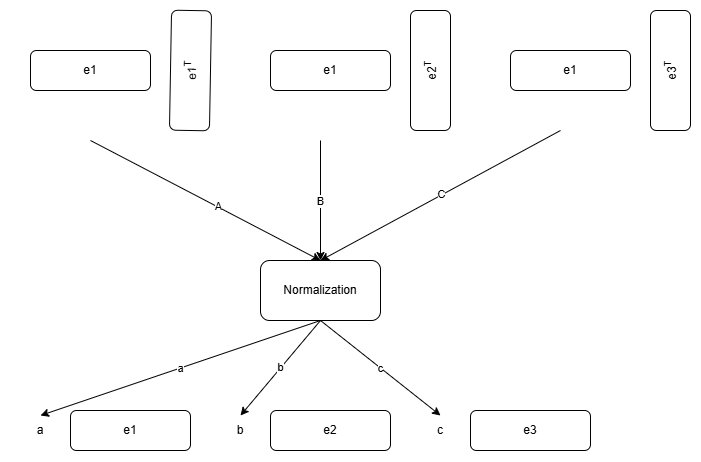

now if you look closely we have use 3 vector to solve this self attention problem i.e, 
- 2 vectors for dot product
- 1 vector for final attention representation

Now on the bases of how we have use those vector we can classify them into three types:

### 1. Query Vector (Q)
A Query represents:

>"What information am I looking for?"

When processing a token, its query is compared against every token's key.

For example, in:

>"money bank grows"

Suppose we're computing attention for money.

The query of money asks:

>"Which words are relevant to me?"
### 2. Key Vector (K)

A Key represents:

> "What kind of information do I contain?"

Every token publishes a key.

Examples:
```
money -> k₁
bank  -> k₂
grows -> k₃
```
### 3. Value Vector (V)
Value represents:

>"What information should I send if someone attends to me?"

Once attention scores are computed, we don't use keys anymore.

Instead we combine values.

Suppose attention weights become:
```
money -> 0.1
bank  -> 0.8
grows -> 0.1
```
Then:

money = 0.1 $V_{money}$ + 0.8 $V_{bank}$ + 0.1 $V_{grows}$

### Example
here is the example of word `money` in sentence `money bank grows`

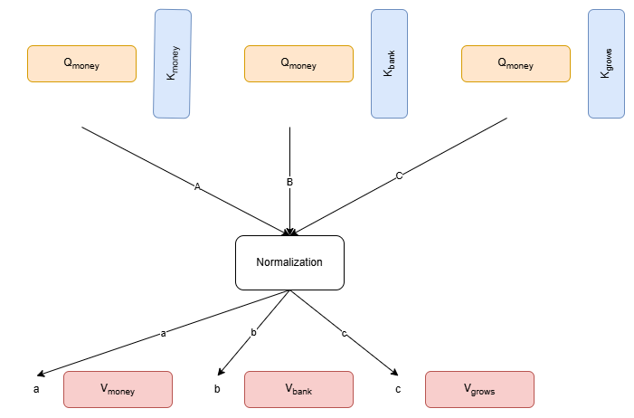

### How to divide a embedding into 3 vectors
from the above example we can see that we need to somehow convert the one embedding vector into 3 vectors i.e, query vector, key vector and value vector 

Therefore in order to transform our one embedding vector into 3 different vector we use liner transformation

> A linear transformation takes an input vector and produces a new vector according to some rule (usually a matrix multiplication). The vector may be stretched, shrunk, rotated, reflected, or sheared.

Hence we simple matrix multiplication we can transform our original embedding vector into 3 different vectors

Example:
- $e_{bank}$ =  embedding vector for word bank
- $W_q$ = matrix for query transformation
- $W_k$ = matrix for key transformation
- $W_v$ = matrix for value transformation

Therefore
- $e_{bank} \times W_q = Q_{bank}$ -> query vector
- $e_{bank} \times W_k = K_{bank}$ -> key vector
- $e_{bank} \times W_v = V_{bank}$ -> value vector

now since we have this 3 vectors we can use that self attention flow to generate the task specific embeddings

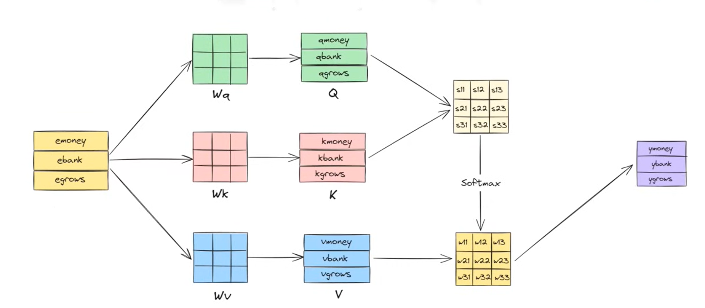

> Note: the parallel execution property of self attention is still true for this architecture

### how to find the transformation matrix $W_q, W_k$ and $W_v$
we doesn't have to decide what the matrix will be like as its done with the help of our data

- we start with the random values for matrix
- feed the data for training
- predict the output
- calculate the loss
- update the matrix values using backpropagation
- repeat until the loss is minimum

### How this solve task specific problem
normal self attention generate the general contextual embeddings which tries to capture overall meaning of the sentence, and not what your task cares about.


This is because there is no training involve in normal self attention, so our self attention model doesn't learn anything from our data. Because of this whatever vector are being generated using self attention are general contextual embedding and are not task specific contextual embedding

Therefore we use 3 transformation vectors $W_q, W_k$ and $W_v$ that learn from the dataset and transform the embedding according to our dataset and the task needed

### Mathematical Representation

$$Attention(Q,K,V) = Softmax\left( \frac{QK^T}{d_K}\right)V$$

where:
- $Q$ = quey vector
- $K$ = key vector
- $V$ = value vector
- $d_K$ = dimension of key vector

Also
- $QK^T$ = dot product between query vector and key vector

#### why $\frac{1}{d_K}$
in dot product as number of dimension of a vector increases the variance also increases

> high valance means values are far apart from each other, i.e, some values ae too big whereas some are too small

because of high variance softmax convert big number into high probability (90%-95%) and small number into small probability (1%-5%)

> softmax is just a function that takes a list of number as input and scale them such that their sum will be equal to 1 i.e, 100%

because of this we face the vanishing gradient problem where  points with low probability barely update its value

therefore to solve this vanishing gradient problem we somehow need to reduce the high variance of dot product

And since the reason behind high variance is high number of dimension of a vector we divide the dot product with the number of dimension to scale the product down to lower the variance

> if the list has high values its variance will be high and if it has small values its variance will be small


[Go To Top](#content)

---
# Multi Head Attention
Although self attention is good for capturing the contextual embedding of any word but they fails in cas of ambiguous sentence

Example:
- Sentence: `"The man saw the astronomer with a telescope"`
- who has the telescope?
    - does man use telescope to saw astronomer?
    - Or there was a astronomer who has telescope with him and that man just happen to saw that astronomer along with that telescope
- now as you can see since this sentence has multiple meaning, but our self attention can only be able to capture one one of them
- so with self attention we can either capture:
    - man with telescope
    - Or astronomer with telescope
- not both at the same time

Now to solve this problem we use multi head attention

### What is multi head attention
as we see in above example if a sentence has multiple meaning self attention can only capture one of them at a time, Therefore to solve this problem we can use multiple self attention so that each self attention will capture different meaning. Hence we call it self multi head attention


Example:
- Sentence: `"The man saw the astronomer with a telescope"`
- 1st self attention ->  man use telescope to saw astronomer
- 2nd self attention -> astronomer with telescope

as you can see with 2 self attention working together we can capture both of those meaning

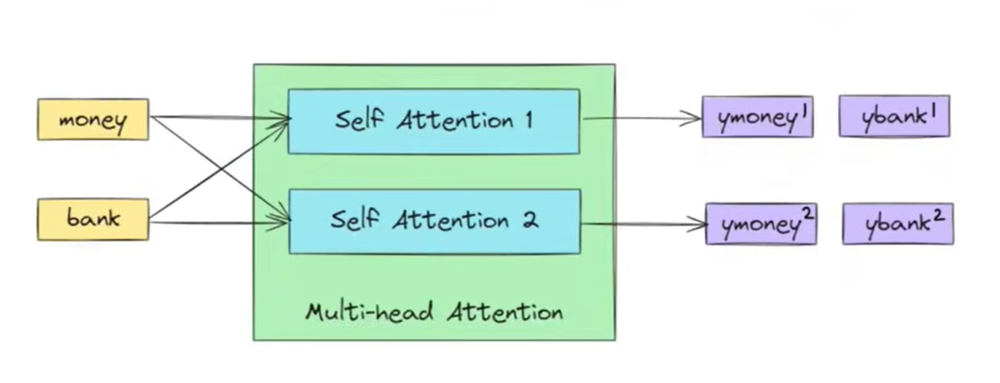

### How to do that?
in self attention to generate any embeddings we need three essential vectors
- $Q$ = query vector
- $K$ = key vector
- $V$ = value vector

and to compute this vectors we use matrix multiplication 
- $W_k$ = matrix for key vector
- $W_Q$ = matrix for query vector
- $W_V$ = matrix for value vector

this matrix is like a trainable parameter that train over the with the help of data

Now for single self attention we need one set of that vector, by that logic for two self attention we need two sets

Therefore we can say that for multi head attention we just need multiple set of $Q, V$ and $K$ vectors
- $Q_1, K_1, V_1$ ->  1st self attention 
- $Q_2, K_2, V_2$ ->  2nd self attention 
- $Q_n, K_n, V_n$ ->  nth self attention 

and to compute this vector we need multiple matrix
- $W_k^1, W_V^1, W_Q^1$ -> key, value and quey matrix for 1st self attention
- $W_k^2, W_V^2, W_Q^2$ -> key, value and quey matrix for 2nd self attention
- $W_k^n, W_V^n, W_Q^n$ -> key, value and quey matrix for nth self attention

Now for sentence with multiple meaning:
- $W_k^1, W_V^1, W_Q^1$ -> $Q_1, K_1, V_1$ -> vector1 -> capture 1st meaning
- $W_k^2, W_V^2, W_Q^2$ -> $Q_2, K_2, V_2$ -> vector2 -> capture 2nd meaning\
and so on

### how to combine multiple output vector
now using multi head attention we may generate multiple contextual embedding so that they can capture multiple meanings, but in output we want single vector that can represent all that information

and to do that we just concatenate those multiple contextual embedding into single vector and then apply liner liner transformation to merge them

Example:
- $W_k^1, W_V^1, W_Q^1$ -> $Q_1, K_1, V_1$ -> $[a, b, b]$
- $W_k^2, W_V^2, W_Q^2$ -> $Q_2, K_2, V_2$ -> $[e, f, g]$

- concatenate: $[q, b, c, e, f, g]$
- liner transformation: $[q, b, c, e, f, g] \times W_0 = [h, i, j]$

here 
- $[h, i, j]$ is the final output of our multi head attention
- $W_0$ is the matrix that merger multiple self attention vectors, and is trainable just like $W_k, W_V, W_Q$

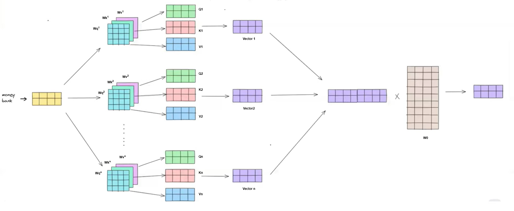


[Go To Top](#content)

---
# Positional Encoding
A self attention processes all words in parallel, unlike an RNN which processes them one after another. This creates a problem where the self attention has no inherent understanding of the order of words.

For example:

- "The cat chased the dog."
- "The dog chased the cat."

Without positional information, these sentences would look like the same collection of words and our model we think both are same.

Positional encoding solves this by giving every word information about where it appears in the sequence.

### Simple solution
The simplest solution for positional encoding could be count i.e, for each word embedding vector we just add a number at last position that describe the position of that that word in a sentence

Example:
- sentence: `"I like AI"`
- now embeddings:
    - I = [a, b, c]
    - like = [e, f, g]
    - AI = [h, i, j]
- with positional encoding:
    - I = [a, b, c, 1]
    - like = [e, f, g, 2]
    - AI = [h, i, j, 3]

As you can see in positional encoding at last position we have count that represent at what position the number lies in the sequence

### Problem with this solution
The problem with this approach os that out count function is:
1. unbound
2. discrete
3. Unable to capture relative positioning
#### 1. Unbounded solution:
- this approach has no maximum limit of the count
- if there is a sentence with 1000's of words the count goes from 1 to 1000
- this makes the training unstable (backpropagation usually need normalized data)

**What if we normalized the count?**
- by saying normalized the count we mean that to keep the count between 0 to 1
- and to do that we simply divide each count by total number of words
- Example:
    - Sentence: `"I like AI"`
    - total number of words = 3
    - with positional encoding:
        - I = [a, b, c, 1/3] = [a, b, c, 0.33] 
        - like = [e, f, g, 2/3] = [e, f, g, 0.66] 
        - AI = [h, i, j, 3/3]  = [h, i, j, 1] 
    - but the problem with this normalized count approach is that if sentence length change then positional encoding for a position will also change
    - that makes model confuse which number represent the true position
    - example:
        - sentence1 = `"Thank you"`
        - sentence2 = `"nice to meet you"`
        - nor according to normalized count position encoding:
            - 2nd word in sentence1 = you = [. . . , 2/2 ] = [. . . , 1 ]
            - 2nd word in sentence2 = to = [. . . , 2/4 ] = [. . . , 0.5 ]
        - now our model get confuse:
            - is 1 represent the position 2?
            - or 0.5 represent the position 2?
#### 2. Discrete Numbers:
- the count is discrete variable and not a continuos one
- and neural network does not work well with discrete values, they generally required continuous data

#### 3. Unable to capture relative positioning
- relative positioning the position of the word with respect to other word
- example:
    - Sentence: `"I like AI"`
    - absolute position:
        - I = 1
        - like = 2
        - AI = 3
    - relative distance from `I` to `AI` = 2
- this happen because the count is discrete variable and model does not have data between two values, 
- model has data for position 2 and 3 but none for values between 2 and 3, so model does not know how much they are far apart

### Using sin(x) instead of count
as we know the problem with count function is that count function is unbounded, discrete  and unable to capture relative positioning

Therefore we use sing(x) function as sin(x) is bounded and continuous

Example:

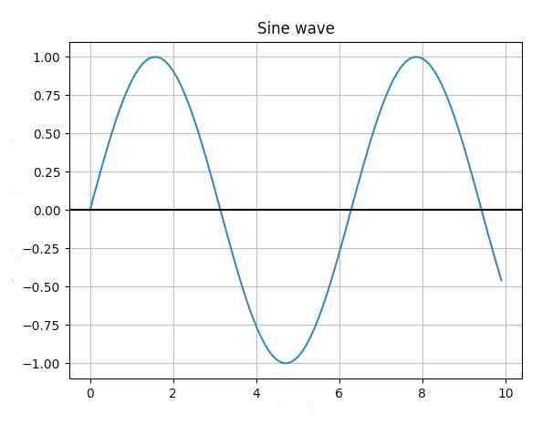

as you can the sin wave is bounded between 1 to -1, and has continuous values

Therefore, for sentence `"I like AI"`
- I = sin(1) = 0.65 -> [. . . , 0.65]
- like = sin(2) = 0.85 -> [. . . , 0.85]
- I = sin(3) = 0.2 -> [. . . , 0.2]

### Problem with thi approach
as each word must have unique position in a sentence  i.e, no two word can be at same position in a same sentence. Their positional encoding must be unique

but the problem is that sin curve is periodic i.e, pattern repeat itself therefore, for multiple X input we can have same output for sin(x)

now if the sentence is too long then that increases the probability of having similar positional encoding for few words in that sentence

because of which we might have same positional encoding to multiple words and model will think that those words are on the same position in a sentence

### Multiple trigonometric  function

the problem with single sin(X) function is that the sin curve repeat its pattern after some time, because of which we might have same positional encoding to multiple words in a same sequence

now instead sin(X) alone if we use sin(X) and Cos(X) function together we reduce the probability of same encoding

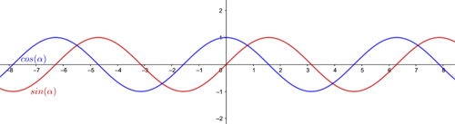

now for each word we use both waves to calculate the positional encoding

Example:
- sentence `"I like AI"`
- for I -> X = 1 
    - sin(1) = 0.65
    - cos(1) = 0.5
- for like -> X = 2 
    - sin(2) = 0.85
    - cos(2) = -0.4
- for AI -> X = 3
    - sin(3) = 0.2
    - cos(3) = 0.1
- therefore:
    - I = [. . . , 0.65, 0.5]
    - like = [. . . , 0.85, -0.4]
    - AI = [. . . , 0.2, 0.1]

Note: this approach does not provide 100% unique values, although the chances of having duplicate outputs is low but not 0% as pattern may repeat 

now to reduce to reduce the chances of duplicate outputs we can add more trigonometric functions like:
- first pair = sin(x) , cons(x)
- second pair = sin(x/2), cos(x/2)
- third pair = sin(x/3), cos(x/)\
... and so on


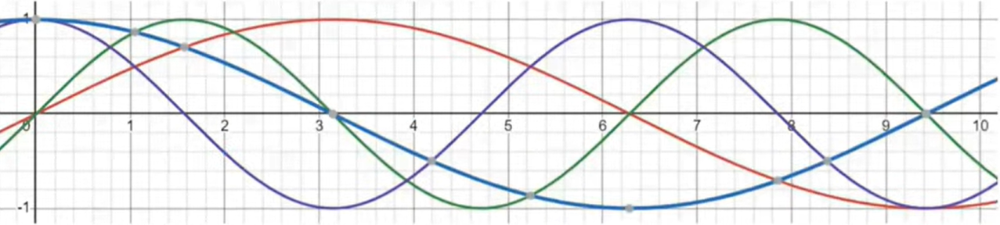

now here we have even less chances of repeating sequence and getting duplicate outputs

> size of positional vector will be equal to Number of trigonometric function used

Example with 4 trigonometric functions sin(x), cos(x), sin(x/2) & cos(x/2):
- sentence `"I like AI"`
- for I -> x = 1
    - sin(1) = 0.65
    - cos(1) = 0.5
    - sin(1/2) = 0.25
    - cos(1/2) = 0.9
- therefore positional encoding of I = [0.65, 0.5, 0.25, 0.9] -> 4 function = 4 dimensions
- now I = [. . . , 0.65, 0.5, 0.25, 0.9]

### Problem with concatenation and why to use addition
Up til now we have learn that once we find the position vector we can simple concatenate it to our main embedding vector so that our embedding vector will have information about positions of each word in a given sentence 

example:
- embedding vector = [a, b, c]
- position vector = [e, f, g]
- final vector = [a, b, c, e, f, g]

But the problem with this approach is that it increases the number of dimension of our final embedding vector,  because of which the computational cost increases

> we pass this final embedding vector into self attention model and as we know self attention uses matrix multiplication, and as number of dimension increases cost for multiplying those matrix also increases

therefore to solve this problem we simply perform vector addition to prevent the dimension increase because of concatenation

example:
- embedding vector = [a, b, c]
- position vector = [e, f, g]
- final vector = [a+e, b+f, c+g]

now as you can see our final matrix contains the positional information without increasing its dimension

**Note: for this approach to work make sure that embedding vector and positional vector has same size**

### Mathematically

$$PE_{(pos, 2i)} = sin(pos/1000^{2i/d_m})$$

$$PE_{(pos, 2i+1)} = cos(pos/1000^{2i/d_m})$$

Where
- pos = position of word in sentence (start from 0)
- $d_m$ = dimension of embeddings 
- $i$ = value between $0$ to $d_m/2$

#### Example:
consider a sentence: `"river bank"`

now will be finding the positional embedding for word `"bank"`

therefore:
- pos = 1
- $d_m$ = 6
- $i$ = 0 to 3

for $i=0$

$$PE_{(1,0)} = sin(1/1000^{0}) = 0.84$$

$$PE_{(1,1)} = cos(1/1000^{0}) = 0.54$$

for $i=1$

$$PE_{(1,2)} = sin(1/1000^{1/3}) = 0.04$$

$$PE_{(1,3)} = cos(1/1000^{1/3}) = 0.99$$

for $i=2$

$$PE_{(1,4)} = sin(1/1000^{2/3}) = 0.00$$

$$PE_{(1,5)} = cos(1/1000^{2/3}) = 0.99$$

now positional encoding for `bank` will be:

$$bank = [0.84, 0.54, 0.04, 0.99, 0.00, 0.99]$$

>Note:
>- according to the paper [attention is all you need](https://arxiv.org/pdf/1706.03762) we generally compute positional encoding in pair of sin and cos function
>- therefore in final embedding we have dimensions in multiples of 2, i.e, one for sin function and another one for cos function  

### How this help in relative positioning
- relative positioning the position of the word with respect to other word
- example:
    - Sentence: `"I like AI"`
    - absolute position:
        - I = 1
        - like = 2
        - AI = 3
    - relative distance from `I` to `AI` = 2

with this positional embedding approach we can use liner transformation i.e, matrix multiplication to jump from one vector to any other vector

example:
- $V_{10}$ -> liner transformation -> output = $V_{20}$

as you can see with liner transformation we go to next 10th  words from current word

this distance is also known as delta, i.e,

for delta = 5
- $V_{10}$ -> liner transformation -> output = $V_{15}$

therefore in this approach for each delta i.e, distance we have a liner transformation, through which we can understand the relative positioning of any word


[Go To Top](#content)

---
# Layer Normalization
> To understand Layer normalization you first need to understand [Normalization](./ANN.md#normalization) and [Batch Normalization](./ANN.md#batch-normalization)

Normalization is the process of changing data to a common scale or standard so it can be compared, analyzed, or stored more effectively. The exact meaning depends on the context.

> to understand more about normalization why to use it please check out [Normalization](./ANN.md#normalization) from ./ANN.md

### Why didn't use batch norm in transformers?

> To understand about batch norm and why to use it please checkout of [Batch Normalization](./ANN.md#batch-normalization) from ANN.md

The problem with batch norm it that is doesn't work well with the self attention model or sequential data

#### 1. BatchNorm depends on other examples in the batch

- BatchNorm computes means across the batch so the output for one sample depends on all the other samples in the mini-batch.
- Self-attention, however, is designed so that each sequence can be processed independently.
- If you use batch norm is self attention the representation of sentence A changes depending on what other sentences are in the batch.

Example:
- Suppose your batch contains:
    - "I love cats."
    - "Quantum mechanics is fascinating."
- The normalization statistics are computed using both sequences together, even though they're unrelated.

#### 2. Variable-length sequences
Transformers process sequences of different lengths.

Example:

- Sentence 1: 8 tokens
- Sentence 2: 100 tokens
- Sentence 3: 25 tokens

To batch them, you need to perform the zer padding over the shorter sequences.

### what is layer normalization?
Layer Normalization (LayerNorm) is a normalization technique that normalizes the features of a single data point 

In Transformers, LayerNorm is applied independently to each token.

#### Example:

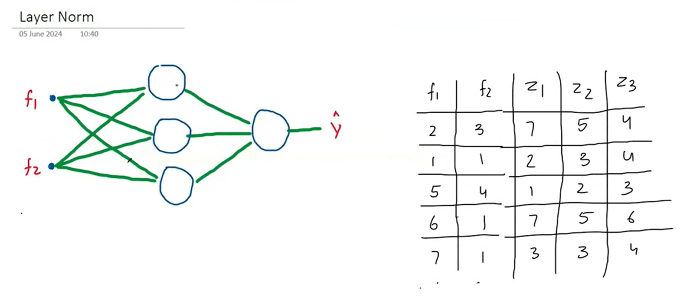

here input vector i.e, self attention embedding of a single word is of 2 dimension
```
embedding = [f1 f2]
```

where as z1, z2 and z3 are the activation of three nodes present in the hidden state

for first word input vector: [2 3]

activation from hidden layer = [7 5 4]

- now use following formula to get normalized value:

$$x_{norm} = \frac{x - \mu}{\sigma}$$

where:
- $\mu$ = average
- $\sigma$ = standard deviation


Therefore normalized output vectors can be
```
normalized activation = [1.336, -0.267, -1.069]
```

### Scale and Shift
in most of the cases some of the nodes does't want the normalized input in that case we want the flexibility so that our model can decide whether to apply normalization or not

to do that we simply update our output as follow:

$$x_{final} = \lambda x_{norm} + \beta$$

where:
- $\lambda$ and $\beta$ both are trainable parameter

> to learn more about it please learn [Batch norma](./ANN.md#batch-normalization)


[Go To Top](#content)

---
# Encoder 

An encoder is the part of a transformer that reads the input and converts it into a meaningful numerical representation that the rest of the model can use.


Here, Nx represent that there can be multiple encoder decoder block i.e, for Nx = 6

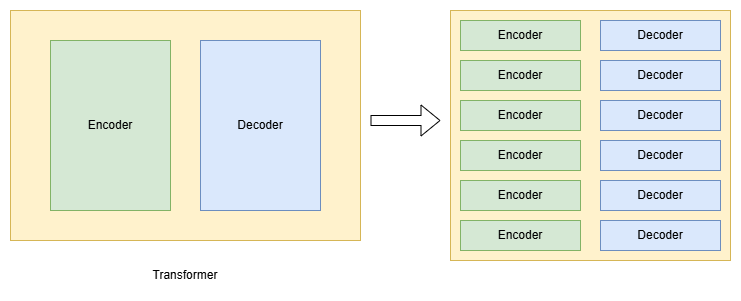

As you can see that there are six encoder and decoder block as Nx is 6

Also:
- all of the encoder blocks are identical to each other in terms of their architecture
- all of the decoder blocks are identical to each other in terms of their architecture

The similarity between the encoder/decoder blocks is only limited to  their architecture because of in terms of parameter (weight and biases) they are different

### what type of input does encoder block gets?
before we provide any sentence as an input to encoder we need to perform certain operations so that encoder can process them

those operations are:
- **Tokenization**: divide sentence into token
- **Embedding**: generate embedding for each token
- **Position encoding**: perform position encoding on each vector

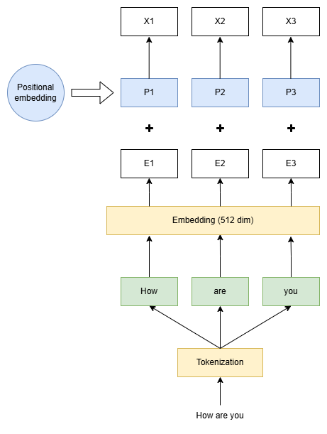

here:
- E1, E2, E3 are the embeddings for word How, are, you respectively
- P1, P2, P3 are the position encoding for each word
- X1, X2, X3 are the final position encoded embedding vectors, use as input in encoder


### encoder Block
if you look at the single encoder block you'll be seeing two things i.e, 
1. feed forward neural network (ANN)
2. self attention

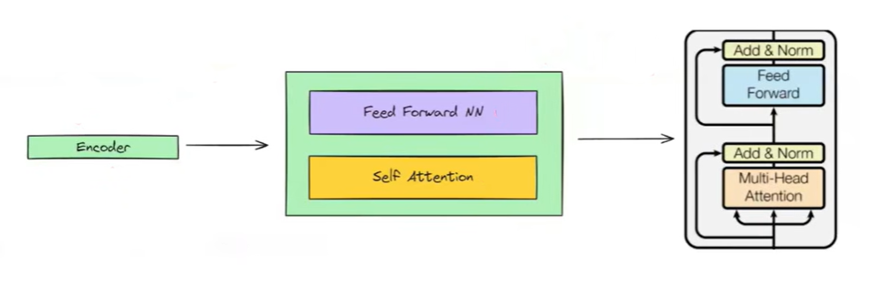


### Self attention Module

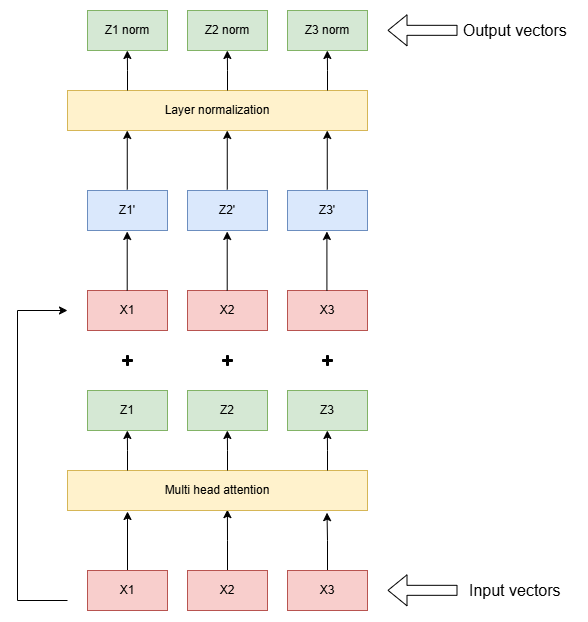

### Feed Forward Neural Network Module
output of self attention module is use as input here

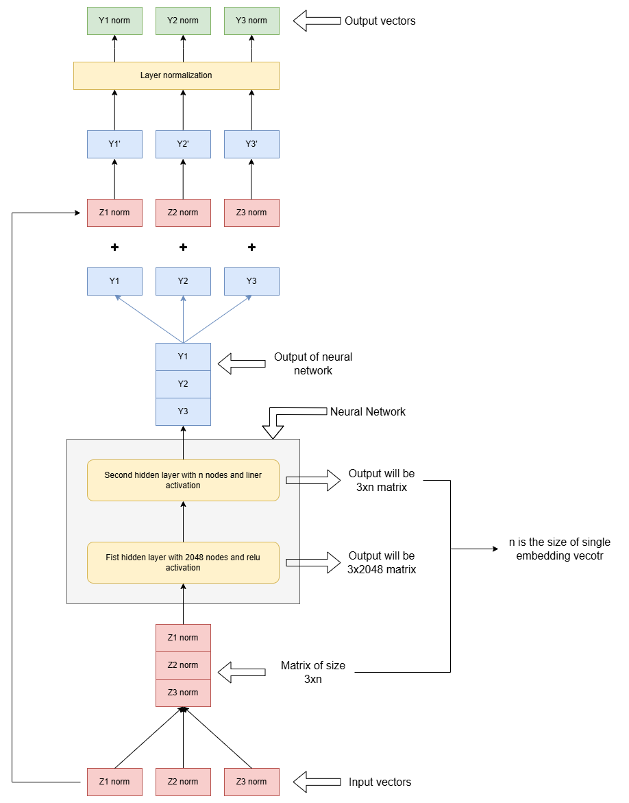

now the output can pass to next encoder block in line or to the decoder

[Go To Top](#content)

---
# Masked self attention
Transformer decoder is autoregressive at the time of inference and non-autoregressive at training time

Autoregressive: 
- model that generate the new datapoint in a sequence by using previously generated points
- example:\
in encoder decoder model uses each previous state to compute current state


### Short example:
Dataset:
english | hindi |
--- | ---
how are you | आप कैसे हैं?

during inference our model predict each word one after another, where current word is predicted by using previous word:

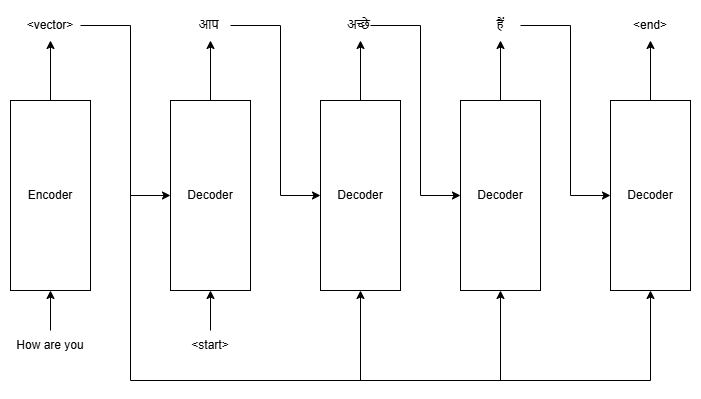

here:
- input = "how are you"
- output = "आप अच्छे हैं"

as you can see we have predicted one word wrong i.e, "अच्छे" but we still pass it as input for next prediction

but during the training instead of previously generated word we use actual word from dataset


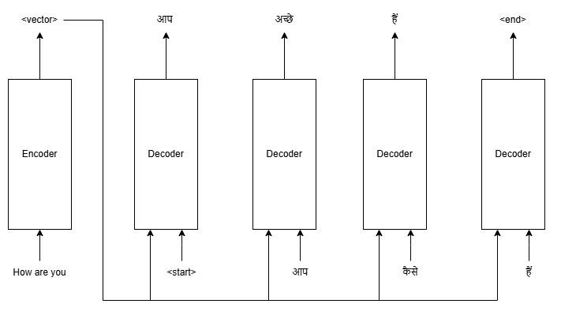

as you can even though we predicted one wrong word i.e, "अच्छे" we pass the correct one i.e,  "कैसे" from dataset

### Why non-autoregressive

now as you can see from above example that at the time of inference our model is completely depend on previous sate to generate the current word

Whereas in training time the model get fresh and correct input from dataset, i.e, it is not depended on previous sate fof generating output at the time of training

because of which we can train each decoder timestamp individually in parallel to increases the training speed, therefore decoder of transformer is non-autoregressive at the time of training

### Data leakage due to non-autoregressive training
Data leakage in machine learning occurs when information that would not be available at prediction time accidentally gets used during training. This causes the model to appear more accurate during evaluation than it will be in the real world.

> Think of it as "cheating": the model gets access to answers or hints about the future.

in self attention we calculate the embedding with respect to each word in the sequence

Example:
- sentence: "I like AI"
- embedding for "like" = 0.2I + 0.5like + 0.3AI


now consider the output = "how are you"

according to self attention:
- "How" = 0.2how + 0.6are + 0.2you
- "are" = 0.1how + 0.6are + 0.3you
- "you" = 0.3how + 0.2are + 0.5you

but the problem is decoder generate single word at a time i.e, first model generate "how" then "are" and finally "you"

but according to self attention to compute word "how" we need word "are" and "you" which is not yet generated via decoder 

but since we are in the training which is non-autoregressive we provided those future outputs through dataset, so technically we are just telling model what the output will be at the training time

but we don't have this facility at the time of inference as inference is autoregressive i.e, it generate single word at a time therefore, in inference phase when model generate the word "how" it will not have access to word "are" and "you"

this is way data leakage happen when you train decoder with non-autoregressive manner

### Now the Problem is
if we tain decoder in autoregressive mode:
- training became slow
- but there is no data leakage

if we train decoder in non-autoregressive mode:
- training became fast (parallel)
- but there is data leakage

Therefore we need a way through which we can get best of both in our model

### Solution Masked attention
Masked attention is a mechanism used in the decoder of a Transformer to prevent a token from "looking into the future" during training.

in normal self attention:
- sentence: "I like AI"
- for word I: 0.1 I + 0.5 like + 0.4 AI
- but "like" and "AI" is not generated yet

in Masked self attention
- sentence: "I like AI"
- for word I: 0.1 I + 0 like + 0 AI = 0.1 I
- for word like: 0.2 I + 0.3 like + 0 AI = 0.2 I + 0.3 like
- as you can see when the respective word is not yet generated via decoder the masked attention set their respective attention score to zero
- therefore by using this we make sure that our model ignore those word who are not yet generated by decoder during training

### How masked attention work

if you learn about self attention you can clearly understand the following flow

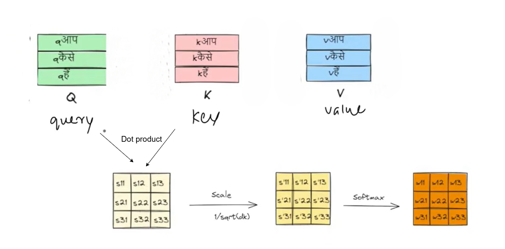


now from this:
- $आप_{ce} = W_{11} V^{आप} +  W_{12} V^{कैसे} + W_{13} V^{हैं}$
- $कैसे_{ce} = W_{21} V^{आप} +  W_{22} V^{कैसे} + W_{23} V^{हैं}$
- $हैं_{ce} = W_{31} V^{आप} +  W_{32} V^{कैसे} + W_{33} V^{हैं}$

now to make respective attention score zero we simply multiply the scaled matrix with masked matrix

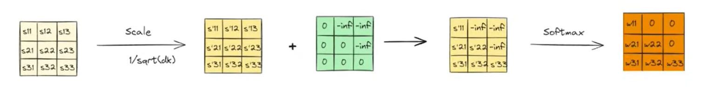

in above image the green matrix is what we called masked matrix which is responsibly for making unavailable words attention score zero

masked matrix is usually a matrix f all zero only the value of those word which are not yet generated via decoder is set to negative infinity so that at the time of softmax they'll become zero

example:
- for word "आप" we don't have  "कैसे" and "हैं" to masked matrix for word "आप" will be $\begin{bmatrix}0 & -\infty  & -\infty\end{bmatrix}$
- similarly for word "कैसे"
    - unavailable words = "हैं"
    - masked matrix = $\begin{bmatrix}0 & 0  & -\infty\end{bmatrix}$
- similarly for word "हैं"
    - unavailable words = none (all available)
    - masked matrix = $\begin{bmatrix}0 & 0  & 0\end{bmatrix}$

Therefore final masked matrix:

$$
\begin{bmatrix}
आप\\
कैसे\\
हैं
\end{bmatrix} =
\begin{bmatrix}
0 & -\infty  & -\infty\\
0 & 0  & -\infty\\
0 & 0  & 0
\end{bmatrix}
$$


[Go To Top](#content)

---
# Cross Attention
Cross-attention is a mechanism in transformers where one sequence give attention to another sequence.

- Self-attention: "Look at my own sequence to understand myself."
- Cross-attention: "Look at a different sequence to gather information."

### Self-Attention vs Cross-Attention
Suppose you are translating English to hindi.

Input (Encoder):
```
we are friends
```
Output being generated (Decoder):
```
हम ....
```

#### Self-Attention (Decoder)

When generating the next hindi word, the decoder first looks at the words it has already generated:
```
हम → दोस्त 
```
It asks:\
Which previous hindi words are important?

> Self attention only gets the current output (hindi) sequence as input 

#### Cross-Attention

Now the decoder also needs information from the English sentence.

While generating `"दोस्त"`, it asks "which English word should I focus on?"

> Cross attention gets both current output (hindi) and input (english) sequence as input

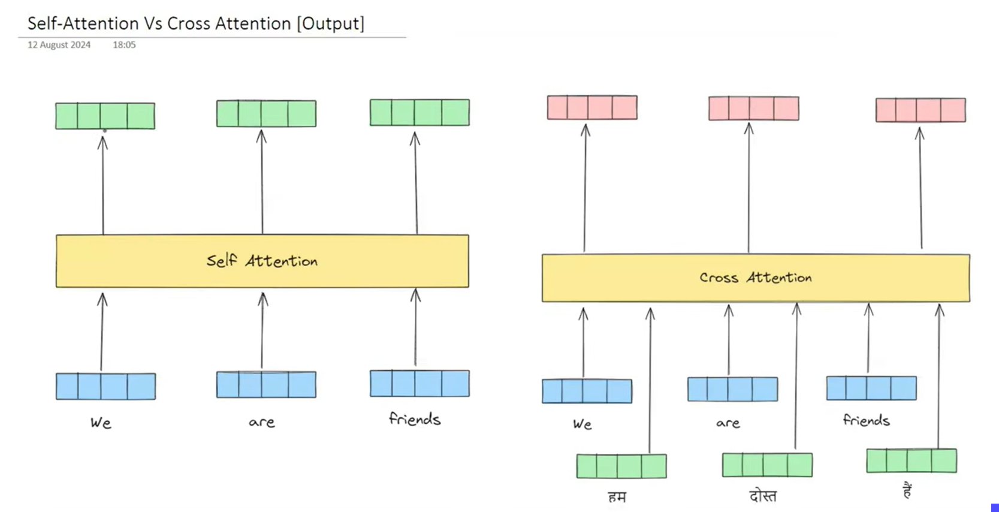

### How cross attention works
The only way cross attention is different from self attention how they calculate the Query, Key and Value vector


#### in self attention
```
                   ┌──> query vector 
output embedding ──┼──> key vector 
                   └──> value vector 
```
#### in cross attention

```
output embedding ────> query vector  

input embedding ──┬──> key vector 
                  └──> value vector 
```

now once we find this Query, Key and Value vector rest of the calculation is exact same as that of self attention

### Why to use cross attention
Cross-attention is used because self-attention alone cannot connect information from two different sources.

Suppose you're translating: `we are friends`

The decoder is generating hindi: `हम`

If the decoder only uses self-attention, it can only see `हम` It has no idea what the English sentence was.

Therefore to solve this problem in cross attention decoder generates a query based on what it has produced so far i.e, output sequence

Then it asks the encoder:\
"Which part of the English sentence is relevant right now?"

and to do that decoder uses dot product with key vector of input sequence

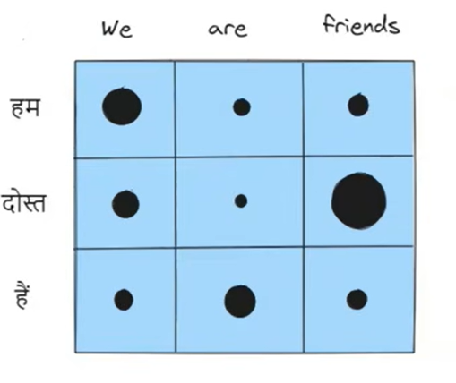

in above image:
- bigger the dot stronger the relation between word
- smaller the dot lesser the relation between word

### Output of self attention vs coss attention

in both attention the final output vector is like:

$CE_{we} = a \times E_{we} + b \times E_{are} + c \times E_{friend}$

where:
- a = attention score between word we and we (attention of word we with itself)
- b = attention score between word we and are 
- c = attention score between word we and friends

Now,

in self attention the output vector is usually look something like:
- $CE_{we} = 0.6 \times E_{we} + 0.1 \times E_{are} + 0.3 \times E_{friends} $
- $CE_{are} = 0.2 \times E_{we} + 0.5 \times E_{are} + 0.3 \times E_{friends} $
- $CE_{friends} = 0.4 \times E_{we} + 0.1 \times E_{are} + 0.5 \times E_{friends} $

in cross attention output vector looks like:
- $CE_{हम } = 0.5 \times E_{we} + 0.2 \times E_{are} + 0.3 \times E_{friends} $
- $CE_{दोस्त } = 0.1 \times E_{we} + 0.2 \times E_{are} + 0.7 \times E_{friends} $
- $CE_{हैं} = 0.3 \times E_{we} + 0.4 \times E_{are} + 0.3 \times E_{friends} $


understand it visually

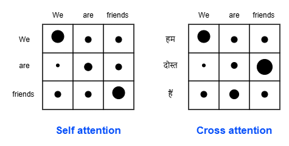

here
- large the circle higher the attention score between words
- smaller the circle smaller the attention score between words


[Go To Top](#content)

---