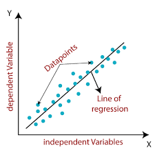

# Content
1. [AI vs ML vs DL vs DS](#ai-vs-ml-vs-dl-vs-ds)
2. [Type of ML Algorithm](#type-of-ml-algorithm)
3. [Regression and Classification](#regression-and-classification)
4. [Clustering And Dimensionality Reduction](#clustering-and-dimensionality-reduction)
5. [Clustering vs Classification](#clustering-vs-classification)
6. [Liner Regression](#liner-regression)
7. [Cost Function](#cost-function)
8. Gradient Decent Algorithm
    - [Gradient Decent](#gradient-descent)
    - [Convergence Equation](#convergence-equation)
9. [Gradient Decent Algorithm For Liner Regression](#gradient-decent-algorithm-for-liner-regression)
10. [Performance Matrix](#performance-matrix)
    - [R² Score](#score)
11. [Underfitting & Overfitting](#underfitting--overfitting)
12. [Ridge Regression](#ridge-regression)
13. [Lasso Regression](#lasso-regression)
14. [Why Not To Use Liner Regression for classification?](#why-not-to-use-liner-regression-for-classification)
15. [Logistic Regression](#logistic-regression)
16. [Sigmoidal Function](#sigmoidal-function)
17. [Cost Function For Logistic Regression](#cost-function-for-logistic-regression)
18. [Performance Matrix](#performance-matrix)
    - [Confusion Matrix](#confusion-matrix)
    - [Accuracy](#calculate-accuracy-from-the-confusion-matrix)
    - [Precision, Recall, and F1 (F-Beta)](#precision-recall-and-f1-f-beta)
19. [Naïve Bayes Algorithm](#naïve-bayes-algorithm)

---

# AI vs ML vs DL vs DS

### 1. Artificial Intelligence (AI)
**Definition:**\
AI is the broad field that focuses on making machines think and act like humans — reasoning, learning, and decision-making.

**Goal**: Create systems that can perform tasks requiring human intelligence (e.g., speech, vision, planning).

**Example:**
- Siri or Alexa understanding your voice and responding.
- Self-driving cars making driving decisions.

### 2. Machine Learning (ML)
**Definition:**\
ML is a subset of AI that teaches computers to learn from data without being explicitly programmed.

**Goal**: Make predictions or decisions using data patterns.

**Example:**
- Netflix recommending movies based on your watch history.
- Spam filter learning what emails are spam.

### 3. Data Science (DS)
**Definition:**\
Data Science focuses on collecting, cleaning, analyzing, and visualizing data to extract insights and help in decision-making.

**Goal**: Turn raw data into useful information and models.

**Example:**
- Analyzing user data to find which products sell best.
- Visualizing COVID-19 trends using graphs.
> Data Science often uses AI/ML techniques to draw conclusions from data.

### 4. Deep Learning (DL)
**Definition:**\
DL is a subset of Machine Learning that uses neural networks with many layers to learn complex patterns — similar to how the human brain works.

**Goal**: Handle large and complex data (like images, audio, or natural language).

**Example:**
- Face recognition in phones.
- ChatGPT (it uses deep learning models).

### For Visual Understanding

### Comparison Table
| Field  | Focus                         | Example                 | Type                 |
| ------ | ----------------------------- | ----------------------- | -------------------- |
| **AI** | Simulating human intelligence | Self-driving car        | Broad field          |
| **ML** | Learning from data            | Netflix recommendations | Subset of AI         |
| **DL** | Neural networks & big data    | Face recognition        | Subset of ML         |
| **DS** | Data analysis & insights      | Business data reports   | Separate but related |

[Go To Top](#content)

---
# Type Of ML Algorithm

Machine Learning algorithms are mainly divided into 4 types, based on how they learn from data.
Here’s a clear breakdown with simple explanations and examples

### 1. Supervised Learning
- The model learns from labeled data — meaning both input and correct output are known.
- **Goal:** Predict outcomes for new, unseen data.
- **Example:** If you have a dataset of house prices with features like area, location, and price — the model learns the pattern and predicts price for a new house.

**Types:**
| Type               | Description                | Example Algorithms                           |
| ------------------ | -------------------------- | -------------------------------------------- |
| **Regression**     | Predicts continuous values | Linear Regression, Decision Tree Regressor   |
| **Classification** | Predicts discrete labels   | Logistic Regression, Random Forest, SVM, KNN |

> Input and Output variable are also know as dependent and independent variables
>
> **Independent variable** -> inputs\
> **Dependent variable** -> output

### 2. Unsupervised Learning
- The model learns from unlabeled data — only inputs, no known outputs.
- **Goal:** Discover groups, similarities, or patterns without knowing the output.
- **Example:** Grouping customers with similar buying behavior (Clustering).

**Types:**
| Type            | Description                           | Example Algorithms                       |
| --------------- | ------------------------------------- | ---------------------------------------- |
| **Clustering**  | Groups similar data points            | K-Means, Hierarchical Clustering, DBSCAN |
| **Dimensionality Reduction** | Reducing dataset features while preserving key information. | PCA (Principal Component Analysis),                            |

### 3. Semi-Supervised Learning
- Uses a mix of labeled and unlabeled data — labeled data helps guide learning for unlabeled data.
- **Goal:** Improve accuracy when labeling all data is expensive or time-consuming.
- **Example:** Email spam detection — a few emails are labeled as spam or not, rest are learned automatically.
- Algorithms:
    - Self-training models
    - Graph-based models
    - Semi-supervised SVM
### 4. Reinforcement Learning (RL)

- The model learns by interacting with an environment and receiving rewards or penalties for actions.
- **Goal:** Learn the best sequence of actions to maximize rewards.
- **Example:**
    - A robot learning to walk.
    - A game-playing AI (like AlphaGo) improving with each match.
- **Algorithms:**
    - Q-Learning
    - Deep Q-Network (DQN)
    - SARSA
    - Policy Gradient Methods

### Summary Table
| Type                | Data Type         | Goal                            | Example Use Case      |
| ------------------- | ----------------- | ------------------------------- | --------------------- |
| **Supervised**      | Labeled           | Predict output                  | Predict house prices  |
| **Unsupervised**    | Unlabeled         | Find patterns/groups            | Customer segmentation |
| **Semi-Supervised** | Partially labeled | Better learning with less data  | Spam filtering        |
| **Reinforcement**   | Reward-based      | Learn actions via trial & error | Game bots, robots     |

[Go To Top](#content)

---
# Regression and Classification

## Regression
Regression is a type of Supervised Learning used when you want to predict a continuous numeric value (not categories).

In short:\
Regression finds a relationship between input (X) and output (Y) and tries to draw the best-fit line through the data points.

#### Example: House Price Prediction
Let’s say you have a dataset like this
| Area (sq ft) | Price (₹ in lakhs) |
| ------------ | ------------------ |
| 1000         | 40                 |
| 1200         | 50                 |
| 1500         | 65                 |
| 1800         | 80                 |

You want to predict the price of a house that’s 1600 sq ft.

**How it works:**
1. Input (X) = Area of house
2. Output (Y) = Price of house
3. The regression algorithm tries to find a line (or curve) that best fits all data points.

This line can be represented as: `Y = mX + c`

**Where:**
- Y → Predicted value (price)
- X → Input feature (area)
- m → Slope (how much price changes per sq ft)
- c → Intercept (base price)

from this graph we can predict the housing price for 1600 sq ft.
- for above graph calculated slope is `m = 0.04`
- Therefor, `Price = 0.04 * Area + 0`
- `Price = 0.04 * 1600` = `₹64 lakhs`

#### Common Types of Regression
| Type                           | Description                      | Example Use                          |
| ------------------------------ | -------------------------------- | ------------------------------------ |
| **Linear Regression**          | Straight line relation           | House price vs area                  |
| **Multiple Linear Regression** | Many inputs                      | Price based on area, rooms, location |
| **Polynomial Regression**      | Curved relation                  | Growth trends, population over years |
| **Ridge/Lasso Regression**     | Regularized versions             | Prevent overfitting                  |
| **Logistic Regression**        | Used for classification (yes/no) | Spam email detection                 |

## Classification
Classification is another type of Supervised Learning — but instead of predicting numbers (like regression), it predicts categories or labels.

**In short:**\
Classification answers “Which class does this data belong to?”

#### Example: Email Spam Detection
You have a dataset like:
| Email text                     | Label    |
| ------------------------------ | -------- |
| “You won a lottery!”           | Spam     |
| “Meeting at 10 AM”             | Not Spam |
| “Get rich fast!”               | Spam     |
| “Your project is due tomorrow” | Not Spam |

The algorithm learns the patterns:
- Words like “lottery”, “win”, “offer” → Spam
- Words like “meeting”, “project” → Not spam

Then when a new email comes in, the model predicts whether it’s spam or not.

### To visually understand how classification works

#### Types of Classification
| Type                           | Description                              | Example                            |
| ------------------------------ | ---------------------------------------- | ---------------------------------- |
| **Binary Classification**      | Two possible outcomes                    | Spam / Not Spam, Male / Female     |
| **Multi-Class Classification** | More than two categories                 | Cat / Dog / Rabbit                 |
| **Multi-Label Classification** | Each item can belong to multiple classes | News tagged as [Politics, Economy] |

#### Popular Classification Algorithms
| Algorithm                        | Description                                  |
| -------------------------------- | -------------------------------------------- |
| **Logistic Regression**          | Linear model for binary outcomes             |
| **Decision Tree**                | Splits data using conditions                 |
| **Random Forest**                | Multiple trees for better accuracy           |
| **KNN (K-Nearest Neighbors)**    | Classifies based on nearest data points      |
| **SVM (Support Vector Machine)** | Finds the best boundary line between classes |
| **Naive Bayes**                  | Based on probability and Bayes’ theorem      |

[Go To Top](#content)

---
# Clustering And Dimensionality Reduction

## Clustering

Clustering is a type of Unsupervised Learning, where the algorithm groups similar data points together — without knowing any labels in advance.

**It answers:**\
“Which data points are similar to each other?”

#### Example: Customer Segmentation
Imagine you have shopping data from customers:
| Customer | Age | Spending Score |
| -------- | --- | -------------- |
| A        | 18  | 80             |
| B        | 22  | 75             |
| C        | 45  | 30             |
| D        | 48  | 25             |
| E        | 28  | 85             |
| F        | 50  | 20             |

You don’t know who’s which type of customer,

but clustering algorithms can group them like:
- **Cluster 1**: Young customers who spend more (A, B, E)
- **Cluster 2**: Older customers who spend less (C, D, F)

So now, a marketing team can create different strategies for each cluster!

#### How it works
1. The algorithm calculates similarity between data points
2. Then it groups the closest points together.
3. Each group = one cluster.

#### Understand Visually

### Common Clustering Algorithms
| Algorithm                   | Description                                      | Example Use           |
| --------------------------- | ------------------------------------------------ | --------------------- |
| **K-Means**                 | Divides data into K clusters based on similarity | Customer segmentation |
| **Hierarchical Clustering** | Builds tree-like clusters (dendrogram)           | Gene classification   |
| **DBSCAN**                  | Groups dense regions and ignores noise           | Detecting outliers    |
| **Mean Shift**              | Moves points toward cluster centers dynamically  | Image segmentation    |

## Dimensionality Reduction
Dimensionality Reduction means reducing the number of input features (columns) in your dataset while keeping the important information.

The algorithm only looks at the input features to find patterns, correlations, or redundancies.

The goal is to simplify the data structure, not predict an output.

**In simple words:**\
It’s about simplifying the data — keeping what matters, removing what doesn’t.

#### Example: Student Data
Suppose your dataset has:
| Features    | Description       |
| ----------- | ----------------- |
| Marks       | Exam score        |
| Attendance  | Percentage        |
| Sleep Hours | Daily sleep       |
| Study Hours | Daily study       |
| Social Time | Time with friends |

Maybe these 5 features overlap —\
for example, “Study Hours” and “Marks” are strongly related.

Dimensionality reduction can merge such correlated features into 2–3 “principal components” that still represent the pattern of the data.

So, instead of working with 5 features, you work with 2 — easier, faster, and cleaner!

#### How it works
The algorithm finds new axes (directions) that capture most of the variation in the data and ignores the rest (less important info).

#### Common Techniques
| Technique                                               | Description                                                              | Use                                                  |
| ------------------------------------------------------- | ------------------------------------------------------------------------ | ---------------------------------------------------- |
| **PCA (Principal Component Analysis)**                  | Projects data onto fewer dimensions while keeping variance high          | Most common, used for visualization or preprocessing |
| **t-SNE (t-Distributed Stochastic Neighbor Embedding)** | Reduces data to 2D/3D for visualization while preserving local structure | Useful in clustering or image data                   |
| **LDA (Linear Discriminant Analysis)**                  | Reduces dimensions while keeping class separation                        | Used in classification problems                      |
| **Autoencoders**                                        | Deep learning models that compress and reconstruct data                  | Used in image or noise reduction                     |

[Go To Top](#content)

---
# Clustering vs Classification

### Classification = You already know the groups
You teach the model what each group means.
Then it learns to recognize which one new data belongs to.

**Example:**\
You show pictures of:
- 🐱 Cats
- 🐶 Dogs

You tell the model:
`“These are cats, these are dogs.”`

Now, when you show a new photo,
it says — “This is a dog!” 

So, you already know the categories before training.

### Clustering = You don’t know the groups
You don’t give any labels — the model finds patterns on its own.

**Example:**\
You give the model 100 animal pictures — no names.

It looks and groups them like:
- Group 1 → furry, small = 🐱 cats
- Group 2 → long ears = 🐶 dogs
- Group 3 → feathers = 🐦 birds

The model discovers the groups itself — you didn’t tell it what’s what.

### Think like this:
| Question                               | Classification               | Clustering                           |
| -------------------------------------- | ---------------------------- | ------------------------------------ |
| Do we know the answer before training? | ✅ Yes                        | ❌ No                                 |
| What does the model do?                | Learns to label data         | Finds hidden groups                  |
| Example                                | “Is this email spam or not?” | “Group similar emails automatically” |

### Final comparison
| Feature                   | **Clustering**                                   | **Classification**                                             |
| ------------------------- | ------------------------------------------------ | -------------------------------------------------------------- |
| **Type**                  | **Unsupervised Learning**                        | **Supervised Learning**                                        |
| **Labeled Data?**         | ❌ No labels — the algorithm finds its own groups | ✅ Has labels — the model learns from them                      |
| **Goal**                  | Find hidden **groups or patterns**               | Predict **predefined categories**                              |
| **Output**                | Unknown clusters (e.g., Group 1, Group 2...)     | Known labels (e.g., Cat, Dog, Human)                           |
| **Training Data Example** | Just features like Age, Income                   | Features + Labels (e.g., Age, Income → “Buyer” or “Non-Buyer”) |
| **Evaluation**            | Harder — no true answers                         | Easier — compare predicted vs actual labels                    |
| **Example Algorithms**    | K-Means, DBSCAN, Hierarchical                    | Decision Tree, Random Forest, SVM, Logistic Regression         |
| **Common Use Cases**      | Customer segmentation, pattern discovery         | Spam detection, disease prediction                             |

[Go To Top](#content)

---
# Liner Regression
Linear Regression is a Supervised Learning algorithm used to predict a continuous value
by finding the best straight line that fits the data.

**In short:**\
It tries to find a relationship between input (X) and output (Y) using a straight line.

The main goal of liner regression is to find the best straight line that shows the relationship between input (X) and output (Y) —
so we can predict Y for new values of X.

### Think of it like this:
- You have a bunch of points (data).
- Linear regression tries to draw one line that’s as close as possible to all those points.
- That line helps you:
    - Understand the trend → e.g., as area increases, price increases.
    -  Predict new values → if I know area = 1600, what will be the price?

### Example

### General Hypothesis Equation
There are multiple string line equation that you can use for liner regression like 
:
1. **Slope–Intercept Form:** $y = mx + c$
2. **Point–Slope Form:** $y-y_1 = m(x-x_1)$
3. **Two–Point Form:** $y-y_1 = \frac{y_2 - y_1}{x_2-x_!}(x-x_1)$

4. **Intercept Form:** $\frac{x}{a}+\frac{y}{b} = 1$  
5. **General Form:** $Ax + By + C = 0$

but in most our case will be using `General Hypothesis Equation`

In linear regression, we assume the relationship between input x and output y is linear:

$$h_\Theta (x) = \Theta_0 + \Theta_1 (x)$$

Where:
- $h_\Theta (x)$ → predicted value (hypothesis function)
- $\Theta_0$ → intercept (bias term)
- $\Theta_1$ → weight/slope parameter
- $x$ → input feature (independent variable) 

### Linear Regression assumption

#### 1. Linearity
The relationship between independent variables (X) and dependent variable (Y) should be linear.
That is,

**Example**
| Hours Studied (X) | Marks Scored (Y) |
| ----------------- | ---------------- |
| 1                 | 20               |
| 2                 | 40               |
| 3                 | 60               |
| 4                 | 80               |

This forms a straight-line pattern → as hours increase, marks increase proportionally. The model can easily fit a straight line through the points.

#### 2. No Multicollinearity
Independent variables should not be highly correlated with each other.

**Example:**

Predicting salary based on:
- Years of experience
- Education level

These are independent enough.

Predicting salary based on:
- Years of experience
- Number of projects handled

If more experience almost always means more projects, both variables say the same thing → high multicollinearity.

This makes the model unstable — coefficients (weights) fluctuate unpredictably.

[Go To Top](#content)

---
# Cost Function
The Cost Function (also called Loss Function) tells the model how wrong its predictions are.
It’s like a scorecard — the lower the cost, the better your model is doing.

**In short:**\
The cost function measures the error between the model’s predicted values and the actual values.

### Example
Let’s say your model predicts house prices:
| Actual Price (Y) | Predicted Price (Ŷ) | Error (Y - Ŷ) |
| ---------------- | ------------------- | ------------- |
| 50               | 48                  | 2             |
| 60               | 65                  | -5            |
| 70               | 68                  | 2             |

Here, the errors are small, but we want to measure the total error to see how far off we are.

### Mean Squared Error (MSE)
In [Linear Regression](#liner-regression), the most common cost function is Mean Squared Error:

$$J(m,c) = \frac{1}{n}\sum(Y_i - \bar{Y_i})^2$$

Where:
- $Y_i$ → Actual value
- $\bar{Y_i}$ → Predicted value
- $n$ → Number of data points
- $J(m,c)$ → Cost (depends on slope m and intercept c)

The model tries to find values of m and c that make J(m, c) as small as possible.

This is done using an optimization method like Gradient Descent, which gradually adjusts m and c to reduce cost.

### Example
let say you have dataset like
| input | output|
|--- | ---|
|1|1|
|2|2
3|3

Using general hypothesis equation

$$h_\Theta (x) = \Theta_0 + \Theta_1 (x)$$

lets assume $\Theta_0 = 0$ 

Therefor our equation becomes:

$$h_\Theta (x) =  \Theta_1 (x)$$

#### For $\Theta_1 = 1$

| input $(x_i)$ | predicted Output $h_\Theta(x_i)$| Actual Output $(y_i)$
---| --- | ---
1|1 |1
2|2 | 2
3|3 |3

cost function = $J(\Theta_1) = \frac{1}{n}\sum(Y_i - h_\Theta(x_i))^2 = \frac{1}{3}[(1-1)^2 + (2-2)^2 + (3-3)^2] = 0$  

#### For $\Theta_1 = 0.5$

| input $(x_i)$ | predicted Output $h_\Theta(x_i)$| Actual Output $(y_i)$
---| --- | ---
1|0.5 |1
2|1 | 2
3|1.5 |3

cost function = $J(\Theta_1) = \frac{1}{n}\sum(Y_i - h_\Theta(x_i))^2 = \frac{1}{3}[(1-0.5)^2 + (2-1)^2 + (3-1.5)^2] ≈ 0.58$ 

#### For $\Theta_1 = 0$

| input $(x_i)$ | predicted Output $h_\Theta(x_i)$| Actual Output $(y_i)$
---| --- | ---
1|0 |1
2|0 | 2
3|0 |3

cost function = $J(\Theta_1) = \frac{1}{n}\sum(Y_i - h_\Theta(x_i))^2 = \frac{1}{3}[(1-0)^2 + (2-0)^2 + (3-0)^2] ≈ 2.3$  

#### From those three cases, here’s what we can conclude about the relationship between $\Theta_1$ and the cost function $J(\Theta_1)$

| Θ₁ value | Cost Function (J(Θ₁)) | Interpretation                                                   |
| -------- | --------------------- | ---------------------------------------------------------------- |
| 1        | 0                     | Perfect fit — predictions exactly match the actual values.       |
| 0.5      | 0.58                  | Predictions are somewhat close but not perfect — moderate error. |
| 0        | 2.3                   | Predictions are completely off — large error.                    |

[Go To Top](#content)

---

# Gradient Descent
Gradient Descent is an optimization algorithm that helps a model learn the best parameters (like slope `m` and intercept `c` in linear regression) by minimizing the cost function.

### Example
let say you have dataset like
| input | output|
|--- | ---|
|1|1|
|2|2
3|3

Using general hypothesis equation

$$h_\Theta (x) = \Theta_0 + \Theta_1 (x)$$

Where:
- $h_\Theta (x)$ → predicted value (hypothesis function)
- $\Theta_0$ → intercept (bias term)
- $\Theta_1$ → weight/slope parameter
- $x$ → input feature (independent variable) 

lets assume $\Theta_0 = 0$ 

Therefor our equation becomes:

$$h_\Theta (x) =  \Theta_1 (x)$$

#### For $\Theta_1 = 1$

| input $(x_i)$ | predicted Output $h_\Theta(x_i)$| Actual Output $(y_i)$
---| --- | ---
1|1 |1
2|2 | 2
3|3 |3

cost function = $J(\Theta_1) = \frac{1}{n}\sum(Y_i - h_\Theta(x_i))^2 = \frac{1}{3}[(1-1)^2 + (2-2)^2 + (3-3)^2] = 0$  

#### For $\Theta_1 = 0.5$

| input $(x_i)$ | predicted Output $h_\Theta(x_i)$| Actual Output $(y_i)$
---| --- | ---
1|0.5 |1
2|1 | 2
3|1.5 |3

cost function = $J(\Theta_1) = \frac{1}{n}\sum(Y_i - h_\Theta(x_i))^2 = \frac{1}{3}[(1-0.5)^2 + (2-1)^2 + (3-1.5)^2] ≈ 1.17$  

#### For $\Theta_1 = 0$

| input $(x_i)$ | predicted Output $h_\Theta(x_i)$| Actual Output $(y_i)$
---| --- | ---
1|0 |1
2|0 | 2
3|0 |3

cost function = $J(\Theta_1) = \frac{1}{n}\sum(Y_i - h_\Theta(x_i))^2 = \frac{1}{3}[(1-0)^2 + (2-0)^2 + (3-0)^2] ≈ 4.67$  

#### Similarly when you calculated $J(\Theta_1)$ other values of $\Theta_1$ you'll get following data
|  Θ₁  | Predictions (hΘ(x)) | Errors (y - hΘ(x)) | Sum of squared errors   | J(Θ₁) = 1/3 * SSE |
| :--: | :------------------ | :----------------- | :---------------------- | :---------------: |
|   0  | [0, 0, 0]           | [1, 2, 3]          | 1² + 2² + 3² = 14       |      **4.67**     |
|  0.5 | [0.5, 1, 1.5]       | [0.5, 1, 1.5]      | 0.25 + 1 + 2.25 = 3.5   |      **1.17**     |
|   1  | [1, 2, 3]           | [0, 0, 0]          | 0                       |       **0**       |
|  1.5 | [1.5, 3, 4.5]       | [-0.5, -1, -1.5]   | 0.25 + 1 + 2.25 = 3.5   |      **1.17**     |
|   2  | [2, 4, 6]           | [-1, -2, -3]       | 1 + 4 + 9 = 14          |      **4.67**     |
| -0.5 | [-0.5, -1, -1.5]    | [1.5, 3, 4.5]      | 2.25 + 9 + 20.25 = 31.5 |      **10.5**     |

Now if you plot the graph using this data then you get:

- When we draw the cost function (J) against the model parameter (like θ₁), we get a U-shaped curve.
- The lowest point on this curve (for example, at θ₁ = 1) shows where the error is smallest.
- Since the error is smallest there, that θ₁ value gives the best possible line that fits our data.

> The bottom of the curve = minimum error = best fit line.

### Minima
- The lowest point in gradient decent is called minima
- When we talk about minima in Gradient Descent (i.e., the points where cost function is low), there are a few types

| Feature                            | 🟢 **Global Minimum**                                  | 🟡 **Local Minimum**                                              |
| ---------------------------------- | ------------------------------------------------------ | ----------------------------------------------------------------- |
| **Definition**                     | The **lowest point** on the entire cost function curve | A **low point** in a small region, but **not the lowest overall** |
| **Error value**                    | **Smallest possible error** (best result)              | Error is **low**, but not the smallest                            |
| **Gradient value (slope)**         | Zero (no lower point exists)                           | Zero (but there are lower points elsewhere)                       |
| **Outcome**                        | Gives the **best model parameters**                    | Gives **sub-optimal parameters**                                  |
| **Linear Regression**              | Always reaches global minimum                          | — (no local minima exist here)                                    |
| **Deep Learning / Complex Models** | Hard to find (many local minima exist)                 | Very common in complex models                                     |
| **Example**                        | The **bottom of the deepest valley**                   | A **smaller dip** before the deepest valley                       |

### Maxima
- When we maximize something (like accuracy or profit), we look for the highest point on a curve instead of the lowest.
- It’s the opposite of minima.

| Feature              | 🔵 **Global Maximum**                         | 🟣 **Local Maximum**                                            |
| -------------------- | --------------------------------------------- | --------------------------------------------------------------- |
| **Definition**       | The **highest point** on the entire curve     | A **high point** in a small region, but not the highest overall |
| **Value**            | **Largest possible value** (best performance) | **High**, but not the highest                                   |
| **Gradient (slope)** | Zero (no higher point exists)                 | Zero (but higher points exist elsewhere)                        |
| **Outcome**          | Gives **best possible performance**           | Gives **good but not best** performance                         |
| **Example**          | **Top of the tallest mountain**               | **Top of a smaller hill** nearby                                |

[Go To Top](#content)

---

# Convergence Equation
- When we train a model (like using Gradient Descent), we keep updating parameters (θ) step by step to reduce error (Cost Function J).
- The process keeps going until the error stops changing much — that point is called Convergence.

### Equation
$$
\Theta_j = \Theta_j - \alpha \frac{\partial J(\Theta)}{\partial \Theta_j}
$$

- this equation is the heart of gradient descent, and it’s used for one simple reason: \
to reduce the error (cost function) step by step until it reaches the minimum.

- we use this equation because it tells how to update our parameters (θ values) so that our model learns and the error decreases.

| Part                                             | Meaning                                              | Purpose                                                              |
| ------------------------------------------------ | ---------------------------------------------------- | -------------------------------------------------------------------- |
| $\frac{\partial J(\Theta)}{\partial \Theta_j}$ | The **slope** of cost function (direction of change) | Tells whether we need to go **left or right** to reduce error        |
| $\alpha$                                      | Learning rate                                        | Controls **how big the step** should be                              |
| ( - ) (minus sign)                               | Move in **opposite direction** of slope              | Because slope shows **increasing error**, we want to **decrease it** |
| $\Theta_j$                                     | Model parameter                                      | Gets updated each iteration to get closer to best value              |

### Why we need 𝛼 (learning rate)
Think of gradient descent like walking downhill to reach the lowest point (global minima).
- The gradient (slope) tells you which direction to move.
- But it doesn’t tell you how far to move in that direction. That’s where α comes in — it controls the step size.

| α (learning rate) | What happens                                                                             
| ----------------- | ---------------------------------------------------------------------------------------- | 
| **Too large**     | You take huge steps — might **jump over** the minimum or even **oscillate** forever.     | 
| **Too small**     | You take tiny steps — you **move very slowly**, might take forever to reach the minimum. | 
| **Just right**    | You smoothly go downhill and reach the **global minimum** quickly.                       | 

### Type of slope
The slope tells us how steep a line or curve is and which direction it’s going.

#### Positive Slope
- The line or curve is going upward as you move right.
- It means the value of $J(\Theta)$ (cost) increases when you increase $\Theta$
- So, to reduce cost, you should go left (decrease $\Theta$)

#### Negative Slope
- The line or curve is going downward as you move right.
- It means $J(\Theta)$ decreases when $\Theta$ increases.
- So, to reduce cost even more, you should go right (increase $\Theta$)

#### Example

#### In short
| Slope Type         | Curve Direction          | What It Means                           | Move Which Way To Reduce Cost? |
| ------------------ | ------------------------ | --------------------------------------- | --------------- |
| **Positive (+ve)** | Goes up as θ increases   | You’re on the left side of the minimum  | Move **left**   |
| **Negative (−ve)** | Goes down as θ increases | You’re on the right side of the minimum | Move **right**  |

### How it helps find the minima
1. **Find the slope (gradient)**
    - The slope tells you which way the hill is tilted.
    -   If the slope is positive → the hill goes up to the right.
    - If the slope is negative → the hill goes up to the left.
2. **Move in the opposite direction**
    - Because we want to go downhill, not uphill.
    - That’s why we use the minus (−) in the equation.
    - So if slope is positive → go left (decrease $\Theta$)
    - If slope is negative → go right (increase $\Theta$)
3. **Control how big each step is → that’s what α (alpha) does.**
    - Big α → big steps (you might jump over the bottom).
    - Small α → small steps (you’ll reach slowly but safely).
4. **Keep repeating**
    - After each step, check the slope again.
    - As you get closer to the bottom, the slope becomes smaller.
    - When slope ≈ 0 → you’re at the lowest point (minima).

### Example
Suppose our cost function is:

$$J(\Theta) = \Theta^2$$

That’s a simple U-shaped curve — its minimum is at $\Theta = 0$

#### Step 1: Compute derivative

$$\frac{dJ}{d\Theta} = 2\Theta$$

This tells us the slope at any point.

#### Step 2: Use gradient descent update rule

$$\Theta = \Theta - \alpha(2\Theta)$$

or
 
$$\Theta = \Theta(1 - 2\alpha)$$

#### Step 3: Start with some initial value

Let’s take:
- Initial $\Theta = 4$
- Learning rate $\alpha = 0.1$

Now, update step by step
| Step | Old $\Theta $ | Derivative (2Θ) | New $ \Theta = \Theta - \alpha(2Θ) $ |
| ---- | -------------- | --------------- | ------------------------------------ |
| 1    | 4.0            | 8               | 4 - 0.1×8 = **3.2**                  |
| 2    | 3.2            | 6.4             | 3.2 - 0.1×6.4 = **2.56**             |
| 3    | 2.56           | 5.12            | 2.56 - 0.1×5.12 = **2.048**          |
| 4    | 2.048          | 4.096           | 2.048 - 0.1×4.096 = **1.638**        |

After each step, θ keeps getting smaller → we’re moving toward 0, the minimum of the curve.

[Go To Top](#content)

---
# Gradient Decent Algorithm For Liner Regression

from convergence equation

$$
\Theta_j = \Theta_j - \alpha \frac{\partial J(\Theta_0, \Theta_1)}{\partial \Theta_j}
$$

We know that 

$$J(\Theta_0, \Theta_1) = \frac{1}{2n}\sum(h_0(x^i) - y^i)^2$$

is a cost function where:
- $h_0(x^i)$ -> predicted value 
- $y^i$  -> actual value
- $n$ → Number of data points

### Compute derivative

$$\frac{\partial J(\Theta_0, \Theta_1)}{\partial \Theta_j} = \frac{\partial }{\partial \Theta_j}[\frac{1}{n} \sum(h_0(x^i) - y^i)^2]$$

> $\frac{\partial x^2}{\partial x} = 2x$
>
>similaly
>
>$\frac{\partial \sum (x^2)}{\partial x} = 2\sum(x)$

For j = 1

$$\frac{\partial J(\Theta_0, \Theta_1)}{\partial \Theta_1} = \frac{\partial }{\partial \Theta_1}\left[\frac{1}{n} \sum(h_0(x^i) - y^i)^2\right]$$

from general hypothesis equation we know that

$$h_\Theta (x^i) = \Theta_0 + \Theta_1 (x^i)$$

$$\frac{\partial h_\theta(x^i)}{\partial \Theta_1} = x^i$$

Therefor, we multiply this $x^i$ in our final equation

$$\boxed{\frac{\partial J(\Theta_0, \Theta_1)}{\partial \Theta_1} = \frac{2}{n} \sum(h_0(x^i) - y^i)(x^i)}$$

For j = 0

$$\frac{\partial J(\Theta_0, \Theta_1)}{\partial \Theta_0} = \frac{\partial }{\partial \Theta_0}\left[\frac{1}{n} \sum(h_0(x^i) - y^i)^2\right]$$

from general hypothesis equation we know that

$$h_\Theta (x^i) = \Theta_0 + \Theta_1 (x^i)$$

$$\frac{\partial h_\theta(x^i)}{\partial \Theta_1} = \Theta_0$$

Therefor, we doesn't multiply anything in our final equation

$$\boxed{\frac{\partial J(\Theta_0, \Theta_1)}{\partial \Theta_0} = \frac{2}{n} \sum(h_0(x^i) - y^i)}$$

### Put this values in convergence equation

original equation

$$
\Theta_j = \Theta_j - \alpha \frac{\partial J(\Theta_0, \Theta_1)}{\partial \Theta_j}
$$

for $\Theta_0$

$$\Theta_0 = \Theta_0 - \alpha\left[\frac{2}{n} \sum(h_0(x^i) - y^i)\right]$$

for $\Theta_1$

$$\Theta_1 = \Theta_1 - \alpha\left[\frac{2}{n} \sum(h_0(x^i) - y^i)(x^i)\right]$$

### These equations tell us:

- How to update both parameters (θ₀ and θ₁) step by step so that the prediction error (cost) keeps decreasing
- These two equations work together to slowly adjust the line so that it fits the data points perfectly — i.e., they find the minimum cost through gradient descent.

#### for $\Theta_0$

$$\Theta_0 = \Theta_0 - \alpha[\frac{2}{n} \sum(h_0(x^i) - y^i)]$$

- It updates the intercept of the line.
- It shifts the line up or down to reduce overall error.
- The term $(h_0(x^i) - y^i)$ shows how far predictions are from real values.

So:\
If predictions are too high → θ₀ decreases (moves line down)\
If predictions are too low → θ₀ increases (moves line up)

#### for $\Theta_1$

$$\Theta_1 = \Theta_1 - \alpha[\frac{2}{n} \sum(h_0(x^i) - y^i)(x^i)]$$

- It updates the slope of the line.
- It controls how tilted the line is.
- The extra $(x^i)$ term helps the model learn how much each feature (x) affects the output.

So:\
If the line is too flat → θ₁ increases (line tilts upward)\
If the line is too steep → θ₁ decreases (line tilts downward)

#### In short
| Parameter | Controls                  | What the equation does        |
| --------- | ------------------------- | ----------------------------- |
| **θ₀**    | Line’s height (intercept) | Moves line up or down         |
| **θ₁**    | Line’s tilt (slope)       | Changes how steep the line is |

[Go To Top](#content)

---

# Performance Matrix

A performance metric is a numerical measure used to evaluate how good (or bad) your model’s predictions are compared to actual results.

It tells:

- How accurate is it?
- How much error is it making?
- Is it predicting too high or too low?

### Common Performance Metrics

1. For Regression Problems

| Metric                        | Formula                                | Meaning                                                    |   
| ----------------------------- | -------------------------------------- | ---------------------------------------------------------- |
| [**MSE** (Mean Squared Error)](#cost-function)  | $\frac{1}{n}\sum(y_i - \hat{y}_i)^2$ | Average of squared errors. Penalizes big errors.           |                                                           
| **RMSE** (Root MSE)           | $\sqrt{MSE}$                         | Easier to interpret (same units as output).                |            
| **MAE** (Mean Absolute Error) | $\frac{1}{n}\sum y_i - \hat{y}_i$                      | Average of absolute differences. Less harsh on outliers.         |  
| [**R² Score**](#score)                  | $1 - \frac{SS_{res}}{SS_{tot}}$      | How much of data variance is explained by the model (0–1). |                                                           

2. For Classification Problems

| Metric               | Meaning                                              |
| -------------------- | ---------------------------------------------------- |
| [**Confusion Matrix**](#confusion-matrix) | Table showing True/False Positive/Negative counts.   |
| [**Accuracy**](#calculate-accuracy-from-the-confusion-matrix)         | How many predictions are correct overall.            |
| [**Precision**](#precision-recall-and-f1-f-beta)        | Of all predicted “positives”, how many were correct. |
| [**Recall**](#precision-recall-and-f1-f-beta)          | Of all actual “positives”, how many did we find.     |
| [**F1 Score**](#precision-recall-and-f1-f-beta)         | Balance between Precision and Recall.                |

[Go To Top](#content)

---
# $R^2$ Score
It tells how well your regression line fits the data

### Formula

$$R^2 = 1-\frac{SS_{res}}{SS_{tot}}$$

Where:
- $SS_{res} = \sum(y_i - \hat y_i)^2$ 
- $SS_{tot} = \sum(y_i - \bar y)^2$ 

Here also:

- $\hat y_i$ → value predicted by your model for input $x_i$ (represent best fit line)
- $\bar y$ → average of all actual outputs in your dataset (represent average fit line)
- $y_i$ → actual datapoint

> Average fit line will always be a flat line, and in $SS_{tot}$ we try to find the error with respect to this average fit line (thats way in $SS_{tot}$ $\bar y$ is constant) 

### Example

Let’s say we want to predict marks based on study hours.

| Hours (x) | Actual Marks (y) | Predicted Marks (ŷ) |
| --------- | ---------------- | ------------------- |
| 1         | 20               | 22                  |
| 2         | 40               | 38                  |
| 3         | 60               | 58                  |
| 4         | 80               | 78                  |

Now:

$$SS_{res} = (20 - 22)^2 + (40 - 38)^2 + (60 - 58)^2 + (80 - 78)^2 = 16$$

 

$$\bar y = \frac{20 + 40 + 60 + 80}{4} = 50$$

 

$$SS_{tot} = (20 - 50)^2 + (40 - 20)^2 + (60 - 20)^2 + (80 - 20)^2 = 2000$$

 

$$R^2 = 1 - \frac{16}{2000} = 0.992$$

So, R² = 0.992, meaning our model explains 99.2% of the variation — an excellent fit!

### Problem with $R^2$ 

- When You Add a Useful (Relevant) Feature:

    - That feature actually helps your model predict better.
    - So:
        - Prediction error decreases
        - Cost function J(Θ) decreases
        - R² increases

- When You Add an Unnecessary (Irrelevant) Feature:
    - That feature doesn’t help prediction (maybe just random noise).
    - Then:
        - R² still increases slightly (mathematically, it never decreases)
        > Because R² measures how much variation your model explains compared to a flat mean line. Even if you add noise, the model can “fit” that noise a little, making the R² look better — but not actually better.
- Conclusion:\
Adding Irrelevant new feature increases the $R^2$ value for no reason, deceiving the computer to think model with irrelevant feature is the better model cause it has high $R^2$ value

### Why R² increases when we add more input variables

R² tells us how well our model fits the data.

When you add more inputs (even random ones), the model gets more flexibility to “bend” and fit the data a bit better — so the total error slightly decreases,

So:
- “More flexibility to bend” → model adjusts more to match the data
- “Total error decreases” → predictions become slightly closer to the real values
- But sometimes, it starts matching noise (random variations), not real patterns

That’s why R² goes up — because it only checks if prediction error got smaller,
not if it’s meaningful.

## Adjusted R²
- Adjusted R² is an improved version of R² that checks if the new features you add really help your model or not.
- If a new feature doesn’t make predictions better, it reduces the score instead of increasing it.

#### Why do we need it?

Problem with normal R²:\
R² always increases when you add more features —
even if those features are useless!

That can make you think your model got better, but it actually just got more complex, not more accurate.

#### Adjusted R² fixes this
- It adjusts R² based on how many predictors (features) you have.
- If you add a new feature that doesn’t improve the model,
- Adjusted R² will decrease — telling you it was unnecessary.

#### Formula

$$\text{Adjusted $R^2$} = 1 - [\frac{(1-R^2)(n-1)}{n-p-1}]$$

Where:
- $n$ = number of data points
- $p$ = number of features (independent variables) also called predictor
- $R^2$ = normal R² score

> The more features (p) you add, the denominator grows, which reduces the Adjusted R² 

[Go To Top](#content)

---
# Underfitting & Overfitting

When you build an ML model, you want it to learn patterns from known data and then make predictions on new, unseen data.

To do that, we split our dataset into two (sometimes three) parts:
1. Training Data
2. Testing Data

> training & test data help you spot overfitting and underfitting.

### 1. Training Data
- This is the data the model learns from.
- The model adjusts its parameters (like slope and intercept in linear regression) by minimizing error on this data.
- Think of it like studying for an exam — this is your practice material.

### 2. Testing Data
- This data is not shown to the model during training.
- It is used after training to check how well the model can generalize — i.e., predict unseen data.
- Think of it like your final exam — you test how well you actually learned.

### When a model “fits” the training data…
We look at two types of errors:
1. Training error → how well the model fits the data it has seen i.e training data
2. Testing error → how well the model predicts data it hasn’t seen i.e testing data

The balance between these two tells us whether the model is:

- good (generalizes well)
- overfitting
- underfitting

### Underfitting → “Didn’t learn enough”
| Data              | What Happens                                            |
| ----------------- | ------------------------------------------------------- |
| **Training Data** | Model performs poorly — can’t capture the pattern.      |
| **Testing Data**  | Also performs poorly — since it never learned properly. |

Example:
| Dataset  | Error  |
| -------- | ------ |
| Training | High ❌ |
| Testing  | High ❌ |

Model didn’t learn the pattern → underfit.

### Overfitting → “Learned too much (memorized)”
| Data              | What Happens                                      |
| ----------------- | ------------------------------------------------- |
| **Training Data** | Model performs *extremely well* (memorized data). |
| **Testing Data**  | Performs *poorly* — fails on unseen data.         |

Example:
| Dataset  | Error      |
| -------- | ---------- |
| Training | Very Low ✅ |
| Testing  | High ❌     |

Model learned noise, not the actual pattern → overfit.

### Good Fit (Just Right)
| Data              | What Happens                    |
| ----------------- | ------------------------------- |
| **Training Data** | Fits well (low error).          |
| **Testing Data**  | Also performs well (low error). |

Model learned the true relationship and generalizes correctly.

### Summary Table
| Type             | Training Error | Testing Error | Model Behavior |
| ---------------- | -------------- | ------------- | -------------- |
| **Underfitting** | High           | High          | Too simple     |
| **Overfitting**  | Low            | High          | Too complex    |
| **Good Fit**     | Low            | Low           | Just right     |

### Bias–Variance Tradeoff

1. Bias\
Bias means how much your model’s predictions are off from the true values — it’s the error due to wrong assumptions in the model.
    - High bias → High Error→ Model is too simple, doesn’t learn enough patterns.
    - Low bias → Low Error → Model captures the trend correctly.
2. Variance\
Variance means how much your model’s predictions change when given different data — it’s the sensitivity to training data.
    - High variance → Model reacts too much to small changes (memorizes data).
    - Low variance → Model remains stable even if data changes slightly.

You can think of it like a see-saw:
- If you reduce bias too much, variance increases.
- If you reduce variance too much, bias increases.

#### Why this happen?
When training a model, you have two goals:
- Learn the real pattern (↓ bias)
- Stay stable on new data (↓ variance)

Let’s say you make your model more complex (add more features or increase polynomial degree).

Effect:
- It can fit the training data better → bias decreases 
- But it also starts reacting to tiny random changes or noise in the data → variance increases
- The model starts memorizing — so it performs perfectly on training data, but poorly on unseen data.
That’s overfitting.

Now, if you make your model simpler (fewer features or lower polynomial degree):

Effect:
- It stops reacting to small details → variance decreases 
- But now it can’t capture the full pattern → bias increases
- It generalizes too much — predicting roughly the same for all inputs.
That’s underfitting.

>The trick is to find a sweet spot — not too simple, not too complex — where the model captures the true pattern and still generalizes well.

| Type             | Bias    | Variance | Model Behavior                    | Example                       |
| ---------------- | ------- | -------- | --------------------------------- | ----------------------------- |
| **Underfitting** | 🔺 High | 🔻 Low   | Too simple, misses patterns       | Straight line for curved data |
| **Overfitting**  | 🔻 Low  | 🔺 High  | Too complex, memorizes data       | Wiggly curve following noise  |
| **Good Fit**     | ✅ Low   | ✅ Low    | Learns pattern + generalizes well | Smooth curve matching trend   |

#### In short:
- Underfitting = High Bias, Low Variance → model is dumb  (doesn’t learn enough)
- Overfitting = Low Bias, High Variance → model is too smart  (learns even noise)
- Good Fit = Balance → learns real pattern and generalizes well

[Go To Top](#content)

---

# Ridge Regression
Ridge Regression is a type of Linear Regression that adds a penalty to the model to prevent overfitting.

It’s also called L2 Regularization.

### Normal Linear Regression equation
The goal in normal regression is to minimize the cost function:

$$J(\Theta) = \frac{1}{n}\sum(Y_i - \bar{Y_i})^2$$

Where:
- $Y_i$ → Actual value
- $\bar{Y_i}$ → Predicted value
- $n$ → Number of data points
- $J(\Theta)$ → Cost (depends on slope m and intercept c)

This just tries to make predictions close to actual values.

let say somehow you'll get the best fit line as follow

if you calculate the cost function for this graph then:

$$J(\Theta) = \frac{1}{2}[(2-2) + (8-8)] = 0$$

Whenever $J(\Theta)$ becomes 0 its the condition of overfitting

in such cases use Ridge equation

### Ridge Regression equation

$$J(\Theta) = \frac{1}{n}\sum(Y_i - \bar{Y_i})^2 + \lambda(slope)^2$$

Here,
- $\lambda$ = regularization strength (a positive number) that tells how much slope should change during each iteration

if you calculate the slope of above graph then you'll get:

$$Slope = \frac{8 - 2}{4 - 1} = \frac{6}{3} = 2$$

now our cost function becomes:
- take $\lambda$ = 1

$$J(\Theta_1) = \frac{1}{2}[(2-2)^2 + (8-8)^2] + (1 \times 2^2) = 0 + 4 = 4$$

now as $J(\Theta_1) = 4$ is high our machine will try to reduce it and change the value of $\Theta_1$

Now let say we get our next befit line as follow:

Now our new cost function (Ridge Regression equation) becomes

$$Slope = \frac{7.3 - 2.8}{4-1} = \frac{4.5}{3} = 1.5$$

$$J(\Theta_2) = \frac{1}{2}[(2-2.8)^2 + (8-7.3)^2] + (1 \times 1.5^2)$$

$$J(\Theta_2) = \frac{1}{2}[0.64 + 0.49] + 2.25 = 0.565 + 2.25 = 2.81$$

As you can see 2.81 < 4 we can say that the value of cost function is less for $\Theta_2$ than that of $\Theta_1$

That means:
- $\Theta_1$ = high cost → because of overfitting issue
- $\Theta_2$ = low cost → less overfitting
- Therefor $\Theta_2$ will be preferred over $\Theta_1$

[Go To Top](#content)

---
# Lasso Regression
Lasso Regression is another type of Regularized Linear Regression, just like Ridge.

It’s also called L1 Regularization.

### The Lasso Cost Function:

$$J(\Theta) = \frac{1}{n}\sum(Y_i - \bar{Y_i})^2 + \lambda|slope|$$

Because of the absolute value penalty (`|slope|`), Lasso can remove unimportant features by setting their weights to zero.

So, Lasso not only reduces overfitting, but also performs feature selection!

Example:
- Imagine you have 10 input features (x₁, x₂, …, x₁₀).
- After applying Lasso, maybe only 3 features get non-zero coefficients.
- So the final model becomes simpler and focuses only on the important ones.

### How it works (conceptually)
When we train a model, we try to find the best $\Theta$ (coefficients) that minimize the cost function $J(\Theta)$

Now, because of the |Θⱼ| penalty:
- If a feature (say x₃) doesn’t help in predicting y much,
- The algorithm realizes that it can reduce the cost more by setting Θ₃ = 0 (since |Θ₃| adds unnecessary penalty).
- So it “drops” that feature automatically.

[Go To Top](#content)

---
# Why Not To Use Liner Regression for classification?

Let’s say you want to predict whether a student will pass (1) or fail (0) based on study hours.
- more than 3.5 hours → pass
- less than 3.4 hours → fail

with dataset like 
| Study Hours (x) | Result (y) |
| --------------- | ---------- |
| 1               | 0          |
| 2               | 0          |
| 3               | 0          |
| 4               | 1          |
| 5               | 1          |
| 6 | 1|

if we plot a graph:

from this graph we can say that:
- Result >= 0.5 → Hours >= 3.5 → pass 
- Result < 0.5 → Hours < 3.5 → fail

But let say there is a valid outlier where is it recorded that a student is pass by studying for 9 hours, Therefor we get new entry as:
- Study Hours(x) = 9 ; Result(y) = 1

now the graph we get:

now as you can see there is a bit disturbance at the boundary of pass and fail

This time our ML model says:
- Result >= 0.5 → Hours >= 3.83 
- Result < 0.45 → Hours < 3.5 

now let say i want to find whether the student who have study for 3.6 hours will pass or not?
- From our graph
    - For Hours = 3.6 → Result = 1.48
    - Hours > 3.5 but Result < 0.5
- for student to consider pass his result must be greater than 0.5 otherwise the respective student is fail
- but in our case even though the student has studied more than 3.5 hours his result is less than 0.5 i.e, fail
- This error occur because our line has tilted towards the outlier causing the disturbance in boundary

So, this example makes it clear why Linear Regression isn’t used for classification — it can’t handle class boundaries properly.

[Go To Top](#content)

---
# Logistic Regression

Logistic Regression is a supervised machine learning algorithm used for classification problems, not regression (despite its name).

It predicts categorical outcomes, like:
- Whether an email is spam or not spam,
- Whether a student passes or fails,
- Whether a customer will buy a product or not, etc.

It works like Linear Regression, but instead of predicting continuous values, it predicts the probability that a data point belongs to a certain class (usually 0 or 1).
### Example:
Suppose you want to predict if a student passes based on hours studied.
| Hours Studied | Pass (y) |
| ------------- | -------- |
| 1             | 0        |
| 2             | 0        |
| 3             | 0        |
| 4             | 1        |
| 5             | 1        |
| 6             | 1        |

A logistic regression model will learn a curve like this:

That “S-shaped” curve is the Sigmoid function, showing how probability increases with study hours.

from this curve we can find the probability of student passes on the bases of their study hours

[Go To Top](#content)

---
# Sigmoidal Function

The sigmoid function (also called the logistic function) is a mathematical function that converts any real number into a value between 0 and 1.

That’s why it’s often used in logistic regression — to express probabilities.

### Squashing

> squash means to press something so that it is damaged, changes shape or becomes flat

in logistic regression, we take the linear line (from linear regression) and then squash it using sigmoidal function so that the outputs become probabilities between 0 and 1.

### Definition

$$g(z) = \frac{1}{1 + e^{-z}}$$

where:
- $z$ = the input (can be any number, from -∞ to +∞)
- $e$ = Euler’s number (~2.718)

### Behavior
| z (input) | Output σ(z) | Meaning              |
| --------- | ----------- | -------------------- |
| -∞        | 0           | almost 0 probability |
| -2        | 0.12        | low probability      |
| 0         | 0.5         | 50% probability      |
| 2         | 0.88        | high probability     |
| +∞        | 1           | almost 1 probability |

So, the sigmoid turns large negative values into near 0, and large positive values into near 1.

**For more understanding:**

from this graph we can say that:
- if $z$ >= 0 then $g(z)$ >= 0.5

### How to use in Logistic Regression
we know that in logistic regression we just squash the straight line which we can construct using liner regression

Therefor, equation of straight line:

$$h(x) = \Theta_0 + \Theta_1x$$

Where:
- $h(x)$ = predicted output for input $x$ in liner regression
- $\Theta_0$ = intercept
- $\Theta_1$ = slope
- $x$ = input

this will give us the needed straight line, then we just apply the sigmoidal function to squash it down

$$g(h_0(x)) = \frac{1}{1 + e^{-h(x)}}$$

$$g(h_0(x)) = \frac{1}{1 + e^{-(\Theta_0 + \Theta_1x)}}$$

Now this will become our new equation of line for logistic regression which will give us the probability for any input value

Therefor we can say that for logistic regression:

$$h_0(x) = g(h(x))$$

$$\boxed{h_0(x) = \frac{1}{1 + e^{-(\Theta_0 + \Theta_1x)}}}$$

Here:
- $h_0(x)$ = potability for input $x$ in logistic equation regression
- $\Theta_0$ = intercept of liner line
- $\Theta_1$ = slope of liner line
- $x$ = input

[Go To Top](#content)

---
# Cost Function For Logistic Regression
> make sure you know about [Cost Function](#cost-function) before you jump onto this topic

we know thw cost function of [liner regression](#cost-function):

$$J(\Theta) = \frac{1}{n}\sum(Y_i - h_0(x_i))^2 _{---------}(i)$$

Where:
- $Y_i$ → Actual value
- $h_0(x_i)$ → Predicted value
- $n$ → Number of data points
- $J(m,c)$ → Cost (depends on slope m and intercept c)

we also know that for logistic regression:

$$h_0(x) = \frac{1}{1 + e^{-(\Theta_0 + \Theta_1x)}}_{-------}(ii)$$

now by putting the equation (ii) into equation (i) we will get the cost function for logistic regression

### Although this equation work we never use it as equation (ii) is non-convex function

- non-convex function has multiple local minima
- because of the presence of local minima our ML model might get stuck on those local minima resulting in poor prediction

### Another Equation

$$
Cost(h_\theta(x), y) =
\begin{cases}
  -\log(h_\theta(x)) & \text{if } y = 1, \\
  -\log(1 - h_\theta(x)) & \text{if } y = 0
\end{cases}
$$

we know that $h_0(x)$ tells probability and probability is always in between of 0 to 1, hence we can say that $h_0(x)$ will always can stat from 0 up to 1

Therefor
#### for y = 1
will get graph:

this graph says that for:\
if y = 1 and $h(x)$ = 1 then cost = 0

#### for y = 0
will get graph:

this graph says that for:\
if y = 0 and $h(x)$ = 0 then cost = 0

### Now when you combine this two graph you'll get 

this is a convex graph

### Updated cost function

$$\boxed{cost(h_\Theta(x^i, y)) = -y\ log(h_\Theta(x^i)) - (1-y)\ log(1-h_\Theta(x))}$$

<!-- Note that:
- for y = 0 : $cost(h_\Theta(x^i, y)) = -0 - 1 \times log(1-h_\Theta(x)) = - log(1-h_\Theta(x))$
- for y = 1 : $cost(h_\Theta(x^i, y)) = -1 \times log(h_\Theta(x^i)) - 0 = -log(h_\Theta(x^i))$
- this is how we handle those boundary condition -->

#### Explanation

**When y=1:**

$$cost(h_\Theta(x^i, y)) = -log(h_\Theta(x^i))$$

The second term becomes zero, since $(1 - y ) = 0$

**When y=0:**

$$cost(h_\Theta(x^i, y)) = -log(1 - h_\Theta(x^i))$$

The first term becomes zero, since $y = 0$

**Therefor we can wite:**

$$\boxed{J(\Theta_1) =-\frac{1}{n} \sum \left[ -y\ log(h_\Theta(x^i)) - (1-y)\ log(1-h_\Theta(x))\right]}$$

Where:

$$h_0(x^i) = \frac{1}{1 + e^{\Theta_ix}}$$

[Go To Top](#content)

---
# Confusion Matrix

the confusion matrix is one of the most important tools to evaluate a classification model (like logistic regression).

A confusion matrix is a summary table used to evaluate how well a classification model performs — especially binary models like Logistic Regression.

It tells you where your model is getting confused — i.e., which classes it predicts correctly and which ones it mistakes.

### Structure of the Matrix
For binary classification (two classes: 0 and 1):
| **Actual \ Predicted**   | **Predicted: 1 (Positive)** | **Predicted: 0 (Negative)** |
| ------------------------ | --------------------------- | --------------------------- |
| **Actual: 1 (Positive)** | ✅ **True Positive (TP)**    | ❌ **False Negative (FN)**   |
| **Actual: 0 (Negative)** | ❌ **False Positive (FP)**   | ✅ **True Negative (TN)**    |

### What Each Term Means

| Term                    | Meaning                                         | Real Example (Spam Email)                          |
| ----------------------- | ----------------------------------------------- | -------------------------------------------------- |
| **TP** (True Positive)  | Model predicted **1** and it was actually **1** | Predicted spam → actually spam ✅                   |
| **TN** (True Negative)  | Model predicted **0** and it was actually **0** | Predicted not spam → actually not spam ✅           |
| **FP** (False Positive) | Model predicted **1** but it was **0**          | Predicted spam → actually not spam ❌ (false alarm) |
| **FN** (False Negative) | Model predicted **0** but it was **1**          | Predicted not spam → actually spam ❌ (missed case) |
xx  

### Example
Suppose you built a model to detect spam emails:
| Actual | Predicted |
| :----: | :-------: |
|    1   |     1     |
|    0   |     0     |
|    1   |     0     |
|    0   |     1     |
|    1   |     1     |

Now count:
- TP = 2 → (1→1 twice)
- TN = 1 → (0→0 once)
- FP = 1 → (0→1 once)
- FN = 1 → (1→0 once)

In matrix format:

|                          | Predicted: Spam (1) | Predicted: Not Spam (0) |
| ------------------------ | ------------------- | ----------------------- |
| **Actual: Spam (1)**     | **TP = 2**          | **FN = 1**              |
| **Actual: Not Spam (0)** | **FP = 1**          | **TN = 1**              |

[Go To Top](#content)

---

# Calculate Accuracy from the Confusion Matrix

> Make sure you know about [confusion matrix](#confusion-matrix)

### Formula for Accuracy:

$$Accuracy = \frac{TP + TN}{TP + TN + FP + FN}$$

Where:
- TP = True Positive
- TN = True Negative
- FP = False Positive
- FN = False Negative

> Accuracy = (All Correct Predictions) / (All Predictions)

### Example
| **Actual \ Predicted** | **Predicted: 1** | **Predicted: 0** |
| ---------------------- | ---------------- | ---------------- |
| **Actual: 1**          | TP = 50          | FN = 10          |
| **Actual: 0**          | FP = 5           | TN = 35          |

Now plug values into the formula:

$$Accuracy = \frac{TP + TN}{TP + TN + FP + FN}$$

$$Accuracy = \frac{50 + 35}{50 + 35 + 5 + 10} = \frac{85}{100} = 0.85$$

Accuracy = 85%

[Go To Top](#content)

---
# Precision, Recall, and F1 (F-Beta)

> Make sure you know about [confusion matrix](#confusion-matrix) as they all come directly from the Confusion Matrix

### 1. Precision
Definition:\
Of all the points predicted as positive, how many were actually positive?

$$Precision = \frac{TP}{TP + FP}$$

High precision = very few false alarms (model rarely predicts “positive” when it’s wrong).

Example (spam filter):\
If 100 emails were predicted as spam, and 90 were actually spam →

$$Precision = \frac{90}{100} = 0.9$$

> Model predict -> 100 positive -> out of those 100 only 90 are actually positive

> We do not care how many positive entries are present in our original dataset — it might have 120 or only 90 positive entries. What we care about is: out of all the positive predictions, what percentage of predictions is correct.

> Think of it like: “Be careful when calling something positive”

### 2. Recall (Sensitivity or True Positive Rate)
Definition:\
Of all the actual positives, how many did the model correctly detect?

$$Recall = \frac{TP}{TP + FN}$$

High recall = model catches almost all real positives (even if some false positives).

Example (spam filter):\
If there were 120 spam emails total and your model caught 90 →

$$Recall = \frac{90}{120} = 0.75$$

> model predict -> 90 positive -> original dataset have 120 positive

> Here we care about our original dataset and check how many positive entry was detected by our model 

> Think of it like: “How many actual positives you catch”

### 3. F1 Score (or F-Beta Score)
Definition:\
The harmonic mean of precision and recall — it balances both.

$$F1 = (1 + \beta^2) \times \frac{Precision \times Recall}{Precision + Recall}$$

High F1 means both precision and recall are good (balanced performance).
If one is low, F1 also drops.

Example:\
If Precision = 0.9, Recall = 0.75, Beta = 1

$$F1 = 2 \times \frac{0.9 \times 0.75}{0.9 + 0.75} = 0.814$$

> Note: \
$\beta = 1$ means focus is on both FP and FN \
$\beta \lt 1$ means FP is more important than that of FN\
$\beta \gt 1$ means FN is more important than that of FP

### Example:

A hospital uses an AI model to detect if a person has diabetes.\
(1 = has diabetes, 0 = healthy)

| Patient | **Actual (True)** | **Predicted (Model)** |
| :------ | :---------------: | :-------------------: |
| 1       |         1         |           1           |
| 2       |         0         |           0           |
| 3       |         1         |           1           |
| 4       |         1         |           0           |
| 5       |         0         |           1           |
| 6       |         0         |           0           |
| 7       |         1         |           1           |
| 8       |         0         |           0           |

Confusion Matrix:
| **Actual \ Predicted**   | **Predicted: Diabetes (1)** | **Predicted: Healthy (0)** |
| ------------------------ | --------------------------- | -------------------------- |
| **Actual: Diabetes (1)** | ✅ **TP = 3**                | ❌ **FN = 1**               |
| **Actual: Healthy (0)**  | ❌ **FP = 1**                | ✅ **TN = 3**               |

**Precision**

$$Precision = \frac{TP}{TP+FP} = \frac{3}{3+1} = 0.75$$

Precision = 75%
> Out of all people predicted diabetic Patient, 75% actually had diabetes.

**Recall (Sensitivity)**

$$Precision = \frac{TP}{TP+FN} = \frac{3}{3+1} = 0.75$$

Recall = 75%
> The model correctly identified 75% of all actual diabetic patients.

**F1 Score ($\beta = 1$)**

$$F1 = (1 + \beta^2) \times \frac{Precision \times Recall}{Precision + Recall}$$

$$F1 = 2 \times \frac{0.75 \times 0.75}{0.75 + 0.75} = 0.75$$

F1 = 75%

[Go To Top](#content)

---
# Naïve Bayes Algorithm
Naïve Bayes is a probabilistic model based on Bayes’ Theorem, assuming that all input features are independent given the target.

### Independent and Dependent Events

An event is any possible outcome or set of outcomes from an experiment.

Example:
- Toss a coin → event “Head”
- Roll a die → event “getting 6”

**Independent Events**
- Two events are independent if the occurrence of one does not affect the occurrence of the other.
- Example:
    - Event A: Toss a coin → get Head
    - Event B: Roll a die → get 6

    These two events don’t affect each other.
So they are independent.
- Mathematically:
$$\text{P(A and B)} = P(A) \times P(B)$$

**Dependent Events**
- Two events are dependent if the occurrence of one affects the probability of the other.
- Example:\
You draw 2 cards from a deck without replacement
(meaning you don’t put the first card back).
    - Event A: First card is an Ace
    - Event B: Second card is an Ace

    After drawing the first Ace, there are fewer Aces and fewer total cards left.\
    So event B depends on event A → dependent events.

- Mathematically:

$$\text{P(A and B)} = P(A) \times P(B|A)$$

Where $\text{P(A and B)}$ means “probability of B given A has already happened”.

**Quick Comparison**
| Type                   | Definition                               | Example                           | Formula                    |      
| ---------------------- | ---------------------------------------- | --------------------------------- | -------------------------- | 
| **Independent Events** | One doesn’t affect the other             | Tossing a coin & rolling a die    | $P(A \cap B) = P(A)P(B)$   |      
| **Dependent Events**   | One affects the probability of the other | Drawing cards without replacement | $P(A \cap B) = P(A)P(BA)$ |  

### Bayes’ Theorem
Bayes’ theorem helps us update our belief about an event when we get new evidence.

It answers this question:\
“Given that we have some evidence, what is the probability that our hypothesis is true?”

**Formula**

$$P(B∣A) = \frac{p(A|B) \times P(B)}{P(A)}$$

Where:

| Term     | Meaning                                                                    |                                                                                               
| -------- | -------------------------------------------------------------------------- | 
| P(A) | **Prior probability** → your initial belief about A before seeing evidence |                                                                                               
|  P(B)  | **Evidence** → probability of seeing B (used for normalization)            |                                                                                               
### Naïve Bayes
Naïve Bayes is a supervised learning algorithm based on Bayes’ Theorem, used mainly for classification (like spam detection, sentiment analysis, disease prediction, etc.).

It’s called “naïve” because it assumes all features are independent — which is rarely true in real life, but surprisingly it still works very well.

**Formula Using Bayes’ theorem:**

$$P(Y∣X_1​,X_2​,...,X_n​) = \frac{P(X_1​,X_2​,...,X_n​∣Y)⋅P(Y)​}{P(X_1​,X_2​,...,X_n​)}$$

 
 

we cal also write:

$$P(X_1​,X_2​,...,X_n​∣Y) = P(X_1|Y) \times P(X_2|Y) ...... P(X_n|Y)_{-------------}(i)$$

$$P(X_1​,X_2​,...,X_n​) = p(X_1) \times p(X_2) ...... p(X_n)_{------------}(ii)$$

 
 

Therefor by putting $i$ and $ii$ into our main equation we get:

$$\boxed{P(Y∣X_1​,X_2​,...,X_n​) = \frac{P(Y) ⋅ \left[P(X_1|Y) \times P(X_2|Y) ...... P(X_n|Y)  \right]}{p(X_1) \times p(X_2) ...... p(X_n) } }$$

Here:
- $X_i$ = features
- $Y$ = classes

Since $p(X_1) \times p(X_2) ...... p(X_n)$ is same for all of the classes, we only care about the numerator and can ignore the denominator

> this equation simply say that what will be the probability of $Y$ given $X_i$ features

### Lets understand how this equation works
let say we have multiple feature called $X$ and two classes let say Yes(1) and NO(0)

now we want to check whether our new data entry for features $X_i$ is belong to which class?

 
 

to check is it belong to class Yes:

$$P(Y = Yes∣X_1​,X_2​,...,X_n​) = P(Y = Yes) ⋅ \left[P(X_1|Y) \times P(X_2|Y) ...... P(X_n|Y)  \right]$$

> This equation says that what is the probability of $Y$ being Yes for features $X_i$

 
 

to check is it belong to class No:

$$P(Y = No ∣X_1​,X_2​,...,X_n​) = P(Y = No) ⋅ \left[P(X_1|Y) \times P(X_2|Y) ...... P(X_n|Y)  \right]$$

> This equation says that what is the probability of $Y$ being No for features $X_i$

 
 

Let say we get output like:

$$P(Y = Yes∣X_1​,X_2​,...,X_n​) = 0.13$$

$$P(Y = No ∣X_1​,X_2​,...,X_n​) = 0.05$$

> In binary classification we know that:
>
>Y = 1 if and only if P(Y) >= 0.5\
>if P(Y) < 0.5 then Y = 0

Normalize this probability:
> Normalization means scaling data so that all feature values lie in a similar range (commonly between 0 and 1).

$$P(Y = Yes∣X_1​,X_2​,...,X_n​) = \frac{0.13}{0.13 + 0.05} = 0.72 = \text{72\%}$$
$$P(Y = No∣X_1​,X_2​,...,X_n​) = \frac{0.05}{0.13 + 0.05} = 0.28 = \text{28\%}$$

from this observation we can say that for input feature $X_i$ we will get $Y = Yes$

That is inputted data($X_i$ features) belongs to class($Y$) Yes

### Example:
lets predict whether a person buys a computer based on Age and Income.

| Age    | Income | Buys |
| ------ | ------ | ---- |
| Young  | High   | No   |
| Young  | High   | No   |
| Middle | High   | Yes  |
| Old    | Medium | Yes  |
| Old    | Low    | Yes  |
| Old    | Low    | No   |
| Middle | Low    | Yes  |
| Young  | Medium | No   |
| Young  | Low    | Yes  |
| Old    | Medium | Yes  |

We’ll predict for this person:\
**Age = Young, Income = Medium**

#### Step 1: Find Prior Probabilities
Count how many “Yes” and “No” labels:
- Yes = 6
- No = 4
- Total = 10

$$P(Yes) = \frac{6}{10} = 0.6$$

$$P(No) = \frac{4}{10} = 0.4$$

#### Step 2: Find Conditional Probabilities

For Age:

Age | Yes count | No count | P(Yes) = Yes count/Total Yes count | P(No) = No count/Total No count
---| ---| ---| ---| ---
Young | 1 | 3 | 1/6 | 3/4
Middle | 2 | 0 |2/6 | 0/4
Old | 3 | 1 | 3/6 | 1/4
Total | 6 | 4

For Income:

Income | Yes count | No count | P(Yes) = Yes count/Total Yes count | P(No) = No count/Total No count
---| ---| ---| ---| ---
High | 1 | 2 | 1/6 | 2/4
Medium | 2 | 1 |2/6 | 1/4
Low | 3 | 1 | 3/6 | 1/4
Total | 6 | 4

#### Step 3: Apply Bayes’ Theorem
For the person (Young, Medium)

 
 

**Case 1: “Yes”**

$$P(Yes∣Young,Medium) = P(Yes) \times P(Young | yes) \times P(Medium | yes)$$

$$ = 0.6 \times \frac{1}{6} \times \frac{2}{6} = 0.033  $$

 
 

**Case 1: No**

$$P(No∣Young,Medium) = P(No) \times P(Young | No) \times P(Medium | No)$$

$$ = 0.4 \times \frac{3}{4} \times \frac{1}{4} = 0.075  $$

#### Step 4: Normalization, Compare and Decide

$$P(Yes∣Young,Medium) = \frac{0.033}{0.033 + 0.075} = 0.30 = 30\%$$

$$P(No∣Young,Medium) = \frac{0.075}{0.033 + 0.075} = 0.70 = 70\%$$

The higher probability is for “No”\
Prediction → Person will NOT buy a computer

[Go To Top](#content)

---

