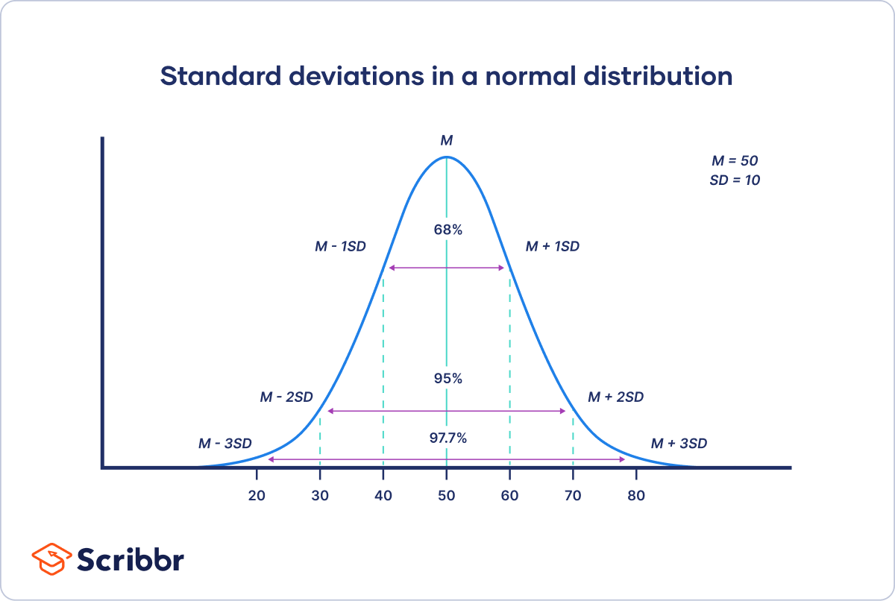

# Content
1. [introduction](#introduction)
2. [Population and Sample](#population-and-sample)
3. [Sampling Techniques](#sampling-techniques)
4. [Variable](#variable)
5. [Variable Measurement Scale](#variable-measurement-scale)
6. [Study of Data Using Graph](#study-of-data-using-graph)
7. [Central Measure of Tendency](#central-measure-of-tendency)
    - [Mean](#mean)
    - [Outlier](#outlier)
    - [Median](#median)
    - [Mode](#mode)
    - [Comparison Between Mean, Median, and Mode](#comparison-between-mean-median-and-mode)
8. [Measure of Dispersion](#measure-of-dispersion)
    - [Range](#range)
    - [Variance](#variance)
    - [Standard Deviation](#standard-deviation)
    - [Standard Deviation Graph](#standard-deviation-graph)
    - [Interquartile Range (IQR)](#interquartile-range-iqr)


# Introduction
**Statistics** is a branch of mathematics that deals **with collecting, organizing, analyzing, interpreting, and presenting data.**

### What is data?
Data is the raw information that you **gather through observation, measurement, or research** — which is then used to do statistical analysis.

#### Example:
Let’s say you ask 5 people how many hours they sleep each night.

Their answers:
```
7, 6, 8, 5, 7
```
These numbers are **data**.\
You can now use **statistics** to find:
- The average sleep time
- The most common sleep time
- How spread out the values are

**Types of Data:**
| Type                          | Description                       | Example                      |
| ----------------------------- | --------------------------------- | ---------------------------- |
| **Qualitative (Categorical)** | Describes qualities or categories | Gender, Color, Type of food  |
| **Quantitative (Numerical)**  | Describes quantities or amounts   | Age, Height, Number of books |

**Quantitative is further divided into:**
- **Discrete**: Countable (e.g. number of siblings)
- **Continuous**: Measurable (e.g. weight, height)


### Two Main Types of Statistics:
| Type                       | Description                                | Example                                          |
| -------------------------- | ------------------------------------------ | ------------------------------------------------ |
| **Descriptive Statistics** | Summarizes data                            | Average height of students in a class            |
| **Inferential Statistics** | Makes predictions or conclusions from data | Predicting election results from a sample survey |

[Go To Top](#content)

---

# Population and Sample

### Population (N):
In statistics, a population is the entire group of people or items you want to study or get information about.

**Example:**\
All the students in your college.

### Sample (n):
A sample is a smaller part (subset) of the population that you actually collect data from.

Choosing a random sample is super important in statistics because it makes your results more fair, accurate, and trustworthy.

**Example:**\
You choose 50 random students from your college to survey.

#### Why use a sample?
Studying the entire population is often:

- Too big
- Too expensive
- Too time-consuming

So we study a sample and use it to make guesses (inferences) about the whole population.

#### Why Choose a Sample Randomly?
1. **Reduces Bias:**\
If you don’t choose randomly, you might pick only certain types of people (e.g., only your friends or only people who agree with you).
 Random selection ensures everyone has an equal chance, so the sample is not one-sided.

2. **Represents the Population:**\
A random sample is more likely to look like the whole population in terms of age, gender, background, etc. This means your conclusions apply to the whole population, not just the few you asked.

3. **Improves Accuracy:**\
Random samples tend to produce more accurate and reliable results — especially when the sample size is large enough.

 4. **Supports Valid Inference:**\
Statistical formulas (for confidence intervals, hypothesis testing, etc.) assume that your sample was random.
If it's not random, these methods might give wrong results.

### Example:
Your college has 2,000 students, and the management wants to know the average screen time of students per day.
| Term           | Example                                                      |
| -------------- | ------------------------------------------------------------ |
| **Population** | All **2,000 students** in your college                       |
| **Sample**     | A group of **100 students** chosen randomly from those 2,000 |

- You ask those 100 students how many hours they use their phone daily.
- You calculate the average screen time of those 100 students.
- Then, you use that result to estimate the average screen time of all 2,000 students.

### Simple Analogy:
Think of a big pot of soup (population).\
You taste one spoonful (sample) to know if it needs more salt.
If the spoonful is well mixed, it gives a good idea about the whole pot.


[Go To Top](#content)

---
# Sampling Techniques
**In statistics, sampling techniques are methods used to select a sample from a population.**

### Main Types of Sampling Techniques
Sampling techniques are divided into two categories:
| Category                        | Types                                          |
| ------------------------------- | ---------------------------------------------- |
| **1. Probability Sampling**     | Simple Random, Systematic, Stratified, Cluster |
| **2. Non-Probability Sampling** | Convenience, Judgmental, Snowball, Quota       |

## Probability Sampling
**Every member of the population has a known and equal chance of being selected.**
1. **Simple Random Sampling**
    - Every member is chosen purely by chance.
    - Like picking card from deck.
    - Example: Randomly selecting 50 students using a random number generator.

2. **Systematic Sampling**
    - Select every kᵗʰ person from a list after a random start.
    - Example: From a list of 1000 students, pick every 10th student (start at position 3 → 3, 13, 23, ...).

3. **Stratified Sampling**
    - Divide population into groups/strata (like gender or department), then randomly sample from each group.
    - Example: Divide students into "Engineering" and "Commerce", then take 20 random student from each.

4. **Cluster Sampling**
    - Divide population into clusters (groups), then randomly select entire clusters.
    - Example: Select 3 out of 10 classrooms randomly, and survey all students in those 3 classes.

## Non-Probability Sampling
**Not everyone has a guaranteed chance of being selected. It's not random.**

1. **Convenience Sampling**
    - Take samples from those easiest to reach.
    - Example: Asking your friends or students in your own class.


2. **Judgmental (Purposive) Sampling**
    - You choose who to ask based on who you think is best for the study.
    - Example: Asking only top scorers to get study tips.

3. **Snowball Sampling**
    - Existing participants refer others.
    - Example: Ask a person, they refer their friend, and so on.

4. **Quota Sampling**
    - Decide how many people you want from each group, then select non-randomly.
    - Example: You want 20 males and 20 females, so you take whoever is available until the quota is full.


[Go To Top](#content)

---
# Variable
**In statistics, a variable is any characteristic or value that can change from one individual or item to another.**

**In simple terms:**\
A variable is what you measure, observe, or record in a study.

####  Example:
If you're studying students:
| Variable | Example Values |
| -------- | -------------- |
| Age      | 18, 19, 20, 21 |
| Gender   | Male, Female   |
| Marks    | 75, 88, 92     |
| Height   | 5.5 ft, 6 ft   |

All of these are variables because they vary between students.

### Types of Variables
**Variables are mainly of two types:**

1.  **Quantitative (Numerical)**\
These represent numbers and you can do math on them.

    - **Discrete**: Countable\
Example: Number of siblings (0, 1, 2…)
    - **Continuous**: Measurable\
Example: Height, weight, temperature

2. **Qualitative (Categorical)**\
These represent categories or labels, not numbers.

    - **Example**:\
Gender (Male/Female)\
Blood type (A, B, AB, O)\
City name (Mumbai, Pune, Delhi)

### In Programming (like Java/C):
```java
int age = 20;           // Quantitative - Discrete
float height = 5.8f;    // Quantitative - Continuous
String gender = "Male"; // Qualitative
```

[Go To Top](#content)

---
# Variable Measurement Scale
**The measurement scale of a variable tells you how the data is classified, and what kind of analysis or operations you can do on it.**

## There are 4 Main Types of Measurement Scales:
| Scale        | Type         | Can You Do Math?        | Example                              |
| ------------ | ------------ | ----------------------- | ------------------------------------ |
| **Nominal**  | Qualitative  | ❌ No                    | Gender, Blood group, City name       |
| **Ordinal**  | Qualitative  | ❌ Only order matters    | Rank (1st, 2nd), Ratings (Good, Bad) |
| **Interval** | Quantitative | ✅ Yes, but no true zero | Temperature (°C), IQ score           |
| **Ratio**    | Quantitative | ✅ Yes, has true zero    | Age, Weight, Height, Salary          |


#### 1. Nominal Scale
- Data is divided into the different different category with no order or ranking. 
- You can't do any math with it.
- **Example**:
    - Gender: Male, Female
    - Blood Type: A, B, AB, O
    - Course: IT, CS, Mechanical

#### 2. Ordinal Scale
- Categories with a meaningful order or ranking.
- Example:
    - **Rank**: 1st, 2nd, 3rd
    - **Feedback**: Poor, Fair, Good, Excellent
You can say “Good is better than Fair” but not by how much.


#### 3. Interval Scale
- Numeric values with equal intervals but no true zero.
- You can add or subtract, but ratios don’t make sense.
- Example:
    - Temperature in °C or °F
    - Time of day (e.g., 3 PM, 6 PM)
    - Saying "30°C is twice as hot as 15°C" is meaningless.

#### 4. Ratio Scale
- Numeric, equal intervals, with a true zero.
- All math operations (+, −, ×, ÷) are meaningful.
- Example:
    - Height, Weight, Distance, Age, Salary
✔ 60 kg is twice as heavy as 30 kg


## Easy Memory Tip:

| Scale    | Think of it as... | Math?    | Zero? |
| -------- | ----------------- | -------- | ----- |
| Nominal  | Name              | ❌        | ❌     |
| Ordinal  | Order             | ➖        | ❌     |
| Interval | Number Line       | ➕ ➖      | ❌     |
| Ratio    | Full Math         | ➕ ➖ ✖️ ➗ | ✅     |


## Frequency Distribution

A frequency distribution shows how frequently each unique value (or interval) appears in a dataset.

#### Example:
Let’s say you surveyed 10 people on how many cups of tea they drink daily:
```
Data: 1, 2, 2, 3, 3, 3, 4, 4, 5, 5
```
| Cups of Tea (x) | Frequency (f) |
| --------------- | ------------- |
| 1               | 1             |
| 2               | 2             |
| 3               | 3             |
| 4               | 2             |
| 5               | 2             |


### Types:
1. **Ungrouped Frequency Distribution**\
Used for discrete data (individual values).

Example:
```
Marks:    10  20  30  40  
Frequency: 2   5   3   1
```
2. **Grouped Frequency Distribution**\
Used for continuous data (values in ranges).

Example:
```
Range (Marks) | Frequency
0 - 10        |     2
11 - 20       |     5
21 - 30       |     3
```
### Cumulative Frequency
Cumulative frequency is the running total of frequencies up to a certain value or class in a frequency distribution.

Suppose this is your frequency table:
| Marks Range | Frequency |
| ----------- | --------- |
| 0 - 10      | 3         |
| 11 - 20     | 5         |
| 21 - 30     | 7         |
| 31 - 40     | 4         |

Now let’s add cumulative frequency:
| Marks Range | Frequency | Cumulative Frequency |
| ----------- | --------- | -------------------- |
| 0 - 10      | 3         | 3                    |
| 11 - 20     | 5         | 3 + 5 = 8            |
| 21 - 30     | 7         | 8 + 7 = 15           |
| 31 - 40     | 4         | 15 + 4 = 19          |


[Go To Top](#content)

---

# Study of Data Using Graph
**Studying data using graphs in data science helps you visually understand patterns, trends, and outliers.**


## 1. Bar Graph (Column-based comparison)
- **Use it when:** You want to compare categories like favorite sport of students
- it is generally use for Discrete variables

**Example:**
| type of sport  | number of student  |
| ------ | ----- |
| Golf  | 6    |
| Tennis | 8     |
| Football  | 12     |
| Rugby  | 10     |
| Basketball  | 16     |


**from this graph we can easily say that `Golf` is the `least` favorite sport whereas `Basketball` is `most` favorite**


## 2. histogram
- **Use it when:** You want to see how values are spread like age
- it is generally use for Continues variables
- **Bin**: In data science, a bin is a range or interval used to group continuous values in a histogram.

**Example:**\
consider a following dataset of age of peoples 

```
age = {22, 26, 31, 35, 37, 39, 40, 43, 46, 48, 51, 53, 54, 55, 57, 66, 68, 69, 75, 92}
```
**From above table we get the frequency table**
Bin(age) | number of people
--- | --- 
0 - 10 | 0
10 - 20 | 0
20 - 30 | 2
30 - 40 | 4
40 - 50 | 4
50 - 60 | 5
60 - 70 | 3
70 - 80 | 1
80 - 90 | 0
90 - 100 | 1


## 3. Line Graph
- **Use it when:** You want to see how something changes over time (like daily temperature).
- it is generally use for Continues variables

**Example:**


## 4. Pie Chart (Percentage of total)
**Use it when:** You want to show parts small data with respect to bigdata (e.g., vote share, budget spending).

**Example:**


from the above pie chart we can say that toys has total sales of `14%`


[Go To Top](#content)

---
# Central Measure of Tendency

Central Measure of Tendency (or just Measures of Central Tendency) are statistical values that represent the **center of distribution of data**

**They help answer:**\
📌 "What is the average or middle value of this data?"


### There are 3 main types:
| Measure    | Symbol             | Meaning                          | Use Case Example              |
| ---------- | ------------------ | -------------------------------- | ----------------------------- |
| [**Mean**](#mean)   | $\bar{x}$ or $\mu$ | Average of all values            | Average marks of students     |
| [**Median**](#median) | —                  | Middle value when data is sorted | Middle income of a population |
| [**Mode**](#mode)   | —                  | Most frequently occurring value  | Most sold product             |


## Mean
The arithmetic mean is the sum of all values divided by the number of values.

#### Formula:

$$
Mean = \frac{Sum of all values
​} {Number of values}
$$


###  1. Population Mean (μ)
Used when you're dealing with the entire group (like all students in a school).

#### Formula:

$$
\mu = \frac{\sum_{}^{} X_i}{\text{N}}
$$

Where:

- **𝜇**: Population mean  
- **∑𝑋ᵢ**: Sum of all data points in the population  
- **N**: Total number of data points in the population


#### Example:
Heights of all 5 students: 150, 160, 170, 180, 190
$$
μ = \frac{150 + 160 + 170 + 180 + 190}{5} = \frac{850}{5} = 170
$$

###  2. Sample Mean (x̄)
Used when you take a subset (sample) from the population.

#### Formula:

$$
\bar{x} = \frac{\sum_{}^{} X_i}{\text{n}}
$$


Where:

- **x̄**: sample mean  
- **∑𝑋ᵢ**: Sum of all data points in the sample  
- **n**: Total number of data points in the sample

#### Example:
Heights of a sample of 3 students: 150, 170, 190

$$
\bar{x} = \frac{150 + 170 + 190}{3} = \frac{510}{3} = 170
$$

#### Key Difference

| Aspect      | Population Mean (μ) | Sample Mean (x̄) |
| ----------- | ------------------- | ---------------- |
| Use case    | Whole group         | Subset of group  |
| Notation    | $\mu$               | $\bar{x}$        |
| Size symbol | $N$                 | $n$              |


## outlier
- An outlier is a data point that is significantly different from the other values in a dataset — it either lies much higher or much lower than the rest.

**Example:**\
Data:\
`10, 12, 11, 13, 500`\
🔍 Here, `500` is an outlier because it’s far away from the other values.
 

 - An outlier can pull the mean toward itself, especially if the dataset is small.


#### How outlier affect mean
**Example:**\
Data without outlier:\
`10, 12, 14, 16, 18`

**Mean = (10 + 12 + 14 + 16 + 18) / 5 = 70 / 5 = `14`**

Now add an outlier → 100:\
`10, 12, 14, 16, 18, 100`

**Mean = (10 + 12 + 14 + 16 + 18 + 100) / 6 = 170 / 6 ≈ `28.3`**

👉 The mean jumped from **14 to 28.3** — just because of one outlier!


## Median
Median is the middle value of a sorted dataset.

#### Steps to Find the Median:
1. Sort the data
2. Use these rules:
    - If odd number of values:\
👉 Median = middle value

    - If even number of values:\
👉 Median = average of two middle values


**Example 1: Odd number of elements**

Data:\
`[5, 1, 3]` → sort it → `[1, 3, 5]`\
👉 Median = `3`


 **Example 2: Even number of elements**

Data:\
`[6, 2, 4, 8]` → sort → `[2, 4, 6, 8]`\
👉 Median = (4 + 6) / 2 = `5`

#### Median is not affected by outlier

**Example:**\
data\
`10, 12, 14, 16, 18, 100`\
outlier → 100:

**Mean = (10 + 12 + 14 + 16 + 18 + 100) / 6 = 170 / 6 ≈ `28.3`**\
**Median = (14 + 16) = `15`**

out of `28.3` and `15` median `15` is more realistic 


## Mode
Mode is the value that appears the most number of times in a dataset.
It tells you the most frequent or popular value. especially used for categorical or non-numeric data.


#### Example:
**Data:**\
`[2, 4, 4, 6, 7, 4, 8]`\
👉 Mode = 4 (because it appears 3 times)

####  Other Possibilities:
| Type of Mode   | Example              | Explanation                   |
| -------------- | -------------------- | ----------------------------- |
| **No Mode**    | `[1, 2, 3, 4]`       | All values occur only once    |
| **Unimodal**   | `[3, 3, 5, 6]`       | One mode (3)                  |
| **Bimodal**    | `[2, 2, 5, 5, 7]`    | Two modes (2 and 5)           |
| **Multimodal** | `[1, 1, 2, 2, 3, 3]` | More than two values repeated |

#### Where is Mode Useful?
| Situation                      | Why Mode Helps                          |
| ------------------------------ | --------------------------------------- |
| Most bought product            | Shows customer preference               |
| Most common exam score         | Shows what most students scored         |
| Categorical data (e.g. colors) | Mean/median doesn’t make sense for text |

#### Does an outlier affect the mode?
It depends on whether the outlier is frequent or not.

1. **Usually, outliers do NOT affect mode**\
Because mode depends on frequency, not size.\
**Example:**\
Data: `[2, 2, 3, 4, 100]`
    - Mode = 2
    - 100 is an outlier (appears once) → ❌ No effect on mode

2. **BUT — if the outlier repeats more than others, it can become the mode.**\
**Example:**\
Data: `[1, 2, 3, 4, 5, 100, 100]`

    - 100 appears twice, more than any other\
✅ Mode = 100\
🎯 Outlier became the mode


## Comparison Between Mean, Median, and Mode
| Feature                      | **Mean**                                 | **Median**                                   | **Mode**                            |
| ---------------------------- | ---------------------------------------- | -------------------------------------------- | ----------------------------------- |
| **Definition**               | Average of all values                    | Middle value in sorted data                  | Most frequently occurring value     |
| **Formula**                  | $\text{Sum of values} \div \text{Count}$ | Middle of sorted list (or avg of two middle) | Value that appears most often       |
| **Affected by Outliers**     | ✅ Yes                                    | ❌ No                                         | ❌ No                                |
| **Data Type**                | Numerical only                           | Numerical only                               | Numerical & Categorical             |
| **Use Case**                 | Balanced data                            | Skewed data or with outliers                 | Categorical or repeated values      |
| **Example (2, 3, 3, 6, 10)** | Mean = 4.8                               | Median = 3                                   | Mode = 3                            |
| **Uniqueness**               | One unique value                         | One unique value                             | Can be none, one, or multiple modes |
| **Common In**                | Grades, salary average                   | Real estate prices, age data                 | Survey results, product popularity  |


[Go To Top](#content)

---
# Measure of Dispersion
A Measure of **Dispersion** tells you how **spread** out or **scattered** the values in a dataset are.

It shows how much the data spread from the center (mean/median) — basically, how consistent or variable the data is.

### Common Measures of Dispersion:
| Measure                       | What it tells you                       |
| ----------------------------- | --------------------------------------- |
| [**Range**](#range)                     | Difference between max and min values   |
| [**Variance**](#variance)                  | Average squared deviation from the mean |
| [**Standard Deviation**](#standard-deviation)        | Square root of variance (most used)     |
| [**Interquartile Range (IQR)**](#interquartile-range-iqr) | Spread of the middle 50% of data        |

---
## Range
Range is the simplest measure of dispersion — it tells you how spread out the data is by calculating the difference between the highest and lowest values.

#### Formula:

$$
\text{Range} = \text{Maximum Value} - \text{Minimum Value}
$$

#### Example:
Data: `[4, 7, 9, 15, 20]`

- Max = 20
- Min = 4\
👉 Range = 20 - 4 = 16

#### Key Points
- Easy to calculate	
- Affected by outliers	
- Useful for quick overview	as it give basic spread
- only looks at two values (max and min), so it ignores the rest of the dataset.

---
## Variance
Variance measures how far each value in a dataset is from the mean (on average).
It shows the spread or variability of data.

#### Formula:

- For Population Variance ($\sigma^2$)

$$
\sigma^2 = \frac{1}{N} \sum_{i=1}^{N} (x_i - \mu)^2
$$

- For Sample Variance ($s^2$)

$$
s^2 = \frac{1}{n - 1} \sum_{i=1}^{n} (x_i - \bar{x})^2
$$

**Where:**
- $x_i$ :  each data point
- $\mu$ : population mean
- $\bar{x}$ : sample mean
- $N$ : population size
- $n$ : sample size


#### The reason why population variance uses N, but sample variance uses n − 1, comes down to accuracy and unbiased estimation.

 **Population Variance:**
- You have all data points from the population.
- So, you know the true mean 𝜇
- μ, and can calculate exact spread.
- Use divisor **N** (the total number of values).

**Sample Variance:**
- You only have a subset of the population.
- You don’t know the true mean 𝜇, so you estimate it using sample mean $\bar{x}$
- That estimation introduces a small error, which tends to underestimate the real variance.
- To correct that underestimation, we divide by n − 1 instead of n.\
→ This correction is called Bessel's correction.


#### Example:
Data: `[2, 4, 6, 8]`\
Mean = (2 + 4 + 6 + 8) / 4 = `5`

| Data $x_i$ | Mean $\bar{x} = 5$ | $x_i - \bar{x}$ | $(x_i - \bar{x})^2$ |
| ---------- | ------------------ | --------------- | ------------------- |
| 2          | 5                  | 2 − 5 = **−3**  | (−3)² = **9**       |
| 4          | 5                  | 4 − 5 = **−1**  | (−1)² = **1**       |
| 6          | 5                  | 6 − 5 = **+1**  | (+1)² = **1**       |
| 8          | 5                  | 8 − 5 = **+3**  | (+3)² = **9**       |

- $\sum{}{}(x_i - \bar{x})$ = 9 + 1 + 1 + 9 = `20`
- Number of values (n) = 4

**For Population Variance:**

$$
\sigma^2 = \frac{20}{4} = 5
$$

**For Sample Variance:**

$$
s^2 = \frac{20}{4 - 1} = \frac{20}{3} ≈ 6.67
$$

---
## Standard Deviation
Standard Deviation (SD) measures how spread out the values in a dataset are from the mean.
It tells you how much the data varies on average.

It’s the square root of the variance — this brings the unit back to the original scale of your data (unlike variance, which is squared).

#### Formula:

 **For Population:**

 $$
 \sigma = \sqrt{\frac{1}{N}\sum{}{}(x_i - \mu)^2} = \sqrt{Population Variance (\sigma^2)}
 $$

**For Sample:**

 $$
 \sigma = \sqrt{\frac{1}{n-1}\sum{}{}(x_i - \bar{x})^2} = \sqrt{Sample Variance (s^2)}
 $$


 Data: `[2, 4, 6, 8]`\
Mean = (2 + 4 + 6 + 8) / 4 = `5`

| Data $x_i$ | Mean $\bar{x} = 5$ | $x_i - \bar{x}$ | $(x_i - \bar{x})^2$ |
| ---------- | ------------------ | --------------- | ------------------- |
| 2          | 5                  | 2 − 5 = **−3**  | (−3)² = **9**       |
| 4          | 5                  | 4 − 5 = **−1**  | (−1)² = **1**       |
| 6          | 5                  | 6 − 5 = **+1**  | (+1)² = **1**       |
| 8          | 5                  | 8 − 5 = **+3**  | (+3)² = **9**       |

- $\sum{}{}(x_i - \bar{x})$ = 9 + 1 + 1 + 9 = `20`
- Number of values (n) = 4

**For Population:**
$$
Variance(\sigma^2) = \frac{20}{4} = 5
$$
$$
\text{Standard Deviation}(\sigma) = \sqrt{5} ≈ 2.24
$$

**For Sample:**
$$
Variance(s^2) = \frac{20}{4 - 1} = \frac{20}{3} ≈ 6.67
$$

$$
\text{Standard Deviation}(s) = \sqrt{6.67} ≈ 2.58
$$

---
## Standard Deviation Graph
lets assume a dataset whose mean is `50` and standard deviation is `10`
- Draw X-axis (horizontal) → represents the data values, how to create the x-axis
    - Mean = 50 and SD = 10
    - Mean $\pm$ SD = 40, 60
    - 40 - SD = 30 and 60 + SD = 70 
    - 30 - SD = 20 and 70 + SD = 80 
    - therefor mark points: 20, 30, 40, 50, 60, 70, 80  
- Draw Y-axis (vertical) → represents frequency or probability
- if you connect the all point then you'll find the smooth curve like:




here:
- 50 : Standard deviation 
    - μ = 50
- 60 : 1st SD to the left
    - μ + 1σ = 60
- 70 : 2nd SD to the left
    - μ + 2σ = 70
- 80 : 3rd SD to the left
    - μ + 3σ = 80
- 40 : 1st SD to the right
    - μ − 1σ = 40
- 30 : 2nd SD to the right
    - μ − 2σ = 30

- 20 : 3rd SD to the right
    - μ − 3σ = 20

with this graph we can say that how far the value is from the mean

**Example:**\
data value 65 is 1.5 SD to the left -> $\mu$ + $1.5\sigma$ = 65 


### Also larger the curve of the graph higher the SD and smaller the curve of the graph lower the SD


- Higher the SD higher the value spread from mean, whereas lower the SD lower the value spread form mean

---
## Interquartile Range (IQR)
IQR is a measure of dispersion that tells you how spread out the middle 50% of your data is.
It’s useful for removing the influence of outliers.

#### Formula:
$$
IRQ = Q_3 - Q_1
$$

**Where:**
- $Q_3$ = 1st quartile (25% of data below it)
- $Q_1$ = 3rd quartile (75% of data below it)

So IQR = the range between the 25th and 75th percentile.

#### Example:
Let’s take the data:\
`[5, 7, 8, 10, 12, 14, 18, 20, 22]`

1. **Sort the data**\
`[5, 7, 8, 10, 12, 14, 18, 20, 22]`

2. Find the Median (Q2)
- Total values = 9 (odd number)
- Middle value = 5th value → 12\
So,
$$Q_2 = Median = 12
$$
3. **Find Q1 (Lower Quartile)**\
Take the lower half of data, before the median: `[5, 7, 8, 10]`
    - This has 4 values → Median of this group = average of 2nd and 3rd value:
    $$
    Q_1 = \frac{7 + 8}{2} = 7.5
    $$
4. **Find Q3 (Upper Quartile)**\
Take the upper half of data, after the median:` [14, 18, 20, 22]`
    - Again, 4 values → Median = average of 2nd and 3rd:
    $$
    Q_3 = \frac{18 + 20}{2} = 19
    $$

5. **Final Answer:**

| Quartile | Value               |
| -------- | ------------------- |
| Q1       | 7.5                 |
| Q3       | 19                  |
| IQR      | 19 − 7.5 = **11.5** |


[Go To Top](#content)

---