# Content
1. [Introduction](#introduction)
2. [Interpretability](#interpretability)
3. [XAI Methods](#xai-methods)
4. [XAI technique](#xai-technique)
5. [LIME: Local Interpretable Model-agnostic Explanations](#lime-local-interpretable-model-agnostic-explanations-1)
6. [SHAP: SHapely Additive exPlanation ](#shap-shapely-additive-explanation)


[Acknowledgment](#acknowledgment)

---

# Introduction

Explainable AI (XAI) means AI systems that can clearly explain why they made a particular decision, in a way humans can understand.

Instead of being a mysterious “black box”, XAI answers questions like:
- Why did the model predict this?
- Which factors mattered the most?
- Can I trust this decision?

### Example
Problem: Predict heart disease risk

Normal ML output
```
Prediction: High Risk
```
Explainable AI output
```
Prediction: High Risk
Reasons:
- High blood pressure (35%)
- High cholesterol (25%)
- Age above 55 (20%)
- Smoking history (15%)
- BMI (5%)
```


### Why explainable AI matters
- It is crucial for an organization to have a full understanding of the AI decision-making processes with model monitoring and accountability of AI and not to trust them blindly. 
- Explainable AI can help humans understand and explain machine learning (ML) algorithms, deep learning and neural networks.
- Explainable AI is one of the key requirements for implementing responsible AI, a methodology for the large-scale implementation of AI methods in real organizations with fairness, model explainability and accountability.
- Explainable AI can improve the user experience of a product or service by helping the end user trust that the AI is making good decisions.

### Black Box AI vs Gray Box AI vs White Box AI
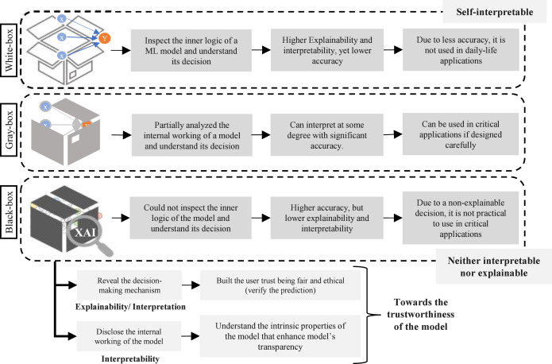


[Go To Top](#content)

---

# Interpretability

Interpretability is the ability of a human to understand how and why a model makes a decision.

> If a human can look at a model’s logic or output and explain it, the model is interpretable.

#### Example:

lets assume a liner ML model that calculate the cholesterol level according the amount of time we do exercise

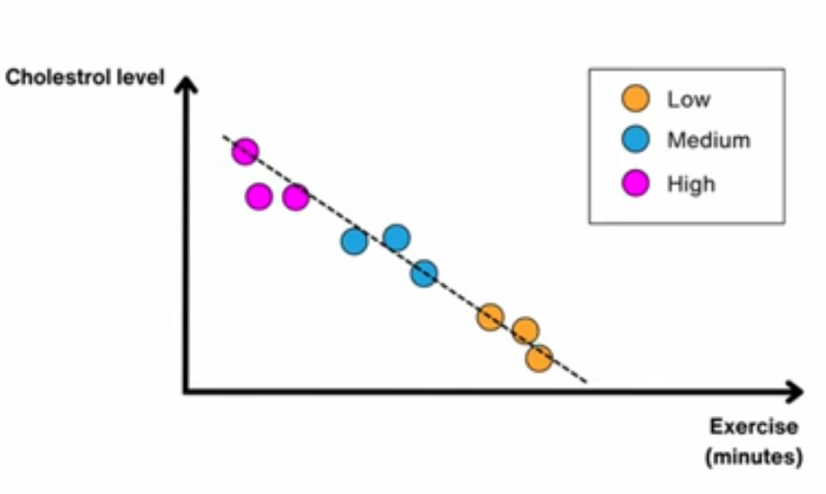

Once our liner model is train and we found the best fit line we can use that line to interpret the new datapoint

Example

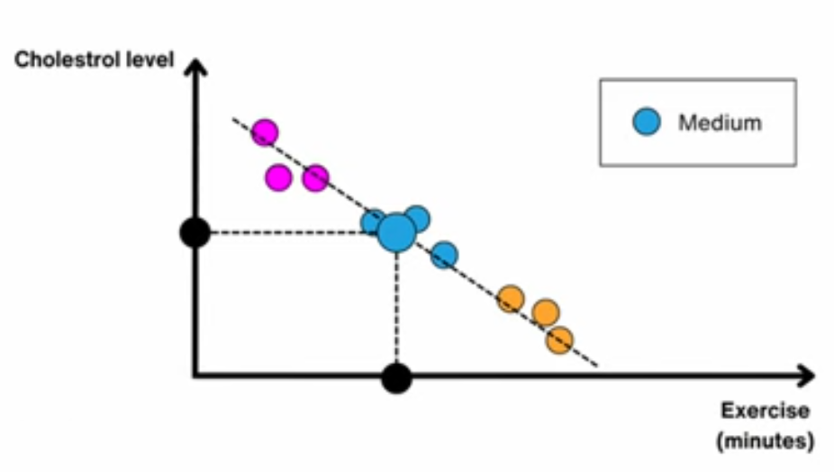

Our new datapoint lies in medium cholesterol level
> for any random exercise value (X) we can interpret its cholesterol level (Y)

Therefor as you can see we can interpret how this model will response, just by the looking at the best fit line

hence Interpretability is high for this ML model

### Interpretability Vs Accuracy

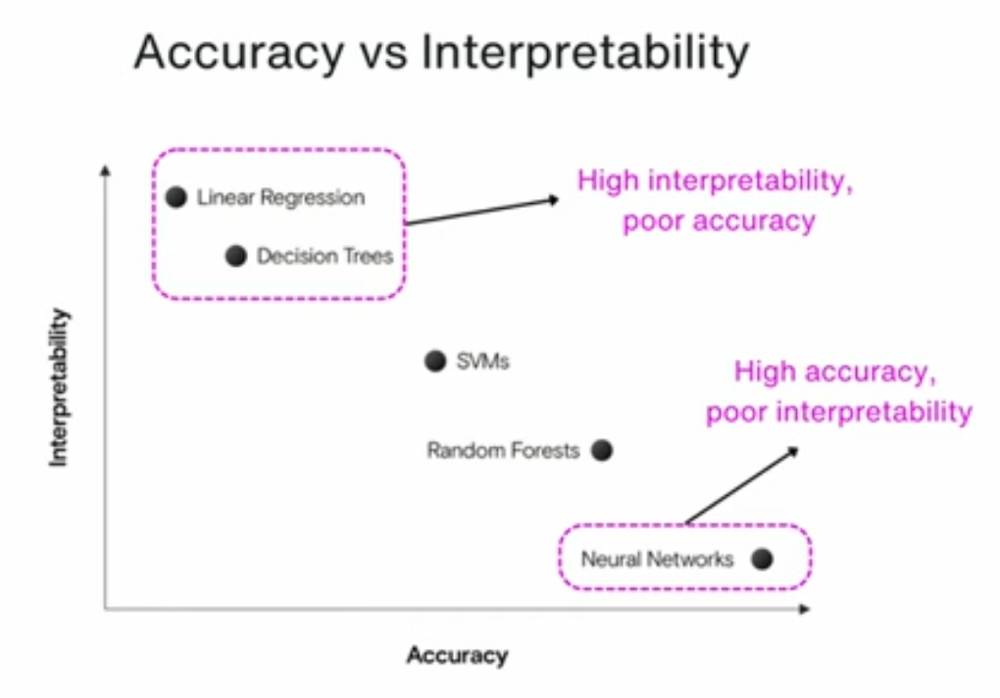

> Neural networks are powerful, but poor at interpretability because their decision-making logic is distributed across thousands or millions of numbers (weights), not human-readable rules.

### Type of interpretability

There are tow main type of interpretability i.e,

A. Global and Local Interpretability\
B. Model-based (Intrinsic) and Post-hoc Interpretability

#### A1. Global Interpretability
Understanding the model as a whole

>Question it answers:\
>How does the model generally make decisions?

What it explains:
- Overall behavior of the model
- Which features are important globally
- General decision logic

**Example:**

Student Performance Model
```
Attendance is the most important factor,
followed by internal marks and assignment score.
```
Or rule
```
IF attendance < 75% → FAIL (for most students)
```
#### A2. Local Interpretability
Understanding a single prediction

> Question it answers:\
>Why did the model make THIS decision?

**Example:**

For one student:
```
Prediction: FAIL
Reason:
- Attendance = 60% (major reason)
- Internal marks slightly low
```

#### B1. Model-based (Intrinsic) Interpretability
Interpretability built into the model
> The model itself is understandable, no external explanation tool needed.

**Examples:**
- Linear / Logistic Regression
- Decision Trees
- Rule-based systems

#### B2. Post-hoc Interpretability
Derive explanation from complex ML model
> Used for black-box models.

Example:
1. LIME
2. SHAP\
etc...

[Go To Top](#content)

---
# XAI methods 
XAI (Explainable AI) methods are techniques used to understand, interpret, and explain the decisions of machine learning models, especially black-box models.

### 1. Agnosticity: 

Whether the XAI method depends on the type of ML model
- Model Agnostic / model independent
    1. LIME
    2. SHAP
    3. Partial Dependency plot (PDPs)\
    etc...
- Model specific
    1. Attention mechanism: Neural Network
    2. Tree interpreter: decision tree and random forest
    3. CNN visualizer: convocational Neural Network\
    etc...

### 2. Scop: 

Whether the method explains the model globally or locally

- Global explanation: for whole model

    Example:\
    For health classifier model, Age has high importance


- Local explanation: for individual instance

    Example:\
    Inside a health classifier model
    - person A: glucose has high importance
    - Person B: sugar has high importance

### 3. Data type: 
for which data this XAI method work?

- **Text: sentence highlighting**\
A map that highlight the contribution of each word to the prediction
- **images: Saliency Maps**\
A map that highlight the contribution of each pixel at the prediction
- **Tabular: feature Importance:**\
A vector containing the value for each feature, Each value  indicates the importance of the feature for the prediction

- **Graph: Node highlighting**\
A score of every node in the graph which highlight the contribution of that node to the prediction


### 4. Explanation Type: 
what type of explanation does XAI method give?

- **Visual:**\
corelation plot to visualize the relation between different variable in the dataset

- **Features importance:**\
How changing the input feature changes the output

- **Data points:**\
using the specific instance from the dataset ot explain the behavior of the model

- **Surrogate / Simple moles:**\
Surrogate models are the simpler, more interpretable models that are used to approximate  the  prediction of a more complex model


[Go To Top](#content)

---
# XAI technique

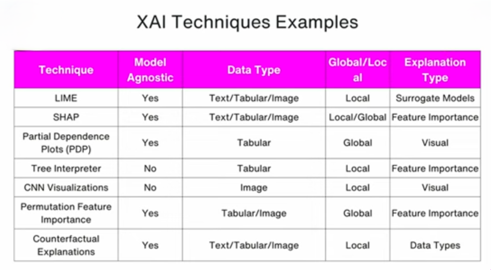

### LIME: Local Interpretable Model-agnostic Explanations
LIME is a model-agnostic explainability technique that explains individual predictions by approximating a complex model locally using a simple, interpretable model.

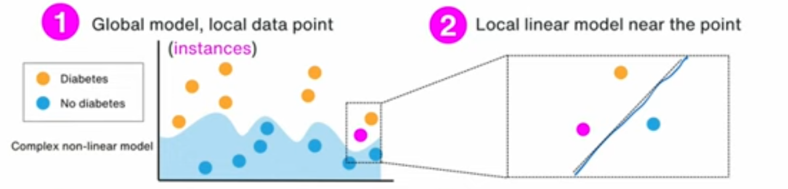

In above image we can see that  we approximate the global complex non-liner model into interpretable local liner model

### SHAP: SHapley Additive exPlanations

SHAP is a model-agnostic XAI technique based on Shapley values from game theory that assigns each feature a fair contribution to a model’s prediction.
> How much each feature contributed to a model’s prediction. It tells you who pushed the prediction up, who pushed it down, and by how much. 

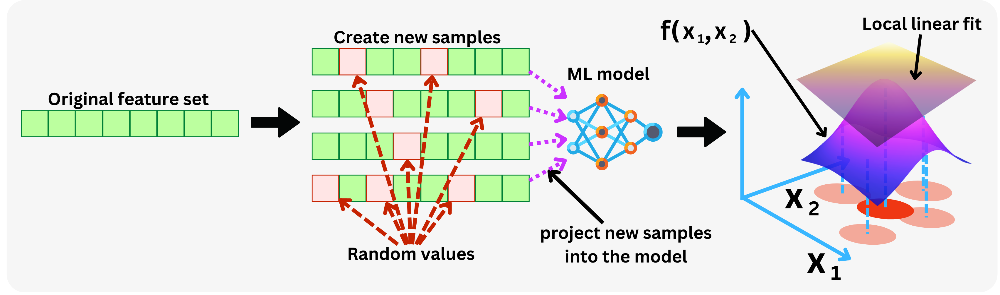

### Partial Dependency Plot
A Partial Dependence Plot shows the marginal effect of one or two features on a model’s predicted outcome by averaging over all other features.

> PDP answers: “If this feature changes, how does the prediction change on average?”

### permutation feature importance
Permutation Feature Importance measures how important a feature is by checking how much the model’s performance drops when that feature’s values are randomly shuffled.

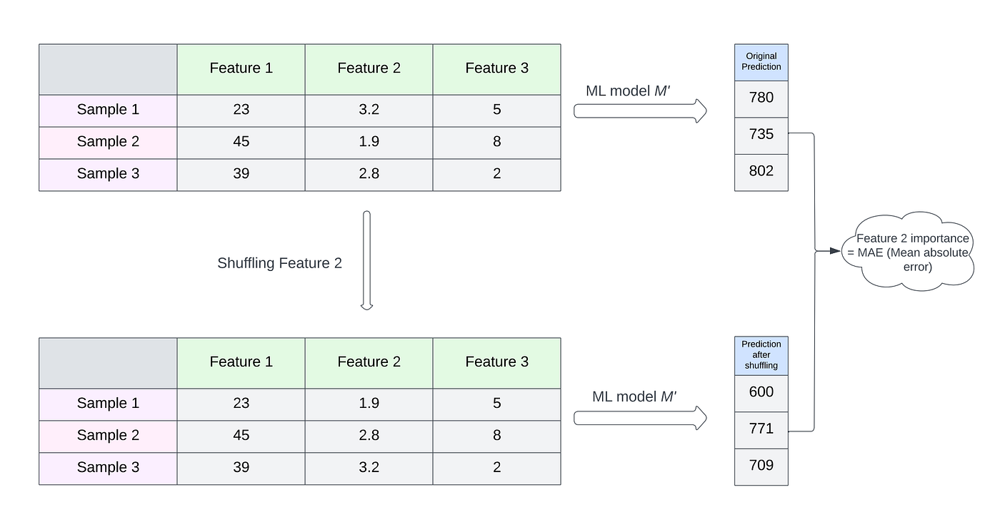


### Counterfactual Explanation 
A counterfactual explanation describes the minimal changes to input features required to alter a model’s prediction to a desired outcome.

> A counterfactual explanation tells you:\
>“What is the smallest change needed to flip the model’s decision?”

#### Example:


- Model says:\
❌ Loan rejected

- Counterfactual says:\
✅ If your income were ₹45,000 instead of ₹40,000, your loan would be approved.

[Go To Top](#content)

---
# LIME: Local Interpretable Model-agnostic Explanations

- **Local**: Local instance of the neighbor
- **Interpretability**: A human should be able to interpret
- **Model-Agnostic**: Applicable to all models
- **Explanation**: Explanation that helps the interpellation

### Global and Local Interpretability

Consider a classifier

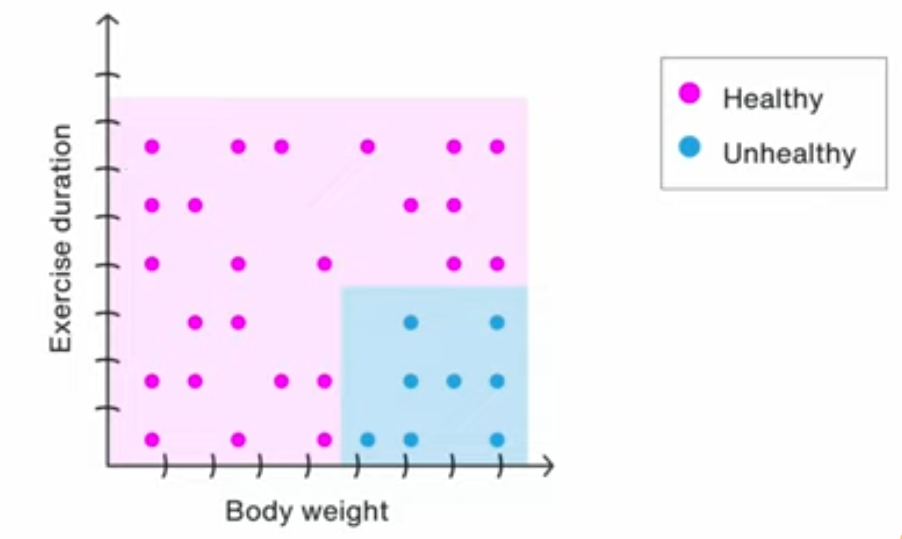

This is how our complete global model look like, that simply classify the person between healthy and unhealthy class based on the body weight and their exercise duration

Now lets look at the local model

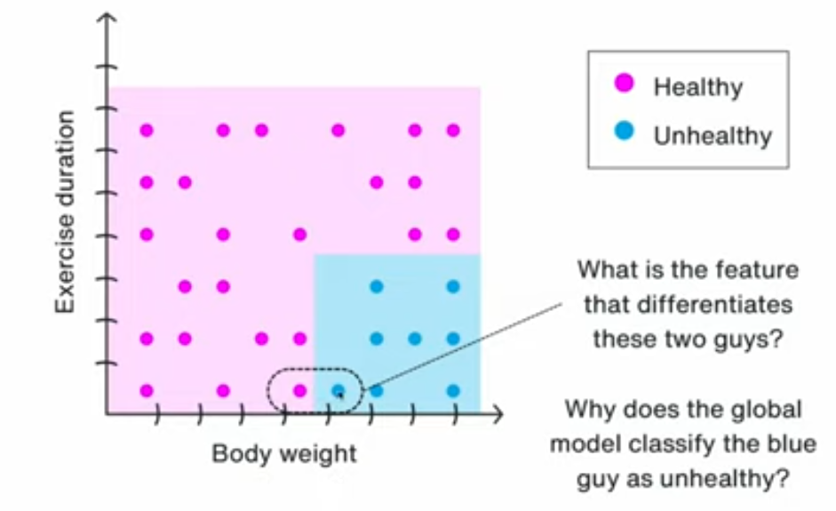

In above local model we can say that body weight differentiate those two guys

therefor we can say that our global modal local says that person is unhealthy because he is overweight
> increasing (unless we increases it by large amount) his exercise duration will not affect much as he'll still be inside the blue box (unhealthy zone)

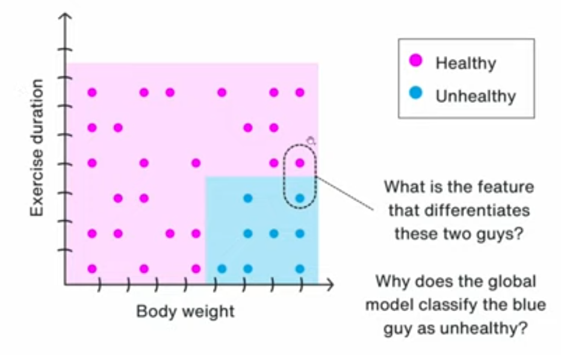

Similar to previous example, in this example the feature that distinguish this two guys is exercise duration

therefor we can say that our global modal local says that the person is unhealthy because he is just train for less amount of time
> decreasing (unless we decrease it by large amount) the body weight will not affect much as he'll still be inside the blue box (unhealthy zone)

### How LIME works internally

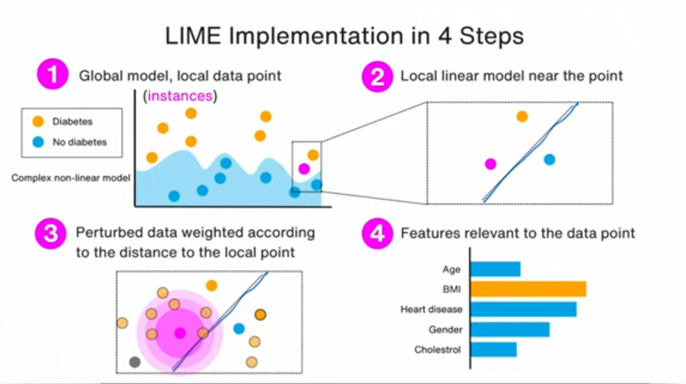

#### Step 1️⃣: Global model + one local data point
What you see
- Blue & orange dots → two classes (e.g., Diabetes / No diabetes)
- Wavy boundary → complex non-linear decision boundary
- Pink dot → the instance you want to explain

Meaning
- The global model is complicated and not interpretable
- We don’t try to explain the whole model
- We only care about:\
“Why was THIS pink point classified as Diabetes?”

📌 This is where local interpretability starts

#### Step 2️⃣: Local linear model near the point
What LIME does here

- Zooms into a small neighborhood around the pink point
- Fits a simple interpretable model:
    - Usually linear regression 
    - Or a small decision rule

**Why linear?**

Because locally:
- Even complex curves look almost straight
- Like zooming into a curve until it looks like a line

📌 This line is NOT the real model\
📌 It’s a local approximation

#### Step 3️⃣: Perturbed data weighted by distance
This is the core magic of LIME

**What happens**
1. LIME creates synthetic data points around the pink point\
(by slightly changing feature values)
2. Each perturbed point is:\
Passed through the original black-box model
3. Points are weighted:
    - Close points → high weight
    - Far points → low weight

**Why weighting matters**

Because:
- We only trust the model near the instance
- Far points may follow very different behavior

**Example**
| Case                | Age | BMI | HeartDisease | Prediction |
| ------------------- | --- | --- | ------------ | ---------- |
| Original            | 45  | 31  | Yes          | 0.82       |
| Change BMI ↓        | 45  | 27  | Yes          | 0.50       |
| Change Age ↓        | 40  | 31  | Yes          | 0.80       |
| Change HeartDisease | 45  | 31  | No           | 0.35       |

**What you learn immediately**
- Changing BMI → big prediction drop ❗
- Changing Age → small change
- Changing HeartDisease → huge change ❗❗

📌 So BMI & HeartDisease are important for this point.

### Mathematical Representation
$$\zeta (X) = argmin_{\text{g ∈ G}}\ L(f, g, \pi_x) + \Omega(g)$$

here:
- X -> local instance of model
- g -> local interpretable model that belongs to `G`
- G ->  class of potentially interpretable models, such
as linear models, decision trees. 
- f -> complex model that is being explained
- $\pi_x$ -> proximity measure of `x`
- $\Omega(g)$ -> measure of complexity of `g`
- L -> fidelity functions

In LIME we must minimize $L(f, g, \pi_x)$ while having $\Omega(g)$  be
low enough to be interpretable by humans


$$L(f, g, \pi_x) = \sum \pi_x(z)(f(z) - g(z^l))^2$$

Here
- z -> a perturbed sample / original feature space (real values)
- $f(z)$ -> prediction of black-box model for sample z
- $g(z^l)$ -> prediction of interpretable local model `g`
- $z^l$ -> interpretable representation of `z` 


### Limitations of LIME

1. **Sensitive to neighborhood size**
    - Lime is dependent on $\pi_x$ 
    - Small $\pi_x$ → too local → noisy
    - Large $\pi_x$ → too global → inaccurate
    - There is no universal best $\pi_x$.

2. **Linear assumption may be wrong locally**
    - LIME assumes: The model is approximately linear near the point
    - But sharp decision boundaries, Feature interaction, Discontinuities break this assumption.

3. **Perturbed samples may be unrealistic**
    - LIME creates synthetic data without checking validity.
    - Example:

    ```
    Age = 5
    HeartDisease = Yes
    BMI = 60
    ```
    - These points:
        - Never exist in real life
        - But still influence the explanation
4. **Computationally expensive**
    - For each explanation:
        - Generate hundreds / thousands of samples
        - Query the black-box model many times
    - Impact
        - Slow for large models
        - Not ideal for real-time systems
    
5. **Instability**
    - If you run LIME twice on the same data point → you may get different explanations.
    - Why
        - Random sampling of perturbed points
        - Different local neighborhoods
        - Different surrogate fits


    
[Go To Top](#content)

---
# SHAP: SHapely Additive exPlanation 
- SHAP uses game theory's Shapley values to fairly attribute a model's output to its input features, treating features as "players" in a coalition that contributes to the prediction payoff
- SHAP works by breaking down a machine learning model's prediction into simple contributions from each input feature, like dividing credit among team players for a win.
- Imagine the model's output as a "pot of gold." SHAP fairly splits this value by testing every possible group of features, seeing how much each one adds or subtracts when joining the group.
- It averages these impacts so no feature gets unfair credit.

> It helps to understand "what is the fair contribution of each individual feature?"

- To calculate the true individual contribution, we need to consider different subsets of features
- calculate the individual contribution for each subset, and then do an average of those contribution to find the marginal contribution of each feature

while building the subset we cannot change the no. of dimensions, as model accept input in fixed dimensions

So we can put some random values for the features that need to be removed.

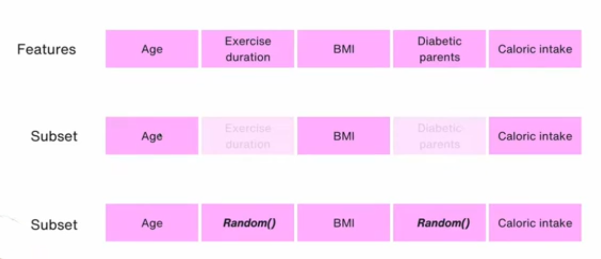

now when we iterate this subset large no. of time then the affect of this random value will be ignored


### Example
We have a model with 2 features:
```
x1 = Age
x2 = Income
```
With 2 features, subsets are:
| Subset S      | Active features |
| ------------- | --------------- |
| {}            | none            |
| {Age}         | Age only        |
| {Income}      | Income only     |
| {Age, Income} | both            |

Step 4: Model outputs for each subset
| Input            | Meaning                   | Model output |
| ---------------- | ------------------------- | ------------ |
| f({})            | both random          | 50           |
| f({Age})         | Age real, Income random | 60           |
| f({Income})      | Income real, Age random | 70           |
| f({Age, Income}) | both real                 | 80           |

#### Compute SHAP value
For a feature, SHAP asks:\
“How much does the prediction change when I ADD this feature?”
```
(with feature) − (without feature)
```

**Computing SHAP for Age**
> We must compare situations that differ only by Age.
- Case 1: Age added to empty set

    ```
    Before: {}          → f({}) = 50
    After:  {Age}       → f({Age}) = 60
    ```
    Contribution of Age

    ```
    60 − 50 = 10
    ```
    Why this subtraction?\
    Because Income is random in both cases — the only change is Age.

- Case 2: Age added when Income is already present

    ```
    Before: {Income}        → f({Income}) = 70
    After:  {Age, Income}   → f({Age, Income}) = 80
    ```
    Contribution of Age

    ```
    80 − 70 = 10
    ```
    Again:\
    Same Income value, only Age changes.

- Average the contribution 
    ```
    φ_Age = (10 + 10) / 2 = 10
    ```

**Compute SHAP for income**

similar to age logic valid pairs for Income:
- {} → {Income}
- {Age} → {Age, Income}
- Subtractions:

    ```
    70 − 50 = 20
    80 − 60 = 20
    ```
- Average:
    ```
    φ_Income = (20 + 20) / 2 = 20
    ``` 

**conclusion**

- From the SHAP values we computed:
    ```
    φ_Age    = 10
    φ_Income = 20
    ```
- Income contributes more than Age to this prediction
- Because adding Income increases the prediction more than adding Age, on average, across all contexts (subsets)
<!-- ### Step-by-Step Process
- Pick a baseline (average prediction across many examples).
- For one prediction, mask features one by one in random combos and see model changes.
- Weigh and average each feature's "push up or down" effect across thousands of tests.
- Add them up: baseline + feature effects = exact prediction.

 -->


### Mathematical Representation

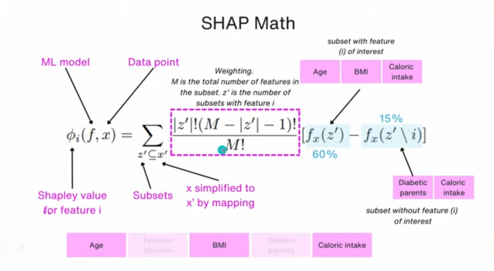

$f_x(z^l) - f_x(z \text{\textbackslash} i) = 60\% - 15\%$ says that by adding `age` into subset [`Diabetic parents`, `caloric intake`] the number of prediction for particular class goes up to 60% from 15%

Therefor we can say that feature `age` has high influence 
    
[Go To Top](#content)

---

# Acknowledgment
1. [Information Fusion (Research Paper)](https://www.sciencedirect.com/science/article/pii/S1566253523001148): XAI concepts
2. [vizuara](https://www.youtube.com/@vizuara): Core XAI Technique and Algorithm
3. [lime github](https://github.com/marcotcr/lime)
4. [Why Should I Trust You? (Research Paper)](https://arxiv.org/pdf/1602.04938): LIME 
5. [SHAP doc](https://shap.readthedocs.io/en/latest/)
6. [shap github](https://github.com/shap/shap)
7. [A Unified Approach to Interpreting Model Predictions (Research Paper)](https://arxiv.org/pdf/1705.07874): SHAP

[Go To Top](#content)

---